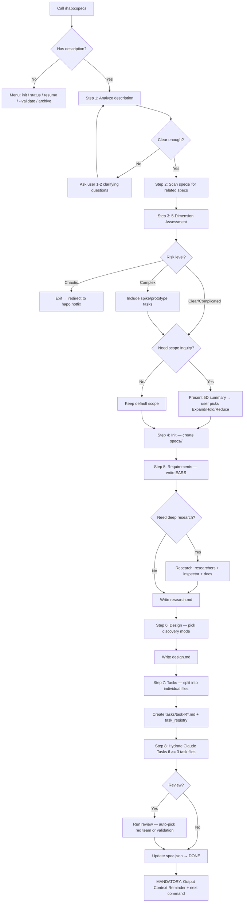

# Specs (SDD — Specification-Driven Development)

> A structured specification system that turns vague ideas into actionable, implementable task lists.

## Overview

This skill provides a 10-step workflow to transform ideas into specs:

```
Analyze → Dependency Scan → Complexity Assessment → Init → Requirements → Design → Tasks → Hydration → Review → Completion
```

**CRITICAL:** Before starting, the system MUST:
1. Scan `specs/` directory for incomplete specs
2. If any spec is `in_progress` (accept legacy `in-progress` when reading) → ask user whether to continue or create new
3. Detect cross-spec dependencies (see `references/cross-spec-dependency.md`)

## Core Responsibilities & Rules

### Development Principles
- **YAGNI** — Don't add functionality until it's actually needed
- **KISS** — Prefer simple solutions over complex ones
- **DRY** — Don't repeat existing code/logic
- **Be honest, direct, to the point, concise.**

### Phase Separation Rules
- Each phase (Init → Requirements → Design → Tasks) must complete before the next begins
- No skipping — don't write design without requirements
- Exception: simple tasks may merge requirements + design into one step

### Scope Rules
- Respect `scope_lock` absolutely once user has confirmed
- Never silently expand or shrink scope
- If scope change needed → ask user, record reason in `spec.json`

### State & Integrity Rules
- Canonical active status string is `in_progress`. Legacy `in-progress` may be READ for compatibility but MUST NOT be generated in new specs.
- `current_phase` is required for live work and must track the active phase (`init`, `requirements`, `design`, `tasks`, `develop`, `test`, `review`).
- `task_files` in `spec.json` MUST exactly match the real files under `tasks/` after Step 7.
- `task_registry` in `spec.json` MUST exist once task files are generated and MUST contain one entry per task file, keyed by relative path.
- `ready_for_implementation` is a hard gate, not a convenience flag. Never set it before the finalization audit passes.

### Output Criteria
- Never implement code — only create spec documents
- Return file paths and a brief summary
- Spec files must be self-contained (full context)
- Insert code samples/pseudocode when needed to clarify flow
- Comply with `./docs/development-rules.md` if it exists

### Writing Style
- Concise, prefer bullet lists
- Get straight to the point, no fluff
- Unresolved questions → list at the end of each document

## Default Behavior

### When called WITHOUT arguments

Display selection menu via `AskUserQuestion`:

```json
{
  "questions": [{
    "question": "What would you like to do?",
    "header": "Specs",
    "options": [
      { "label": "Create new spec", "description": "Initialize spec from a feature description" },
      { "label": "status", "description": "View status of all specs in specs/" },
      { "label": "resume", "description": "Continue an active spec" },
      { "label": "--validate", "description": "Review spec (auto-decides: red team or validation)" },
      { "label": "archive", "description": "Archive completed specs + write journal" }
    ],
    "multiSelect": false
  }]
}
```

### When called WITH a feature description

System auto-analyzes the description:
- If description is too short (< 20 words) or vague → stop and ask 1-2 clarifying questions
- If task is simple (small bugfix, config change) → suggest "A spec may not be needed for this. Continue anyway?"
- If task is complex (multi-module, security/migration related) → auto-activate deep research, ask user 3 scope questions

### When called WITH `--validate` argument

System IMMEDIATELY jumps to **Step 9: Validation Review**.
The system MUST NOT execute Steps 1-8. Instead, load `references/review.md` and follow it **step-by-step**.

#### `--validate` Guardrails (NON-NEGOTIABLE)

1. **Red Team cannot be skipped by the system.** If auto-decision says "Red Team + Validate", you MUST run Red Team. A previous `code-auditor` review does NOT count — code-auditor reviews source code, NOT specifications. Only the USER can downgrade to "Validate only" by explicitly saying so.
2. **MUST use the 4 Personas** defined in `review.md` Part A Step 3 (Security Adversary, Failure Mode Analyst, Assumption Destroyer, Scope & Complexity Critic). Generic observations without persona attribution are REJECTED.
3. **MUST use the Finding Format** defined in `review.md` Part A (Severity, Location, Flaw, Failure scenario, Evidence, Suggested fix, Disposition, Rationale). Shortened or custom formats are REJECTED.
4. **MUST create `reports/red-team-report.md`** when Red Team runs (review.md Part A Step 8).
5. **MUST NOT create implementation code files** (`.ts`, `.js`, `.py`, etc.). The validate workflow produces ONLY markdown spec documents and reports. If a fix requires a new shared module, describe it in the relevant task file instead of creating the actual code file.
6. **MUST NOT over-engineer fixes.** Apply YAGNI — if user says "configure later", add an abstraction note to the task, do NOT generate 4 concrete provider implementations.
7. **MUST follow auto-decision table exactly.** Count task files + scan for keywords → pick mode. No self-justification to override the table result.

## Workflow Diagram



**This diagram is the authoritative workflow.** If text below conflicts with the diagram, follow the diagram.

## Detailed Workflow

### Step 1: Analyze Description
- Assess clarity and complexity of the description
- **Multimodal & Document Auto-Ingestion (MANDATORY)**: If the input includes file paths or URLs pointing to images, audio, video, or Office documents, you MUST spawn the matching subagent to extract content BEFORE proceeding:
  - `.mp3`, `.wav`, `.mp4`, `.mov`, `.jpg`, `.png`, `.webp` → `Task(subagent_type="hapo:ai-multimodal", prompt="Transcribe/Analyze [path]")`
  - `.pdf` → `Task(subagent_type="hapo:pdf", prompt="Extract text and tables from [path]")`
  - `.docx` → `Task(subagent_type="hapo:docx", prompt="Extract content from [path]")`
  - `.pptx` → `Task(subagent_type="hapo:pptx", prompt="Extract slide content from [path]")`
  - `.xlsx`, `.csv` → `Task(subagent_type="hapo:xlsx", prompt="Extract data from [path]")`
  - *Append the extracted findings into your working memory as the enriched "description".*
- If description < 20 words or lacks concrete nouns → ask 1-2 clarifying questions
- If task is too simple → warn user that a spec may not be needed

### Step 2: Cross-Spec Dependency Scan
Load: `references/cross-spec-dependency.md`
- Scan `specs/` for incomplete specs
- Compare scope: overlapping files, shared dependencies, same feature area
- Update `spec.json` bidirectionally if relationship detected

### Step 3: Complexity Assessment & Scope Inquiry
Load: `references/scope-inquiry.md`
- Evaluate the request across **5 dimensions**: Semantic Intent, Implementation Hypothesis, Gap Sizing, Risk/Uncertainty (Cynefin), and Blast Radius
- If Risk = **Chaotic** → exit spec workflow, redirect to `hapo:hotfix`
- If Risk = **Complex** → include spike/prototype tasks in the spec
- If Blast Radius = **Critical Path** → spec MUST include rollback strategy and test coverage requirements
- User picks scope level: Expand / Hold / Reduce
- **Skip if:** trivial task (< 20 words, 1 file, user says "just do it")

### Step 4: Init
- Check for duplicate slugs in `specs/` via Glob
- Create directory `specs/<feature-name>/`
- Create `spec.json` from template `templates/init.json`
- Create empty `requirements.md` from template `templates/requirements-init.md`
- Initialize `scope_lock` in `spec.json`:
  - `source`: original description
  - `in_scope`: confirmed scope items
  - `out_of_scope`: excluded items
  - `expansion_policy`: `requires-user-approval`
- Do NOT generate requirements, design, or tasks at this step

### Step 5: Requirements & Research
- Read `spec.json` — stop if init hasn't completed
- Stop if requirements already exist, unless user wants to regenerate
- Respect `scope_lock` — keep new requirements within `in_scope`
- Analyze existing codebase if this is an enhancement (not greenfield)
- **MANDATORY Research:** Spawn `researcher` subagent to gather best practices, documentation, and technical foundation before detailing requirements. Use `Task(subagent_type="researcher", prompt="Research [feature]", description="Research")`.
- Write requirements in **EARS** format (see `rules/ears-format.md`)
- **Feasibility Check:** Cross-check each requirement against known technical constraints from `research.md`.
- Each requirement gets a unique numeric ID
- **Verify Quality:** Before proceeding, assert each requirement is: *Singular, Unambiguous, Testable, and has a numeric ID*. Include Non-Functional Requirements (Performance, Security, Scalability, Reliability, Accessibility).
- Record any findings in `research.md` from template `templates/research.md`
- Update `spec.json` phase + timestamps

### Step 6: Design
- Read `spec.json` — stop if requirements haven't completed
- Pick discovery mode: `minimal` / `light` / `full` based on complexity. **Default: `light`** unless certain it is simple UI (minimal) or complex integration (full).
- Load `rules/design-principles.md`
- Load `rules/design-discovery-[mode].md`:
  - **minimal**: UI-only or simple CRUD
  - **light**: extending existing system
  - **full**: integration, security, schema, or performance
- Record findings in `research.md` before finalizing design
- Write `design.md` from template `templates/design.md` (see `rules/design-principles.md`)
- Add diagrams only when design has multi-step or cross-boundary flows
- For auth/session, transport/entrypoint, persistence/schema, generated-artifact, or runtime-sensitive work, the design MUST fill the `Canonical Contracts & Invariants` section and tasks MUST inherit the same decisions verbatim.
- Update `spec.json` phase, timestamps, discovery mode

### Step 7: Task Breakdown
- Read `spec.json` — stop if `requirements.md` or `design.md` missing
- Respect `scope_lock` — only use valid requirement IDs within `in_scope`
- Load `rules/tasks-generation.md` for core principles
- Load `rules/tasks-parallel-analysis.md` for parallel markers (default: enabled)
- Each task file follows template `templates/task.md`
- Each task file MUST include `Completion Criteria` and `Verification & Evidence` sections detailed enough that a downstream quality gate can prove the task is truly done.
- Build `spec.json.task_registry` alongside `task_files`. For each task file, register at minimum:
  - `id`
  - `title`
  - `status` (`pending` by default)
  - `dependencies` (relative task paths, not prose labels)
  - `blocker`
  - `started_at`
  - `completed_at`
  - `last_updated_at`
- Update `spec.json` phase + task metadata

#### Requirement-Driven Task Grouping (MANDATORY)
Tasks MUST be organized **by requirement**, NOT by technical concern. Each requirement from `requirements.md` gets its own cluster of task files.

**Naming convention:** `tasks/task-R{N}-{SEQ}-<slug>.md`
- `R{N}` = requirement number (e.g., R1, R2, R3...)
- `{SEQ}` = sequential number within that requirement (01, 02, 03...)
- `<slug>` = descriptive kebab-case name

**Example output:**
```
tasks/
├── task-R0-01-database-schema-foundation.md  # Shared foundation
├── task-R0-02-auth-routing-foundation.md     # Shared foundation
├── task-R1-01-captions-observer.md
├── task-R1-02-gap-marker-detector.md
├── task-R1-03-chunk-api-endpoint.md
├── task-R2-01-summarize-orchestrator.md
├── task-R2-02-provider-integration.md
├── task-R3-01-consent-onboarding.md
...
```

**Splitting rules:**
- Each requirement → 1 or more task files (split by sub-scope within the requirement)
- A task file MUST serve exactly 1 primary requirement (cross-cutting references allowed as secondary)
- If a requirement has only 1 natural task, create 1 file (no forced splitting)
- If a requirement has many acceptance criteria spanning different concerns → split into multiple task files
- After generating all tasks: verify **every requirement ID** appears as primary in at least one task file — gaps = failure
- **Legacy Protection:** If the `research.md` identified existing codebase files or tests that will be broken (Blast Radius), you MUST generate explicitly tasked files (e.g., `task-R5-01-update-legacy-tests.md`) to fix those breakages. Do not leave broken tests out of scope.

**Dependency ordering:** Tasks within the same requirement are ordered by natural implementation flow. Cross-requirement dependencies use `Dependencies:` field referencing other task file names.

#### Task File Quality Requirements (MANDATORY)
Each task file MUST be **self-contained and implementation-ready** — detailed enough for a junior developer or AI coding agent to execute without guessing.

**Structure per task file:**
1. **Objective** — 1-2 sentence objective (WHAT, not HOW)
2. **Implementation Steps** — Hierarchical breakdown:
   - Major steps (`- [ ] 1. ...`) group by cohesion
   - Sub-tasks (`- [ ] 1.1 ...`) are specific actionable items (1-3 hours each)
   - Detail bullets under each sub-task describe:
     - Business logic and behavior to implement
     - Edge cases and constraints
     - Validation rules
   - `_Requirements: X.X_` at the END of every sub-task — **no exceptions**
3. **Test coverage** — Last major step in every task must cover unit + integration tests
4. **Related Files** — Table with exact paths, action type, and descriptions
5. **Completion Criteria** — Observable, testable criteria (checkbox format)
6. **Risk Assessment** — Table with risk, severity, mitigation

**Parallel markers:** Append `(P)` to tasks that can run concurrently (no data dependency, no shared files, no prerequisite approval from another task). Tasks serving DIFFERENT requirements are often parallelizable.

**FORBIDDEN:** Task files with only 3-5 top-level checkboxes and no sub-task breakdown. This level of detail is INSUFFICIENT for implementation.

### Step 8: Task Hydration
Load: `references/task-hydration.md`
- Only run if >= 3 task files
- Convert task files → Claude Tasks with dependency chain (`addBlockedBy`)
- If TaskCreate tool unavailable → fallback to `TodoWrite`
- Task files are the single source of truth — hydration is just a convenience

### Step 9: Validation Review (Optional)
Load: `references/review.md` + `rules/design-review.md`
- System auto-evaluates spec complexity and decides review depth:
  - **< 3 task files, no security concerns** → Validate only (lightweight interview)
  - **>= 5 task files OR security/migration keywords** → Red Team first, then Validate
  - **User explicit request** → respect user's intent
- Set `design_context.validation_recommended = true` if the spec includes any of: auth/session, privacy, deletion, migration, schema change, external AI/provider switching, browser extension permissions, or 5+ task files.
- When both run: Red Team ALWAYS before Validate (red team may change the spec)
- **PROHIBITION:** The system MUST NOT skip Red Team because of a prior code-auditor review. Code review ≠ Spec review.
- **PROHIBITION:** The system MUST NOT create `.ts`, `.js`, `.py` or any implementation files during validation. Spec-only outputs.
- **Reconciliation Rule:** `validation.status = "completed"` is forbidden until all accepted findings and validation decisions are physically propagated into `requirements.md`, `design.md`, `tasks/*.md`, and `spec.json` where applicable.

### Step 9.5: Finalization Audit (MANDATORY)
- Re-scan the `tasks/` directory and rebuild `spec.json.task_files` from the real filesystem (sorted, relative paths)
- Rebuild `spec.json.task_registry` from the real filesystem if it is missing, stale, or missing keys. Preserve task status fields when the path still matches.
- FAIL if any task file exists on disk but is missing from `task_files`
- FAIL if any path in `task_files` does not exist on disk
- FAIL if any task file exists on disk but is missing from `task_registry`
- FAIL if any path in `task_registry` does not exist on disk
- FAIL if any requirement or NFR mapping uses non-numeric labels (`NFR-1`, `SEC-1`, etc.)
- FAIL if a task lacks `Completion Criteria` or `Verification & Evidence`
- FAIL if accepted validation decisions exist in reports but are not reflected in the implementation-facing sections of affected artifacts (`Objective`, `Constraints`, `Implementation Steps`, `Completion Criteria`, `Verification & Evidence`, canonical contracts, or requirements text).
- FAIL if the spec scope/provider was switched away from Anthropic/Claude but `requirements.md`, `design.md`, or `tasks/*.md` still contain stale provider-specific strings such as `Claude API`, `Haiku`, or `haiku_reachable`. `research.md` is the only allowed place for historical cost comparisons.
- FAIL if privacy/delete-data work lacks a single canonical deletion policy. The design MUST explicitly choose either:
  1. hard-delete with no re-registration lock, or
  2. privacy-preserving re-registration lock using a non-raw identifier (for example `email_hash` / `email_fingerprint`) with a retention period.
  Tasks and requirements must reuse the same policy verbatim; mixed policies are invalid.
- FAIL if `validation.status = "completed"` but `timestamps.validation_done` / `timestamps.review_done`, `updated_at`, and report metadata are not synchronized with the final reviewed state.
- If `validation_recommended = true` and `validation.status` is not `completed` (or an explicit accepted-risk state recorded by the user), `ready_for_implementation` MUST remain `false`
- Only after this audit passes may the system mark `progress.tasks = "done"` and `ready_for_implementation = true`

### Step 10: Completion — Context Reminder (MANDATORY)
After completing the spec, output a short summary of what was generated, then you MUST output the following block EXACTLY as written. DO NOT use awkward translations like "Điểm đã phản ánh đúng quyết định của bạn", keep it professional or just output the block directly:

```
✅ Spec complete: specs/<feature>/
📌 Next step — run:
   /hapo:develop <feature>

💡 Tip: Run /clear or start a new chat session before implementing to reduce planning context carryover.
```

## Active Spec State

When user calls `hapo:specs`, system checks `specs/`:

| Situation | Action |
|---|---|
| A spec is `in_progress` | Ask: "You have spec `<name>` at phase `<phase>`. Continue? [Y/n]" |
| A spec matches current git branch | Ask: "Branch `feature/X` has spec `X`. Activate or create new?" |
| Nothing found | Create new spec or show menu |

**Next step suggestions based on `spec.json`:**

| Current phase | Suggestion |
|---|---|
| `init` done | "Next: write requirements" |
| `requirements` done | "Next: architectural design" |
| `design` done | "Next: break into tasks" |
| `tasks` done + validation recommended but incomplete | "Next: `/hapo:specs --validate <feature>`" |
| `tasks` done + ready_for_implementation = true | "Next: `/hapo:develop <feature>`" |
| Spec is `blocked` | "Warning: spec `X` is blocking this spec" |

**State persistence:** Update `spec.json` `phase` field on each transition. `spec.json` is the single source of truth.

### spec.json Update Rules (MANDATORY)

**Canonical status vocabulary:** Use `in_progress`, `blocked`, `done`, and `archived`. New specs MUST NOT emit `in-progress`.

**Timestamps:** Each `timestamps.*_done` field MUST use the **actual current time** (ISO 8601 with timezone) when that specific phase completes. This includes `review_done` and `validation_done` after review/validate workflows. Do NOT reuse the `init` timestamp for later phases. If running the full pipeline end-to-end, capture a fresh timestamp at each phase transition.

**Approvals (auto-approval behavior):**
- When running the **full pipeline end-to-end** (init → tasks in one session): set `approvals.{phase}.generated = true` AND `approvals.{phase}.approved = true` for each completed phase before proceeding to the next.
- When running a **single phase**: set `generated = true` but leave `approved = false` — user must explicitly approve before continuing.

**Task inventory:** `task_files` MUST be present and MUST list every real task file exactly once using relative paths like `tasks/task-R1-01-example.md`.

**Task machine-state:** `task_registry` MUST be present after Step 7. Each key is a relative task path, and each value MUST contain `id`, `title`, `status`, `dependencies`, `blocker`, `started_at`, `completed_at`, and `last_updated_at`.

**Validation recommendation:** `design_context.validation_recommended` MUST be `true` for auth, privacy, delete-data, migration, schema-change, browser-extension-permission, external-provider, or 5+ task file specs.

**`ready_for_implementation`:** This field MUST only be set to `true` when ALL of the following conditions are met:
1. `approvals.requirements.approved = true`
2. `approvals.design.approved = true`
3. `approvals.tasks.approved = true`
4. `progress.tasks = "done"`
5. `task_files` matches the real filesystem
6. `task_registry` matches the real filesystem and does not omit any task file
7. If `design_context.validation_recommended = true`, `validation.status = "completed"` (or another explicit user-accepted risk state that is recorded)

If any approval is `false`, `ready_for_implementation` MUST remain `false`.

## Output Structure

```
specs/
└── <feature-name>/
    ├── spec.json              # Metadata, state, scope_lock, dependencies, task_registry
    ├── requirements.md        # Technical requirements (EARS format)
    ├── research.md            # Research notes
    ├── design.md              # Architectural design
    ├── tasks/                 # Grouped by requirement (R1, R2, R3...)
    │   ├── task-R0-01-foundation.md
    │   ├── task-R1-01-<slug>.md
    │   ├── task-R1-02-<slug>.md
    │   ├── task-R2-01-<slug>.md
    │   ├── task-R3-01-<slug>.md
    │   └── ...
    └── reports/               # Auxiliary reports
        ├── researcher-01.md
        ├── inspect-report.md
        └── red-team-report.md
```

## Subcommands

| Command | Purpose | Reference |
|---|---|---|
| `/hapo:specs status` | View status of all specs | — |
| `/hapo:specs resume <feature>` | Continue an active spec | — |
| `/hapo:specs --validate <feature>` | Validate spec (auto: red team + validate based on complexity) | `references/review.md` |
| `/hapo:specs archive` | Archive completed specs + write journal | `references/archive-workflow.md` |

## Quality Standards

### Spec Content
- Specific enough for a junior developer to understand and execute
- Every requirement must be testable/verifiable
- Design must state trade-offs, not just solutions
- Every task must have clear definition of done

### Security & Performance
- Design must include security assessment (at least OWASP Top 10)
- Evaluate performance for potential bottlenecks
- Rollback plan for each major change

### Consistency
- Match existing codebase patterns
- Comply with `./docs/development-rules.md`, `./docs/code-standards.md`
- Check file naming conventions per project rules

### Maintainability
- Design for the future — require extensibility
- Document rationale behind every architectural decision
- No over-engineering: if a function suffices, don't create a class

### Pre-Finalization Checklist
Before finalizing any specification, assert all the following:
- [ ] **scope_lock** initialized and respected throughout all phases
- [ ] **EARS format** applied to all acceptance criteria in requirements.md
- [ ] **Numeric requirement IDs** assigned to every requirement
- [ ] **Discovery mode** selected and recorded in spec.json.design_context
- [ ] **Requirements traceability** matrix present in design.md
- [ ] **Canonical Contracts & Invariants** filled for auth/transport/persistence/artifact-sensitive work
- [ ] **Every task file** maps to at least 1 valid in-scope requirement ID
- [ ] **Every task file** includes `Verification & Evidence` with executable or inspectable proof
- [ ] **State Machine Blueprint:** design.md contains Mermaid diagrams for non-trivial flows
- [ ] **Dependency graph complete**: no task can start before its blockers are listed
- [ ] **Risk matrix filled**: likelihood × impact, with mitigation for High items
- [ ] **Test strategy defined**: what gets unit tested, integration tested, e2e validated
- [ ] **task_files inventory synced**: no missing or orphaned task references
- [ ] **task_registry synced**: every task file has exactly one machine-state entry with valid status + dependencies
- [ ] **Validation gate consistent**: validation_recommended and validation.status agree with spec risk
- [ ] **Provider wording clean**: no stale vendor/provider strings outside allowed research context
- [ ] **spec.json fully updated**: phase, current_phase, progress, timestamps, approvals, design_context

## When TO Use

✅ Creating a new complex feature
✅ Need documentation before coding
✅ Working with a team (need spec review)
✅ Project requires an audit trail

## When NOT to Use

❌ Simple bugfixes
❌ Small changes (< 1 hour)
❌ Emergency hotfixes

## Resources

### Templates (`templates/`)
- `init.json` — Metadata schema for spec.json
- `requirements-init.md` — Empty requirements template
- `requirements.md` — Full requirements template
- `design.md` — Design document template
- `research.md` — Research log template
- `task.md` — Template for individual task file

### Rules (`rules/`)
- `ears-format.md` — EARS requirements standard
- `design-principles.md` — Design principles
- `design-discovery-full.md` — Full research workflow
- `design-discovery-light.md` — Lightweight research workflow
- `design-review.md` — Design review GO/NO-GO process
- `tasks-generation.md` — Task generation rules (includes spike task rules)
- `tasks-parallel-analysis.md` — Parallel task analysis

### References (`references/`)
- `cross-spec-dependency.md` — Cross-spec dependency detection
- `scope-inquiry.md` — 5-Dimension Complexity Assessment (Semantic, Hypothesis, Gap, Risk/Cynefin, Blast Radius)
- `research-strategy.md` — Research strategy (7 tools)
- `codebase-analysis.md` — Codebase analysis (4 mandatory files)
- `task-hydration.md` — Task files → Claude Tasks conversion
- `review.md` — Spec review (auto-decides: red team 8 steps + validate 6 steps)
- `archive-workflow.md` — Archive workflow (5 steps)
