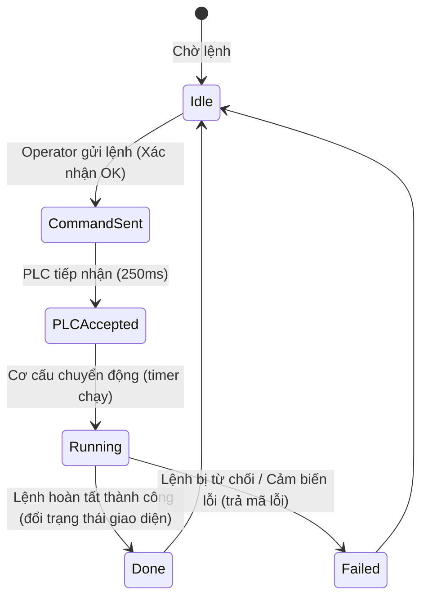

# Tài liệu Thiết kế Kỹ thuật - Operation Control Center (OCC)

## 1. Overview
Tính năng này cung cấp một trung tâm vận hành tập trung chuyên nghiệp (OCC) cho nhân viên vận hành bãi xe Puzzle. Tại đây, operator có toàn quyền kiểm soát chế độ hoạt động, gửi lệnh trực tiếp, khởi chạy/tạm dừng block, và khắc phục sự cố có hướng dẫn.

### Mục tiêu (Goals)
- Tạo một trang điều khiển vận hành OCC chuyên biệt.
- Cho phép gửi các lệnh điều khiển block (Start, Stop, Pause, Resume, Lock, Unlock, Disable) và đổi chế độ (Auto, Manual, Maintenance, Emergency).
- Tích hợp checklist động hướng dẫn quy trình phục hồi sau lỗi (Guided Recovery Checklist).
- Cung cấp tính năng gọi xe/trả xe trực tiếp của operator.
- Mô phỏng pipeline trạng thái gửi lệnh PLC trực tiếp thời gian thực.

---

## 2. Architecture & Tech Stack

### Technology Stack
- **Backend**: ASP.NET MVC 5, C# (Controller routing)
- **Frontend**: Razor View, HTML5, CSS (Vanilla + Tailwind CSS inline styles), JavaScript (ES6)
- **Icons**: Lucide Icons
- **Persistence**: browser `localStorage` để đồng bộ dữ liệu trạng thái block và checklist giữa các trang.

### Sơ đồ luồng trạng thái lệnh PLC (Mermaid Diagram)

---

## 3. Canonical Contracts & Invariants (Hợp đồng Dữ liệu & Ràng buộc)

Giao diện OCC sẽ sử dụng chung và đồng bộ dữ liệu thông qua các key trong `localStorage` sau:

| Tên Key | Kiểu Dữ Liệu | Mục Đích | Ràng Buộc |
|---------|--------------|----------|-----------|
| `occBlockStates` | JSON Object | Lưu trạng thái hoạt động và chế độ của từng block | Các trạng thái hợp lệ: `Normal`, `Running`, `Warning`, `Error`, `Maintenance`, `Offline`, `Disabled` |
| `occActiveRecovery` | JSON Object | Lưu trạng thái checklist phục hồi đang thực hiện của block bị lỗi | Chỉ tồn tại khi block có trạng thái `Error` và checklist đang chạy |
| `palletCycleData` | JSON Object | Lưu chu kỳ chạy của các pallet (từ trang báo cáo tần suất) | Dùng để cập nhật độ hao mòn cơ khí |
| `activeAlarms` | JSON Array | Lưu trữ các cảnh báo đang hoạt động | Khi lỗi được Reset thành công trên OCC, cảnh báo tương ứng phải được gỡ bỏ |
| `occBypassedSensors`| JSON Object | Lưu danh sách cảm biến bị bypass của từng block | Danh sách các chuỗi cảm biến: `safeguard`, `lift-limit`, `overload` |
| `occAdminOverride` | Boolean String | Trạng thái cờ cưỡng bức Admin hoạt động toàn hệ thống | Nhận giá trị `true` hoặc `false` |

---

## 4. Components and Interfaces

### Giao diện OperationControl.cshtml
Trang được chia thành các khu vực:
1. **Lưới chọn Block (Block Overview Grid):** Hiển thị danh sách tất cả các block thuộc Zone được chọn dưới dạng các card trạng thái thu nhỏ kèm các thông số nhanh.
2. **Bảng điều khiển Block chi tiết (Block Control Panel):** Xuất hiện khi click chọn một block cụ thể, gồm:
   - *Status Banner:* Hiển thị chế độ hiện tại (Auto/Manual...) và trạng thái cơ học (Bình thường, Lỗi...).
   - *Admin Override Banner:* Hiển thị thông báo nhấp nháy màu vàng khi chế độ Cưỡng bức Admin được kích hoạt.
   - *Mode Selector Buttons:* Các nút chuyển đổi chế độ Auto, Manual, Maintenance, Emergency.
   - *Operation Action Buttons:* Các nút Start, Stop, Pause, Resume, Lock, Unlock, Disable block.
   - *Direct PLC Command Input:* Hộp nhập mã lệnh raw (ví dụ: `CMD_ROT_P02`), nút Send, và hàng đèn LED chỉ báo tiến trình (`Command Sent`, `PLC Accepted`, `Running`, `Done/Failed`).
   - *Bypass Sensor & Admin Override Buttons:* Hai nút thao tác nhanh cho phép bỏ qua cảm biến và kích hoạt override an toàn.
   - *Operator Dispatch Forms:* Form Gọi xe vào (chọn biển số) và Trả xe ra (chọn pallet đang đỗ) hoạt động ở chế độ Manual.
3. **Bảng hướng dẫn phục hồi sự cố (Guided Recovery Panel):** Hiển thị checklist các bước động khi block bị lỗi (Error).

---

## 5. Luồng xử lý chi tiết (System Flows)

### 5.1. Luồng Gửi lệnh PLC trực tiếp
- Khi operator click "Send":
  1. Hiển thị hộp thoại Modal xác nhận bảo mật: `"Bạn có chắc chắn muốn gửi trực tiếp lệnh [Command] xuống PLC của block [Block ID]?"`.
  2. Nếu xác nhận: Kích hoạt đèn LED `Command Sent` sáng xanh.
  3. Sau 300ms, chuyển sang đèn LED `PLC Accepted`.
  4. Sau 500ms tiếp theo, chuyển sang đèn LED `Running` (vẽ thanh tiến trình chạy).
  5. Khi tiến trình đạt 100%: đổi trạng thái block tương ứng (ví dụ: Start -> `Running`, Stop -> `Normal`) và sáng đèn `Done`. Khóa đầu vào cho đến khi chu kỳ kết thúc.
  6. Nếu giả lập lỗi (ví dụ lệnh không hợp lệ), chuyển đèn `Failed` đỏ và hiển thị mã lỗi cụ thể (ví dụ: `ERR_PLC_CMD_TIMEOUT_0x1E`).

### 5.2. Luồng Phục hồi sau lỗi (Fault Guided Recovery)
- Khi block có trạng thái `Error`:
  1. Hệ thống tự động khóa tất cả các điều khiển vận hành thường quy.
  2. Hiển thị bảng checklist hướng dẫn động:
     - *Bước 1:* Xác nhận cảm biến quang ngoài biên không có vật cản.
     - *Bước 2:* Xác nhận khóa chốt an toàn đã mở.
     - *Bước 3:* Nhấn Reset PLC và chạy Homming (đồng bộ gốc).
  3. Nhân viên vận hành phải click chọn tích hoàn thành Bước 1 và Bước 2 thì nút "Reset Fault & Home" mới được mở khóa.
  4. Khi nhấn nút "Reset Fault & Home", gửi lệnh reset lỗi xuống PLC. Khi lệnh chạy thành công, khôi phục block về trạng thái "Normal", gỡ bỏ cảnh báo lỗi khỏi danh sách `activeAlarms` và lưu trạng thái sạch vào `localStorage`.

### 5.3. Bỏ qua cảm biến (Bypass Sensor) và Cưỡng bức Admin (Admin Override)
- **Bypass Sensor:** Khi người vận hành bật Bypass cho một cảm biến, cơ cấu an toàn cơ học sẽ bỏ qua kiểm tra hoặc cảnh báo lỗi của cảm biến đó (ví dụ bypass SafeGuard cho phép vận hành khi phát hiện vật thể quét giả lập).
- **Cưỡng bức Admin:** Khi cờ cưỡng bức Admin kích hoạt (`occAdminOverride = true`), hệ thống SCADA cho phép operator thực thi toàn bộ các lệnh Start/Pause/Resume và Gọi/Trả xe ngay cả khi block đang bị lỗi (`Error`) hoặc bị khóa bảo trì (`Disabled`).

---

## 6. Testing Strategy
- **Unit Tests (JS Helper Functions)**:
  - Kiểm tra hàm chuyển đổi trạng thái block `updateBlockState(blockId, newState)` cập nhật chính xác thuộc tính trong đối tượng dữ liệu.
  - Kiểm tra hàm tính toán tiến trình lệnh.
- **Integration/UI Tests (Manual Verification)**:
  - Click chọn chế độ *Manual* -> Xác nhận form Gọi/Trả xe mở ra.
  - Click chọn chế độ *Maintenance* -> Xác nhận nút *Disable block* mở ra.
  - Chọn một block bị lỗi -> Kiểm tra xem checklist phục hồi lỗi có hiển thị đúng các bước và khóa nút Reset PLC khi chưa tích đủ checklist hay không.
  - Thực hiện Reset lỗi -> Kiểm tra xem block có đổi sang màu xanh (Normal) và cảnh báo trên Dashboard có biến mất hay không.
