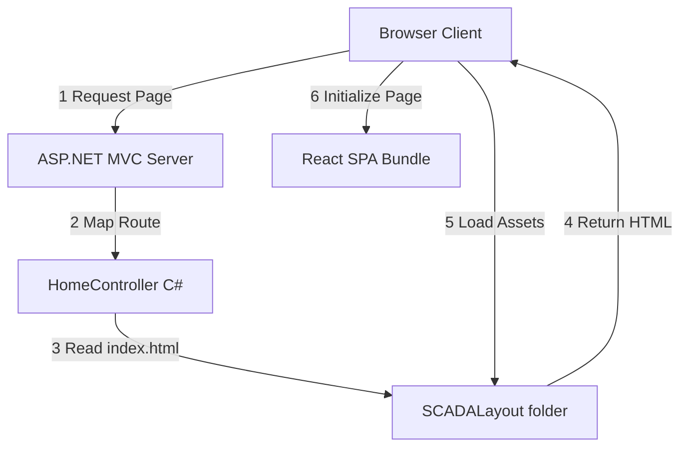
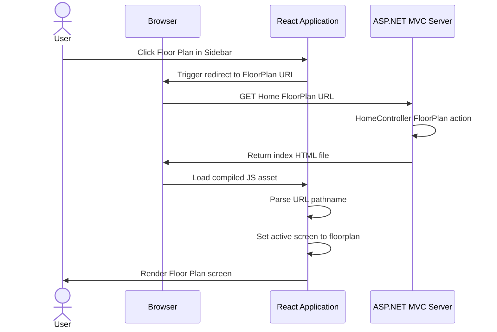

# Design Document: SCADA Web Integration

---
**Purpose**: Hướng dẫn chi tiết cách tích hợp giao diện React tĩnh từ [TotalParkingLayout](file:///c:/Users/HOME/source/repos/TotalParking/TotalParkingLayout) vào backend C# ASP.NET MVC [TotalParking](file:///c:/Users/HOME/source/repos/TotalParking/TotalParking) đảm bảo định tuyến backend hoạt động trơn tru và độc lập với mã nguồn React ban đầu.
---

## Overview

### Purpose
Tính năng này chuyển đổi giao diện SCADA tĩnh viết bằng React/Vite từ dự án [TotalParkingLayout](file:///c:/Users/HOME/source/repos/TotalParking/TotalParkingLayout) thành các tài nguyên tĩnh chạy trực tiếp trên host backend ASP.NET MVC [TotalParking](file:///c:/Users/HOME/source/repos/TotalParking/TotalParking). Điều này giúp người dùng truy cập giao diện giám sát SCADA đồng nhất và cho phép quản lý các đường dẫn điều hướng trực tiếp bằng Routing phía Backend C#.

### Users
- **Nhân viên vận hành hệ thống đỗ xe:** Sử dụng giao diện web này để giám sát mặt bằng bãi xe, quản lý thẻ, theo dõi cảnh báo và lịch bảo trì thiết bị.
- **Nhà phát triển hệ thống:** Có thể dễ dàng thay đổi cấu hình hoặc điều hướng của trang web thông qua mã nguồn C# và xóa bỏ hoàn toàn thư mục React ban đầu để giảm tải dung lượng lưu trữ dự án.

### Impact
- Thay đổi cấu hình build của dự án React tại [TotalParkingLayout](file:///c:/Users/HOME/source/repos/TotalParking/TotalParkingLayout) (chuyển sang base path `/SCADALayout/`).
- Bổ sung thư mục `/SCADALayout` chứa tài nguyên tĩnh đã biên dịch vào dự án C# [TotalParking](file:///c:/Users/HOME/source/repos/TotalParking/TotalParking).
- Thêm các Route Action mới trong [HomeController](file:///c:/Users/HOME/source/repos/TotalParking/TotalParking/Controllers/HomeController.cs) để điều hướng các trang SCADA.

### Goals
- Trích xuất thành công toàn bộ giao diện từ React sang HTML/JS/CSS tĩnh chạy ổn định trên IIS.
- Điều hướng chuyển màn hình hoàn toàn qua backend URL (không dùng client state chuyển đổi kín).
- Cho phép xóa bỏ thư mục [TotalParkingLayout](file:///c:/Users/HOME/source/repos/TotalParking/TotalParkingLayout) sau khi tích hợp mà website vẫn chạy bình thường.

### Non-Goals
- Xây dựng API C# để đồng bộ dữ liệu động với database (dữ liệu tạm thời vẫn dùng mock data của React).
- Cấu hình phân quyền đăng nhập hay quản lý phiên làm việc của người dùng trong giai đoạn này.

---

## Architecture

### Existing Architecture Analysis
Dự án C# [TotalParking](file:///c:/Users/HOME/source/repos/TotalParking/TotalParking) hiện tại là một ứng dụng ASP.NET MVC truyền thống dùng Razor View để kết xuất giao diện. Nó có sẵn định tuyến mặc định `{controller}/{action}/{id}`. Để chạy ứng dụng React SPA mà không bị xung đột với các thành phần cũ (như Bootstrap mặc định trong `_Layout.cshtml`), chúng ta sẽ chạy độc lập giao diện SCADA bằng cách trả về trực tiếp file `index.html` tĩnh đã biên dịch.

### Architecture Pattern & Boundary Map



### Technology Stack

| Layer | Choice / Version | Role in Feature | Notes |
|-------|------------------|-----------------|-------|
| Frontend / CLI | React 18.3.1 / Vite 6.3.5 | Xây dựng giao diện SCADA | Dùng Tailwind CSS v4 và Radix UI |
| Backend / Services | ASP.NET MVC (.NET Framework) | Host và điều phối định tuyến | Sử dụng controller trả về FileResult tĩnh |
| Build Scripts | Node.js script | Tự động hóa biên dịch và copy tài nguyên | Copy từ dist/ sang TotalParking/SCADALayout |

---

## Canonical Contracts & Invariants

| Contract Area | Canonical Decision | Applies To | Must Stay Consistent In |
|---------------|--------------------|------------|-------------------------|
| Route Mapping | URL `/Home/[Action]` sẽ phục vụ cùng một file `/SCADALayout/index.html` | C# Controller & React Router | `HomeController.cs` và định tuyến React |
| Asset Base Path | Tất cả tài nguyên tĩnh được tải từ `/SCADALayout/assets/` | Vite config & C# serving | `vite.config.ts` và thư mục static của IIS |
| Routing State | Khởi tạo trang dựa trên `window.location.pathname` của Browser | React App Startup | [App.tsx](file:///c:/Users/HOME/source/repos/TotalParking/TotalParkingLayout/src/app/App.tsx) |

---

## System Flows

### Sequence Diagram: Chuyển trang và Khởi tạo qua Backend Routing



---

## Requirements Traceability

| Requirement | Summary | Components | Interfaces | Flows |
|-------------|---------|------------|------------|-------|
| 1.1 | Chạy lệnh build tĩnh tạo ra HTML/JS/CSS | Node.js Build Script | N/A | Quy trình đóng gói đóng vai trò chuẩn bị |
| 1.2 | Phục vụ file tĩnh từ thư mục `/assets` | IIS / MVC Static Files | Static assets serving | Phục vụ script và css từ `/SCADALayout/assets` |
| 1.3 | View Index chứa HTML và tắt layout mặc định | index.html -> C# serving | HomeController | Trả về FileResult tĩnh từ Controller |
| 2.1 | HomeController map các action SCADA về Index | HomeController | C# Controller Actions | Điều hướng tất cả request phụ về view chính |
| 2.2 | React đọc pathname để xác định screen | App | React App initialization | Phân tích pathname và set screen state ban đầu |
| 2.3 | Sidebar click chuyển hướng URL thật | Sidebar | SidebarProps | Click mục sidebar đổi window.location.href |
| 3.1 | Nút chuyển đổi ngôn ngữ ở Header | Header / App | AppState | Chọn vi/en cập nhật ngôn ngữ hiển thị |
| 4.1 | Thời gian tải trang dưới 1.5 giây | React App | N/A | Tối ưu hóa bundle và load assets tĩnh nhanh |
| 5.1 | Chạy độc lập sau khi xóa thư mục React | SCADALayout | N/A | Hoạt động không phụ thuộc TotalParkingLayout |

---

## Components and Interfaces

### Component Summary Table

| Component | Domain/Layer | Intent | Req Coverage | Key Dependencies (P0/P1) | Contracts |
|-----------|--------------|--------|--------------|--------------------------|-----------|
| `App` | Frontend / UI | Quản lý trạng thái và khởi tạo màn hình từ URL | 2.2, 3.1, 4.1 | `Sidebar` (P0), `Header` (P0) | State |
| `Sidebar` | Frontend / UI | Hiển thị menu và kích hoạt chuyển hướng URL thật | 2.3 | `SCREEN_URLS` (P0) | Service, State |
| `HomeController` | Backend / Controller | Tiếp nhận các route SCADA và trả về index.html | 1.3, 2.1 | Static File System (P0) | API / File Serving |

### Frontend

#### Component: App (`App.tsx`)

| Field | Detail |
|-------|--------|
| Intent | Khởi chạy ứng dụng, phân tích URL ban đầu và kết xuất màn hình SCADA phù hợp |
| Requirements | 2.2, 3.1, 4.1 |

**Responsibilities & Constraints**
- Phân tích `window.location.pathname` khi ứng dụng vừa mount để hiển thị đúng component màn hình.
- Quản lý trạng thái ngôn ngữ toàn cục (`lang` state: `"vi" | "en"`).

**Contracts**: State [x]
##### State Model
```typescript
export type Screen =
  | "dashboard" | "floorplan" | "zones" | "routing"
  | "alarms" | "maintenance" | "reports" | "cards"
  | "settings" | "remote";

export interface AppState {
  screen: Screen;
  lang: "vi" | "en";
  selectedBlock: any | null;
}
```

**Implementation Notes**
- Sử dụng hàm helper `getScreenFromPath()` để khớp các chuỗi con trong URL với giá trị của `Screen`.

---

#### Component: Sidebar (`Sidebar.tsx`)

| Field | Detail |
|-------|--------|
| Intent | Cung cấp danh sách menu SCADA và kích hoạt điều hướng trang thông qua Backend URL |
| Requirements | 2.3 |

**Responsibilities & Constraints**
- Khi nhấp vào các nút menu, chuyển hướng trình duyệt tới URL backend tương ứng (ví dụ `/Home/FloorPlan`) thay vì chỉ cập nhật local state.
- Cho phép chạy SPA bình thường khi phát hiện môi trường phát triển cục bộ (`localhost:5173`).

**Contracts**: Service [x]
##### Service Interface
```typescript
export const SCREEN_URLS: Record<Screen, string> = {
  dashboard: "/Home/Index",
  floorplan: "/Home/FloorPlan",
  zones: "/Home/Zones",
  routing: "/Home/Routing",
  alarms: "/Home/Alarms",
  maintenance: "/Home/Maintenance",
  reports: "/Home/Reports",
  cards: "/Home/Cards",
  settings: "/Home/Settings",
  remote: "/Home/Remote",
};
```

---

### Backend

#### Class: HomeController (`HomeController.cs`)

| Field | Detail |
|-------|--------|
| Intent | Xử lý các Action trong Controller của C# và trả về file `index.html` tĩnh từ thư mục `/SCADALayout` |
| Requirements | 1.3, 2.1 |

**Responsibilities & Constraints**
- Đọc nội dung file `index.html` từ thư mục vật lý `~/SCADALayout/index.html`.
- Trả về đối tượng `FileResult` với kiểu MIME `"text/html"` cho tất cả các Action tương ứng với SCADA.

**Contracts**: API [x]
##### API Contract
| Method | Endpoint | Response | Errors |
|--------|----------|----------|--------|
| GET | /Home/Index | index.html (tĩnh) | 404 (nếu thiếu file) |
| GET | /Home/FloorPlan | index.html (tĩnh) | 404 (nếu thiếu file) |
| GET | /Home/Alarms | index.html (tĩnh) | 404 (nếu thiếu file) |
| GET | /Home/Maintenance | index.html (tĩnh) | 404 (nếu thiếu file) |
| GET | ... | index.html (tĩnh) | 404 (nếu thiếu file) |

---

## Data Models

### No Data Model Changes
Tính năng này chỉ phục vụ mục đích chuyển đổi và đóng gói giao diện tĩnh từ React sang ASP.NET MVC. Không bổ sung hay sửa đổi bất kỳ cấu trúc dữ liệu lưu trữ nào ở phía Backend (Database) trong giai đoạn này. Mọi dữ liệu hiển thị tạm thời vẫn được lấy từ mock data sẵn có ở Frontend.

---

## Error Handling

### Error Strategy
Hệ thống xử lý lỗi bằng cách đảm bảo tải tài nguyên tĩnh an toàn và điều hướng thân thiện.

### Error Categories and Responses
- **System Errors (5xx) / File Not Found (404)**:
  - Nếu file `index.html` trong thư mục `/SCADALayout/` bị thiếu hoặc bị xóa nhầm, C# Controller sẽ ghi log và trả về trang báo lỗi HTML chuẩn của ASP.NET MVC thay vì crash ứng dụng.
- **Client Route Not Found (404)**:
  - Nếu người dùng truy cập một URL không hợp lệ (ví dụ `/Home/Unknown`), hệ thống định tuyến mặc định của MVC sẽ tự động trả về lỗi 404 chuẩn.

---

## Testing Strategy

### Unit Tests
- `getScreenFromPath` unit test: Kiểm tra xem các pathname đầu vào khác nhau (ví dụ `/Home/FloorPlan`, `/Home/`, `/Home/Alarms/`) có trả về đúng Screen tương ứng không.

### Integration Tests
- Kiểm tra xem các Action trong `HomeController` của C# có trả về đúng file tĩnh `index.html` với mã trạng thái HTTP 200 hay không.
- Kiểm tra xem đường dẫn tài nguyên tĩnh `/SCADALayout/assets/...` có tải thành công (HTTP 200) trên IIS khi truy cập hay không.

### E2E/UI Tests
- **Quy trình Điều hướng:** Bấm vào biểu tượng mặt bằng trên Sidebar -> Trình duyệt gửi yêu cầu mới lên Server -> Tải trang thành công -> Giao diện hiển thị đúng Mặt bằng bãi xe.
- **Quy trình Đa ngôn ngữ:** Nhấp chọn chuyển đổi Tiếng Anh ở Header -> Toàn bộ text ở Sidebar và Dashboard đổi sang tiếng Anh.

---

## Conditional Sections

### Security Considerations
- **XSS Prevention**: Tài nguyên tĩnh được build trực tiếp bằng Vite đã loại bỏ các lỗ hổng tiêm mã độc. Do không dùng cơ chế Razor để render giá trị đầu vào trực tiếp từ URL, rủi ro XSS qua HTML được hạn chế tối đa.
- **Static Serving Security**: Cấu hình IIS chỉ cho phép đọc các file tĩnh trong thư mục `/SCADALayout/assets/` (.js, .css, .svg, .png), không cho phép thực thi bất kỳ tệp tin kịch bản nào khác tại đây.

### Performance & Scalability
- **Metric targets**:
  - Thời gian phản hồi load file `index.html` từ C# controller: `< 100ms`.
  - Tải toàn bộ assets tĩnh trên trình duyệt (trong điều kiện cache hoạt động): `< 200ms`.
