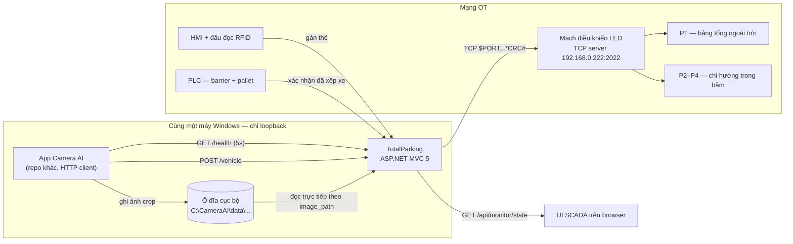
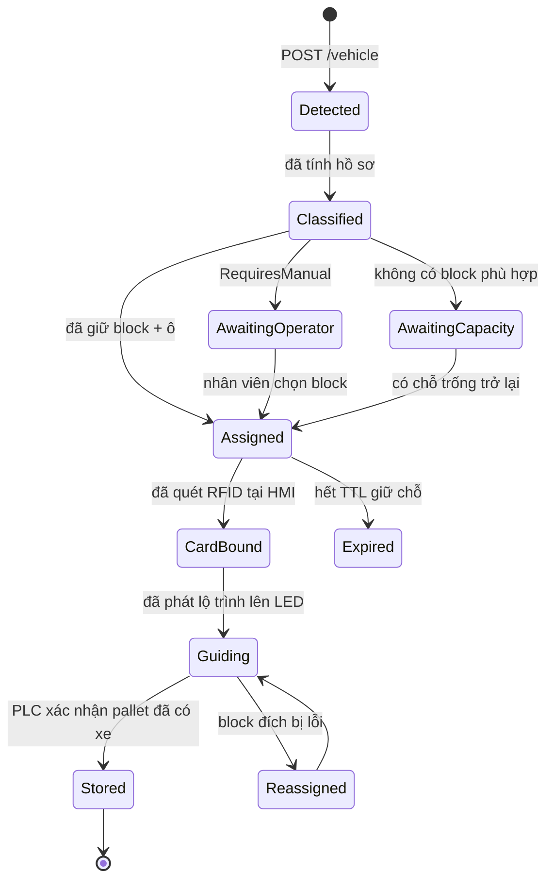

# Thiết kế luồng xe vào — Camera AI → Phân bổ Block → Điều hướng LED

Thiết kế cho luồng xe vào bãi: phát hiện xe tại cổng, phân loại, chọn block, hướng dẫn
tài xế bằng bảng LED chỉ hướng, và ghi nhận xe vào hệ thống theo dõi.

Trạng thái: **chỉ là thiết kế**. Chưa viết code. Mục 12 liệt kê các quyết định cần chốt
trước khi triển khai.

## 1. Phạm vi và các ràng buộc bắt buộc

**Trong phạm vi**, theo 6 lớp tương ứng §3–§8: phát hiện xe (Camera AI đẩy HTTP sang) →
phân loại (kích thước/khối lượng → lớp năng lực đỗ) → phân bổ (chọn zone/block/ô theo chỗ
trống + cân bằng tải) → điều hướng (lệnh TCP tới bảng LED) → ghi nhận (chốt occupancy khi
PLC/HMI xác nhận) → giám sát (UI phản ánh luồng di chuyển thời gian thực).

### Các ràng buộc định hình toàn bộ thiết kế

1. **Camera là client, hệ thống của chúng ta là server.** `docs/TAI_LIEU_API.docx` yêu cầu
   chúng ta host `GET /health` và `POST /vehicle`. JavaScript trên browser không thể nhận
   POST đến từ bên ngoài, nên phần ingest **buộc phải** nằm ở server-side C#.

2. **Bảng LED dùng TCP thuần, không phải HTTP.** Bảng LED là TCP *server*; chúng ta là
   client. JavaScript trên browser không mở được TCP socket, nên phần xuất LED cũng
   **buộc phải** ở server-side C#.

   > Hệ quả: mô hình "toàn bộ logic nằm ở FE" không thể bao được tính năng này. Đây là
   > lớp runtime server-side đầu tiên của dự án. Nhưng nó **không** cần database — xem §9.

3. **Đường dẫn endpoint bị cố định ở root.** App camera chỉ cho phép cấu hình IP và port,
   không cấu hình được path. Do đó `/health` và `/vehicle` phải nằm ngay gốc site, không
   được đặt dưới `/api/...`.

4. **Chưa cài package Web API.** `packages.config` chỉ có MVC 5.2.7 và Newtonsoft.Json
   12.0.2. Cả hai endpoint đều có thể phục vụ bằng một MVC controller thuần với route khai
   báo tường minh — **không cần thêm NuGet dependency nào**.

5. **Camera không gửi biển số.** Nó gửi `event_id`, make, model, year, kích thước, khối
   lượng, `category`, `image_path`. Trong khi mọi view hiện tại (`Cards`, `Queue`,
   `Tracking`, `occPalletOccupancy`) đều lấy biển số làm khóa. Khoảng trống này được xử lý
   ở §6.

6. **Bảng LED cần được refresh định kỳ.** Tài liệu yêu cầu gửi lại tối thiểu mỗi 10 giây và
   nói im lặng ~30 giây là socket bị đóng — probe chưa tái hiện được vế sau (§7.2b). Vẫn
   giữ heartbeat; `LedControl/Form1.cs` hiện chưa có.

7. **Camera AI và hệ thống này chạy trên cùng một máy, chỉ qua loopback.** Nguyên văn:
   *"Hai app chạy trên cùng 1 máy, nên chỉ đi qua localhost."* Camera AI là một repo
   khác, một process khác, không phải thứ chúng ta build hay deploy. Điều này thay đổi
   khá nhiều giả định — xem §3.2, §3.4, §3.6.

8. **Camera AI là bên duy nhất chủ động gọi.** Cả hai mũi tên trong sơ đồ của tài liệu
   đều đi từ Camera AI sang chúng ta. Không có endpoint nào để chúng ta gọi ngược lại:
   không query được, không xin gửi lại được, không hỏi được trạng thái của họ. Mọi thứ
   chúng ta biết về xe đều đến từ `POST /vehicle` mà họ chủ động đẩy sang.

**Ngoài phạm vi:** luồng xe ra/lấy xe, tính phí, chọn giao thức PLC, xác thực người dùng.

## 2. Sơ đồ hệ thống



## 3. Lớp 1 — Tiếp nhận dữ liệu từ Camera

### 3.1 Hợp đồng giao tiếp (nguyên văn theo `docs/TAI_LIEU_API.docx`)

```
GET  /health   → trả bất kỳ mã 2xx trong vòng 5 giây, gọi mỗi 5 giây, 24/7
POST /vehicle  → trả 2xx khi đã nhận và lưu xong sự kiện
```

Body của `POST /vehicle`:

```json
{ "event_id": "ai_20260812_143022_517", "timestamp": "2026-08-12T14:30:22",
  "make": "Toyota", "model": "Vios", "year": "2021-2023",
  "length_mm": 4425, "width_mm": 1730, "height_mm": 1475, "weight_kg": 1075,
  "category": "Nhỏ/Nhẹ", "source": "total_parking_camera_ai",
  "image_path": "C:\\CameraAI\\data\\bboxcropDisplay\\ai_...jpg" }
```

Ba điểm trong bảng mô tả trường quyết định cách dùng những con số này (chi tiết §4.4):
`length_mm` là **thông số hãng**, `width_mm` **không tính gương**, `weight_kg` là **khối
lượng bản thân**. `year` là một *khoảng* (`"2021-2023"`) — dấu hiệu đây là tra cứu catalog
theo model generation, không phải số đo chiếc xe trước mặt.

- **Đọc body dưới dạng UTF-8.** Trường `category` có dấu tiếng Việt.
- **Chống trùng theo `event_id`** — camera gửi lại khi nhận mã khác 2xx hoặc timeout, nên
  cùng một `event_id` chắc chắn đến nhiều lần. Thiết kế đang hoãn, §3.6.
- **Mã khác 2xx nghĩa là "gửi lại sau".** Tuyệt đối không trả 500 cho một xe mà ta chỉ đơn
  giản là không xếp được — camera sẽ gửi lại vô hạn. Xe không xếp được là kết quả **nghiệp
  vụ**: trả `200` và ghi nhận việc từ chối trong state của ta.
- Kích thước/khối lượng bằng `0` khi không xác định; `make`/`model`/`year`/`category` có
  thể là `"Unknown"`. Coi `0` và `"Unknown"` là *không có thông tin*, không bao giờ là giá
  trị thật.

### 3.2 Quyết định về hosting

| Vấn đề | Quyết định |
|---|---|
| Framework | MVC controller thuần (`IngestController`), không dùng Web API |
| Route | Đăng ký **trước** route Default trong `RouteConfig` |
| Giao thức | **HTTP thuần, không HTTPS** — xem (a) |
| Binding | Chỉ loopback, dùng IP loopback riêng: `http://127.0.0.4:8080` — xem (b) |
| Xác thực | Không dùng `X-API-Key`; ranh giới an ninh thật là binding — xem (c) |
| Response | `ContentResult`, `application/json`, `{"status":"ok"}` |
| Chống trùng | **Hoãn** (§3.6); khi làm thì phải bền qua restart — §9 |

**(a) HTTPS ở đây vô ích và còn gây hại.** Traffic loopback không rời khỏi máy nên TLS
không bảo vệ thêm gì, trong khi nó buộc app Camera AI phải tin dev cert của chúng ta —
một điểm vỡ tự tạo. Cả hai code mẫu trong tài liệu đều dùng `http://` thuần. Endpoint
ingest phải là binding HTTP riêng, không dùng lại binding HTTPS `44327` hiện có.

**(b) Dùng IP loopback riêng, không dùng `127.0.0.1`.** Tài liệu tự gợi ý
`VD: IP: 127.0.0.4, PORT: 8080`, và đó là gợi ý có lý: Windows coi cả dải `127.0.0.0/8`
là loopback, nên `127.0.0.4:8080` không xung đột với `127.0.0.1:8080` — port bị chiếm rất
thường xuyên (Jenkins, Tomcat, dev server). Tránh được xung đột mà không phải thương
lượng port với mọi thứ khác trên máy.

Quan trọng: **bind vào đúng IP loopback, không bind `0.0.0.0`.** Bind `0.0.0.0:8080` là
mở cho toàn mạng OT POST xe giả vào hệ thống.

**(c) `X-API-Key` không đáng dùng.** Tài liệu ghi key *"chỉ có nếu bạn yêu cầu"* — quyền
quyết định thuộc chúng ta. Trên loopback, kẻ tấn công khả dĩ duy nhất là một process khác
trên cùng máy, mà process đó cũng đọc được config để lấy key. Ranh giới an ninh thật là
(b). Chỉ thêm key nếu sau này binding bị đổi ra ngoài loopback.

**(d) Cùng máy nghĩa là cùng đồng hồ.** `timestamp` là *"Giờ máy"* — chính đồng hồ của
chúng ta. Không có sai lệch clock, so sánh trực tiếp với `DateTime.Now` là hợp lệ. Điều
này **không** còn đúng nếu sau này camera tách sang máy khác.

**(e) Cùng máy nghĩa là tranh chấp tài nguyên.** Camera AI chạy inference ăn CPU/GPU và
ghi ảnh liên tục xuống đĩa; app pool của chúng ta cạnh tranh trực tiếp. Hệ quả: `/health`
phải cực nhẹ, mọi I/O nặng (socket LED, ghi snapshot) đẩy sang worker nền, không flush
đĩa đồng bộ theo từng sự kiện.

**(f) Không còn kịch bản lỗi mạng.** Loopback không mất gói, độ trễ ~0. Nên khi camera
thấy chúng ta "chết" thì **luôn là lỗi phía chúng ta**: process dừng, app pool recycle,
port chưa bind, hoặc handler bị block. Ngân sách 5 giây cho `/health` là rất thoải mái —
tiêu hết được nó là tự gây ra.

Đăng ký route (path phải nằm ở gốc — xem ràng buộc 3):

```csharp
routes.MapRoute("ingest-health",  "health",  new { controller = "Ingest", action = "Health"  });
routes.MapRoute("ingest-vehicle", "vehicle", new { controller = "Ingest", action = "Vehicle" });
```

`/health` phải giữ ở mức tối giản: không lock state, không I/O tới LED, không đọc/ghi đĩa.
Đây là probe kiểm tra sống, bị gọi 17.280 lần mỗi ngày, và một `/health` chậm sẽ bị camera
hiểu là hệ thống của chúng ta đang chết.

### 3.3 Yêu cầu 24/7 không thể đáp ứng khi chạy bằng F5

Camera kỳ vọng `/health` trả lời liên tục. IIS Express dưới Visual Studio chỉ chạy khi IDE
còn mở, và port của nó là `44327` qua **HTTPS**, không phải port HTTP mà camera sẽ trỏ tới.

Các phương án, theo thứ tự ưu tiên:

1. **Dựng site trên IIS** với binding HTTP cố định ở port đã chọn, app pool đặt
   `AlwaysRunning` / idle timeout `0`. Đây là phương án duy nhất thực sự đáp ứng "24/7".
2. IIS Express thêm binding HTTP — chấp nhận được để test tích hợp với bên cung cấp
   camera, không dùng cho production.

Lưu ý một tác dụng phụ có lợi: `/health` bị gọi mỗi 5 giây sẽ giữ app pool luôn nóng, nên
việc recycle do idle timeout khó xảy ra khi camera đã chạy. Nhưng thời gian khởi động lại
sau một lần recycle **thủ công** vẫn là khoảng trống.

> Đây là quyết định về triển khai, không phải quyết định về code, và cần có câu trả lời
> trước khi cung cấp IP và port cho bên camera.

Vì cả hai app phải sống lại sau khi máy khởi động, IIS cần `app pool = AlwaysRunning`
**và** `site preloadEnabled = true`. Không có `preloadEnabled` thì app chỉ khởi tạo ở
request đầu tiên — camera sẽ nhận vài lần `/health` lỗi ngay sau mỗi lần boot, mà theo
tài liệu đó là tín hiệu "SCADAR đang chết".

### 3.4 `image_path` — cùng máy nên đọc được trực tiếp

Tài liệu ghi: *"Đường dẫn ảnh crop trên máy này. Có thể rỗng."* Vì cùng một máy,
**đường dẫn này mở được trực tiếp bằng `File.OpenRead`** — không cần API tải ảnh, không
cần bên camera cung cấp thêm gì.

Đây là năng lực có giá trị thật: `Routing.cshtml` đang mock một *"Màn hình 55 inch trạm
phân loại"*, và ảnh crop chính là thứ nên hiện trên đó — nhân viên thấy đúng chiếc xe hệ
thống vừa phân loại, thay vì chỉ thấy mấy con số.

Bốn điều bắt buộc khi hiện thực:

1. **Phục vụ qua controller action, không phải đường dẫn tĩnh.** File nằm ngoài web root
   (`C:\CameraAI\data\...`), IIS không phục vụ trực tiếp được.

2. **Kiểm tra đường dẫn nằm trong root đã allowlist, trước khi mở.** `image_path` là dữ
   liệu ngoài; đem thẳng vào `File.OpenRead` rồi phơi ra HTTP là tạo ra lỗ đọc file tùy ý
   trên máy chủ SCADA. Bắt buộc `Path.GetFullPath` rồi so tiền tố với root cấu hình trong
   `Web.config`, lệch là từ chối. Ràng buộc "cùng máy, chỉ loopback" **không** miễn trừ
   việc này — nó giới hạn ai gọi được, không giới hạn ta đọc gì.

3. **Chịu được file chưa tồn tại hoặc đang bị chiếm.** Camera có thể vẫn đang ghi ảnh khi
   POST đến. Mở với `FileShare.ReadWrite`, coi thiếu ảnh là bình thường chứ không phải lỗi.

4. **Trường có thể rỗng** — UI phải hiển thị đẹp khi không có ảnh.

Không copy ảnh sang thư mục của mình: ảnh đã nằm trên đĩa đó, nhân đôi chỉ thêm bài toán
dọn rác cho thứ ta không sở hữu vòng đời.

### 3.5 Repo khác nghĩa là cần bộ giả lập để dev

Không sửa được và cũng không debug được phía họ, nên: **script giả lập camera**
(`.ps1`/`.http`) POST payload mẫu vào `/vehicle` — đủ 6 giá trị `category`, một ca
`Unknown`, một ca kích thước `0` — để trong `TotalParking/scratch/`, không có nó thì tiến
độ bị khóa vào lịch bên camera; **ghi log body thô kèm `event_id`** để phân xử khi hai repo
tranh chấp "bên nào sai"; và **parse dễ dãi**, bỏ qua trường lạ (Newtonsoft mặc định đã
vậy) vì không có type dùng chung nên họ thêm trường mới không được phép làm ta sập.

### 3.6 Tài liệu bị thiếu hẳn phần chống trùng

Bảng trường trỏ `event_id … xem **mục 4**` và `category … xem **mục 5**`, nhưng mục 4 thực
tế *là* category và tài liệu nhảy từ mục 4 sang **mục 6** — không tồn tại mục 5. Suy ra bản
gốc từng có mục 4 = chống trùng; bản ta nhận đã mất. Thông tin còn sót chỉ là câu *"sẽ gửi
lại xe đó sau"* và một `set` trong code mẫu.

Hệ quả: **không biết camera gửi lại sau bao lâu, mấy lần, bỏ cuộc khi nào.** Thiết kế chống
trùng vì vậy được hoãn (quyết định của chủ dự án) — nó là chi tiết độ bền của giai đoạn
sau, không ảnh hưởng việc hiểu luồng. Cần hỏi lại bên camera trước khi hiện thực (§12).

## 4. Lớp 2 — Phân loại xe

### 4.1 Tồn tại hai hệ phân loại độc lập

Camera và bảng LED **không** dùng cùng một hệ lớp kích thước.

`category` của camera được ghép từ hai trục độc lập:

| Trục kích thước (dài × rộng × cao) | | Trục khối lượng | |
|---|---|---|---|
| ≤ 4800 × 2000 × 1900 mm | `Nhỏ` | ≤ 2350 kg | `Nhẹ` |
| ≤ 5000 × 2000 × 1900 mm | `Tiêu chuẩn` | 2351 – 2600 kg | `Nặng` |
| lớn hơn | `Quá khổ` | > 2600 kg | `Quá khổ` |

Ghép lại: một trong hai trục rơi vào `Quá khổ` → trả `"Quá khổ"` không hậu tố; ngược lại
trả `"<kích thước>/<khối lượng>"`. Tập đầy đủ: `Nhỏ/Nhẹ`, `Nhỏ/Nặng`, `Tiêu chuẩn/Nhẹ`,
`Tiêu chuẩn/Nặng`, `Quá khổ`, `Unknown`.

Ba bộ đếm của bảng LED lại là một hệ phân loại **khác** (theo tài liệu giao thức PDF, tên
trường lấy từ code mẫu của chính nhà cung cấp):

| Trường | Tên theo NCC | Ý nghĩa |
|---|---|---|
| `X5.X6` | `Mechanical_L_5M` | số chỗ trống, cơ khí, L ≥ 5 M |
| `X7.X8` | `Mechanical_L_4_8M` | số chỗ trống, cơ khí, L < 4.8 M |
| `X9.X10` | `Normal` | số chỗ trống, đỗ thường (không cơ khí) |

### 4.2 Đề xuất quy đổi — cần xác nhận

```
Nhỏ/*          → Mechanical_L_4_8M   (dài ≤ 4800)
Tiêu chuẩn/*   → Mechanical_L_5M     (4800 < dài ≤ 5000)
Quá khổ        → Normal              (không dùng pallet cơ khí)
Unknown        → nhân viên quyết định thủ công, không tự động phân bổ
```

Khối lượng là một bộ lọc *riêng*, không phải một làn: `Nặng` (2351–2600 kg) giới hạn tập
ứng viên còn lại các block có tải trọng pallet ≥ 2600 kg. `Quá khổ` theo khối lượng thì
loại toàn bộ block cơ khí, bất kể chiều dài.

**Vấn đề còn mở — dải 4800–5000 mm.** Camera gọi 4800–5000 mm là `Tiêu chuẩn`; còn các lớp
của bảng LED là `L ≥ 5M` và `L < 4.8M`, tức là theo đúng nghĩa chữ thì dải 4800–5000 mm
không thuộc lớp nào. Đưa nó vào làn `L ≥ 5M` là lựa chọn an toàn (khoang dài hơn thì luôn
chứa được xe ngắn hơn), và đó là cách quy đổi ở trên — nhưng cần xác nhận lại với thực tế
các khoang đã thi công. Xem §12.

**Vấn đề còn mở — UI đang dùng hệ phân loại thứ ba.** `Routing.cshtml:172` mock bảng ngoài
trời là `SUV: 38 | Sedan: 55 | Đỗ thường: 24`. `SUV`/`Sedan` là kiểu thân xe, không phải
lớp chiều dài của giao thức, và camera thì không hề trả về kiểu thân xe. Các nhãn này phải
được đổi lại theo ba lớp của giao thức, hoặc phải tài liệu hóa cách quy đổi — nếu không,
con số trên bảng LED thật sẽ không khớp với con số trên màn hình của nhân viên vận hành.

### 4.3 Hồ sơ năng lực suy ra được

Kết quả phân loại, tính một lần lúc tiếp nhận và sau đó không đổi:

```csharp
class VehicleProfile {
    string  EventId;
    int     LengthMm, WidthMm, HeightMm, WeightKg;  // 0 = không xác định
    string  RawCategory;                            // đúng như camera gửi
    LedClass Lane;              // MechL48M | MechL5M | Normal
    int     MinPalletRatingKg;  // 0, 2350, hoặc 2600
    bool    RequiresManual;     // true khi Unknown / có input nào bằng 0
}
```

`RequiresManual` là van an toàn: khi camera trả `Unknown` hoặc kích thước bằng `0`, hệ
thống **không được** đoán khoang mà phải đưa xe vào hàng đợi chờ nhân viên. Đoán ở đây
nghĩa là điều một chiếc van dài 5,4 m vào pallet 4,8 m.

### 4.4 Dữ liệu camera có đủ để chọn block không? — Có, nhưng cần biên

Quyết định "xe này vừa khoang đó không" cần đúng bốn con số: dài, rộng, cao, khối lượng.
**Camera cung cấp đủ cả bốn**, nên bài toán giải được; phần chặn nằm ở bảng năng lực block
phía ta (§5.2), không ở camera. Bốn điều chỉnh sau là bắt buộc:

1. **Số catalog, không phải số đo.** Camera nhận dạng make/model/generation rồi tra kích
   thước. Nhận dạng sai (Vios ↔ Yaris) thì kích thước sai một cách rất tự tin, và payload
   **không có trường confidence** — không phân biệt được nhận dạng chắc chắn với phỏng
   đoán. Sai lệch thực tế cũng vô hình: thùng nóc, giá chở xe đạp, body kit, lốp quá cỡ.
   Thùng nóc đáng lo nhất vì nó đổi *chiều cao* — chiều mà pallet cơ khí hẹp nhất.

2. **`weight_kg` là khối lượng bản thân, không phải thực tế.** Điểm quan trọng nhất về an
   toàn: MPV 7 chỗ kerb 1.900 kg khi chở đủ người và hành lý có thể lên 2.400 kg; pallet
   giới hạn 2.350 kg thì số catalog nói "ổn" trong khi thực tế quá tải. Camera không gửi
   GVW cũng không gửi khối lượng thực. **Phải so với ước lượng có tải** (kerb + biên).

3. **`width_mm` không tính gương**, nhưng gương chính là thứ va vào ray trong khoang puzzle
   — gương mở thêm khoảng 150–250 mm tổng. Cần biên riêng cho chiều rộng.

4. **Không dùng `category` để phân bổ.** Nó nén bốn số thành một trong sáu chuỗi, và ngưỡng
   rộng/cao giống nhau ở cả `Nhỏ` và `Tiêu chuẩn` nên category chỉ phân biệt theo *chiều
   dài*: nó cho biết xe có dưới 2000 mm rộng hay không, chứ không cho biết rộng bao nhiêu.
   Với khoang giới hạn 1850 mm thì `Nhỏ` là vô dụng. **Quyết định bằng số mm/kg thô;
   `category` chỉ để hiển thị và đối chiếu.**

Kết luận: dữ liệu đủ cho một **đề xuất**, chưa đủ cho quyết định an toàn không người xác
nhận. Bù bằng biên an toàn từng chiều, khối lượng có tải, và bước nhân viên xác nhận kèm
ảnh crop (§3.4). Tỷ lệ `Unknown` thực tế chưa ai biết — thêm một lý do làm giai đoạn 1
(chỉ ghi log) trước, để đo tỷ lệ đó trước khi xây logic phân bổ đè lên.

## 5. Lớp 3 — Phân bổ block

### 5.1 Codebase hiện có gì

Theo `OperationControl.cshtml:495-566`: **6 zone**, 18 block (`Block A-01` … `Block E-03`),
**12 ô pallet mỗi block** (index `0..11`);
`occBlockStates[blockId] = { status, mode, locked, errorCode?, errorDesc? }` với
`status ∈ {Normal, Running, Error}` và `mode ∈ {Auto, Manual}`;
`occPalletOccupancy[blockId] = [biển số | null, × 12]`.

### 5.2 Cái gì còn thiếu

**Không** có bất kỳ metadata năng lực theo block nào trong codebase, và không có nó thì
không thể phân bổ. Cần một cấu hình tĩnh mới:

```csharp
class BlockProfile {
    string   BlockId;        // "Block A-01"
    int      ZoneId;         // 1..6
    BlockKind Kind;          // Mechanical | Normal
    int      MaxLengthMm;    // 4800 | 5000 | ...
    int      MaxWeightKg;    // 2350 | 2600
    int      SlotCount;      // 12
    LedClass Lane;           // block này nạp vào bộ đếm LED nào
    string   GuidancePanelId;// bảng LED nào chỉ đường tới block này
}
```

Đây là dữ liệu khảo sát hiện trường, không thể suy ra từ UI. Xem §12.

### 5.3 Thuật toán chọn block

```
1. LỌC (bắt buộc)  MaxLengthMm >= LengthMm + biên; MaxWeightKg >= tải có tải (§4.4);
                   Lane khớp; status=="Normal"; mode=="Auto"; !locked;
                   freeSlots(block) > 0   // đã trừ ô giữ chỗ, §5.4
2. XẾP HẠNG        a. tải zone ↑ (cân bằng tải)   b. tải block ↑
                   c. khoảng cách từ cổng ↑        d. blockId ↑ (tất định)
3. GIỮ CHỖ         ô trống index nhỏ nhất trong block thắng + reservation kèm TTL (§5.4)
4. RỖNG            → phiên = AwaitingCapacity, cảnh báo nhân viên, bộ đếm làn trên LED
                     hiển thị 0 màu đỏ. Không bao giờ âm thầm bỏ qua.
```

Tiêu chí (a) chính là cái `Routing.cshtml:129` đang mock dưới dạng *"Ngưỡng lệch mật độ
kích hoạt > 20%"*. Biến mock đó thành thật nghĩa là cân bằng tải là khóa sắp xếp chính,
không phải phép hiệu chỉnh áp vào sau.

### 5.4 Giữ chỗ (reservation) là bắt buộc

Giữa lúc phân bổ và lúc PLC xác nhận pallet có xe là vài phút — tài xế còn phải lấy thẻ và
lái vào. Trong khoảng đó ô đỗ **không trống mà cũng không có xe**. Không có trạng thái thứ
ba tường minh thì hai xe đến cách nhau 30 giây sẽ được gán cùng một ô.

```csharp
class SlotReservation {
    string   BlockId;
    int      SlotIndex;
    string   EventId;      // phiên đang sở hữu
    DateTime ExpiresAt;    // ví dụ now + 10 phút
}
```

`freeSlots(block) = các ô có occupancy == null VÀ không có reservation còn hiệu lực`

Một tiến trình quét giải phóng reservation hết hạn và chuyển phiên sang `Expired`. Giá trị
TTL là quyết định vận hành (§12).

## 6. Lớp 4 — Định danh, RFID, và việc chốt occupancy

### 6.1 Khoảng trống về định danh

Camera định danh xe bằng `event_id`. Hệ thống bãi định danh bằng **thẻ RFID**. UI hiện tại
định danh bằng **biển số**, thứ camera không bao giờ gửi. Ba khóa, không gì nối chúng lại.

Đề xuất cách nối, lấy thẻ làm khóa bền:

```
event_id  — khóa của camera. Từ lúc phát hiện đến khi gán thẻ.
card_id   — khóa RFID, gán tại HMI. Là khóa phiên từ đó trở đi.
plate     — không bắt buộc. Nhân viên nhập hoặc từ camera LPR riêng.
            Chỉ để hiển thị, không bao giờ là khóa tra cứu trong luồng xe vào.
```

`Tracking.cshtml:47` cho tìm theo *"Biển số hoặc Mã thẻ xe"* — với hợp đồng camera hiện
tại, chỉ nhánh tìm theo thẻ chạy tự động được.

### 6.2 Máy trạng thái của phiên



### 6.3 Occupancy do PLC chốt, không phải do chúng ta

Yêu cầu *"khi xe vào được block, phải ghi nhận được vào hệ thống theo dõi"* xác định chính
xác chỗ đặt điểm chốt.

**Phân bổ chỉ là ý định. Chỉ PLC/HMI xác nhận được sự thật vật lý.** Chốt occupancy ngay
lúc phân bổ sẽ tạo ra trạng thái theo dõi âm thầm lệch khỏi thực tế mỗi khi tài xế lấy thẻ
rồi bỏ đi mà không đỗ. Vì vậy `Stored` chỉ vào khi có xác nhận từ bên ngoài gửi đến, và
chỉ khi đó mới ghi occupancy.

### 6.4 Tích hợp PLC/HMI hiện chưa tồn tại

Đây là **khoảng trống lớn nhất của toàn luồng**. `Settings.cshtml:31` mock panel *"Kết nối
truyền thông PLC/HMI"* với địa chỉ Modbus TCP, nhưng không có client, không có lựa chọn
giao thức, không có code. Nên thiết kế dừng ở một hợp đồng nhận vào, do phía HMI/PLC gọi
hoặc do nhân viên bấm tay trong `OperationControl` cho tới khi phần tích hợp kia xong:

```
POST /api/gate/card-bound      { event_id, card_id }
POST /api/gate/store-confirmed { card_id, block_id, slot_index }
POST /api/gate/store-failed    { card_id, reason }
```

Các endpoint này nằm dưới `/api/...` — khác với endpoint của camera, ở đây chúng ta kiểm
soát cả hai đầu nên không bị ràng buộc phải đặt ở gốc.

Điều khiển barrier là trách nhiệm của **PLC**, kích hoạt bởi lần quét thẻ tại HMI. Vai trò
của hệ thống này là trả lời *"thẻ này có được phép không, và nên đi đâu"* — không trực tiếp
điều khiển barrier. Đặt việc đóng/mở barrier phía sau một HTTP request nghĩa là một lần
timeout HTTP sẽ thành một cái barrier bị kẹt.

## 7. Lớp 5 — Điều hướng LED

### 7.1 Giao thức — đã kiểm chứng

Lệnh gửi / phản hồi:

```
gửi:   $PORT,X1,X2.X3.X4,X5.X6,X7.X8,X9.X10*CRC#
nhận:  $PORT,X1,OK*CRC#
```

| Trường | Ý nghĩa | Giá trị |
|---|---|---|
| `X1` | cổng hiển thị đích | `0`→P1, `1`→P2, `2`→P3, `3`→P4 |
| `X2` | hướng mũi tên | `0` Up, `1` Right, `2` Down, `3` Left |
| `X3` | màu mũi tên | `0` Black (tắt), `1` Red, `2` Green, `3` Yellow |
| `X4` | trạng thái mũi tên | `0` đứng yên, `1` dịch chuyển |
| `X5`/`X6` | số chỗ trống / màu — cơ khí L ≥ 5 M | số nguyên / màu |
| `X7`/`X8` | số chỗ trống / màu — cơ khí L < 4.8 M | số nguyên / màu |
| `X9`/`X10` | số chỗ trống / màu — đỗ thường | số nguyên / màu |

`CRC` = XOR của toàn bộ byte nằm giữa `$` và `*` (không tính hai ký tự này), biểu diễn
bằng 2 chữ số hex in hoa.

**Đã kiểm chứng.** Checksum trong `LedControl/Led.cs:GetCommand()` chạy đối chiếu **toàn bộ
10 ví dụ** trong PDF (kể cả `$MOTOR,223*54#`) — **cả 10 khớp chính xác**, gồm cả các ca số
chỗ trống khác độ dài chữ số (`31` vs `311`), chỗ dễ sai nhất vì CRC phụ thuộc từng byte.
Vùng CRC cũng khớp code NCC: `for(i=1; i<Length; i++)` bỏ `Buffer[0]` tức ký tự `$`.
Kết luận: `Led.cs`/`LedSocket.cs` tái sử dụng được gần như nguyên trạng; thiếu gì xem §7.3.

### 7.2 Thông tin phần cứng từ tài liệu PDF

- Mạch LED là **TCP server**, ta là client. Mặc định `192.168.0.222`;
  `LedControl/Form1.cs:btnConnect_Click` dùng port **2022**. Giữ nút trên mạch 10 giây để
  reset về địa chỉ mặc định.
- Một mạch có **4 cổng HUB75 và 4 cổng HUB12**. HUB75 chỉ hỗ trợ P1–P3 (P4 không);
  HUB12 hỗ trợ đủ P1–P4. **Dự án dùng HUB12** → 4 bảng mỗi mạch.
- Một lệnh tác động một bảng. Nhiều bảng ⇒ nhiều lệnh **trên cùng một socket của mạch đó**
  → `LedSocket` là một-trên-một-mạch, không phải một-trên-một-bảng.
- **Bảng tổng ngoài trời cắm P1**, chỉ cần lệnh cho P1, ba con số là tổng toàn bãi.
- **Gửi lại tối thiểu mỗi 10 giây**, và tài liệu nói im lặng ~30 giây là thiết bị đóng
  socket — nhưng **probe không tái hiện được** (§7.2b). Nên test lại với 3–5 phút.
- **Bảng là loại hai màu, không phải RGB.** Module HUB12 gồm `P10 R`, `P10 G`, `P10 RG` —
  đỏ, xanh, đỏ+xanh; đó là lý do enum màu chỉ có 4 giá trị, với vàng = đỏ+xanh cùng sáng.
  Bảng đã test là `P10-RG` (§7.2b), nhưng nếu bảng nào là loại một màu thì gửi màu nó không
  có sẽ hiển thị sai. **Năng lực màu và số chữ số là thuộc tính vật lý theo từng bảng.**
- Ba con số **không** bị giao thức ràng với hướng mũi tên: Hình 8 cho ba bảng ở port 0/1/2
  hiện cùng bộ số nhưng khác mũi tên. Vậy "ba số này đếm cái gì" là lựa chọn của ta theo
  từng bảng — một bậc tự do, kèm yêu cầu định nghĩa một lần và nhất quán theo vai trò.
- `num_para.number` là `uint16_t` (tối đa 65535) và buffer NCC là `char M[64]`; lệnh dài
  nhất của ta khoảng 41 ký tự nên không có rủi ro tràn.

### 7.2b Kết quả probe trên phần cứng thật

`LedControl` chỉ chứng minh được phần hẹp: nó không có control chọn Port lẫn arrow state, và
`btnSend_Click` không gán `hub.Port`/`hub.Arrow.State` → mọi lệnh nó gửi đều là
`$PORT,0,<dir>.<color>.0,...`. Đã probe riêng bằng script TCP (không sửa project nào) trên
bảng thật tại `192.168.0.222:2022`:

**Đã xác nhận — cả ở mức giao thức lẫn quan sát trên bảng vật lý**

- **ACK là thật.** Mọi lệnh đều nhận `$PORT,X1,OK*CRC#`, CRC cả bốn hợp lệ theo đúng thuật
  toán XOR, và **ACK dội lại chỉ số cổng** → đối chiếu được với lệnh của từng bảng.
- **Địa chỉ hoá đa cổng chạy được.** `X1 = 0/1/2/3` đều ACK (`*2D# *2C# *2F# *2E#`) **và
  bảng vật lý sáng đúng cổng**. Đây là nền tảng của toàn bộ thiết kế dẫn đường nhiều bảng.
- **`X4 = 1` làm mũi tên dịch chuyển thật**, phân biệt được với `X4 = 0`.
- **Bảng hiện đủ cả ba màu** đỏ/xanh/vàng → là module **P10-RG hai màu**. Quy tắc màu ở
  §7.4 (xanh/vàng/đỏ) dùng được nguyên trạng.
- **Hiển thị 4 chữ số, đệm số 0**: gửi `44/55/66` thì bảng hiện `0044/0055/0066` → tối đa
  **9999**, trong khi giao thức nhận tới 65535 (`uint16_t`), nên phải chặn số trước khi
  gửi. Bãi này 216 chỗ nên không chạm ngưỡng, nhưng giới hạn vẫn phải nằm trong config.
- **Bảng giữ nguyên frame cuối, kể cả sau khi client ngắt kết nối** — sau 40 giây im lặng
  và sau khi script đóng socket, bảng vẫn hiện mũi tên xanh + `0044/0055/0066`. Socket cũng
  sống sót 40 giây, **mâu thuẫn với tài liệu** (§7.2).

**Hệ quả quan trọng: dữ liệu cũ treo vĩnh viễn.** Bảng là màn hình câm có trạng thái — thứ
ta ghi lần cuối nằm đó mãi, không tự xoá. Publisher chết là bảng tiếp tục quảng cáo số chỗ
trống cũ, dẫn tài xế vào khu đã đầy. Thiết bị không có watchdog → §7.3 mục 4.

### 7.3 `LedControl` còn thiếu gì để dùng được cho production

`LedControl` là công cụ test thủ công. Cần bổ sung bốn thứ:

1. **Heartbeat.** `Form1` chỉ gửi khi bấm nút. Cần timer nền phát lại frame hiện tại cho mọi
   bảng theo nhịp ≤ 10 giây. Probe cho thấy bảng giữ frame kể cả khi ngắt kết nối (§7.2b),
   nên heartbeat **không** phải để giữ hiển thị — mà để tuân thủ tài liệu và phát hiện đứt
   kết nối sớm.
2. **Đọc phản hồi — đã xác nhận có thật, nên dùng.** Cả `LedSocket.Send` lẫn
   `SendBufferToSlave` của NCC đều không đọc `$PORT,X1,OK*CRC#`. Nhưng probe (§7.2b) cho
   thấy thiết bị **luôn** trả ACK hợp lệ và **dội lại chỉ số cổng**. Nên đọc, kiểm CRC, đối
   chiếu chỉ số cổng với lệnh vừa gửi — chỉ báo sức khỏe theo từng bảng, có sẵn, miễn phí.
3. **Điểm gọi không được block.** `LedSocket` tuần tự hóa hoàn toàn bằng `lock`, send
   timeout 3 giây, kèm reconnect-rồi-thử-lại — tức có thể mất ~6 giây bên trong lock. Hợp
   lý cho một cái nút WinForms, không thể chấp nhận trên thread xử lý ingest. Phát LED
   phải chạy trên worker nền nạp qua queue; `POST /vehicle` không bao giờ `await` socket.
4. **Chống dữ liệu cũ treo vĩnh viễn.** Bảng giữ frame cuối mãi mãi (§7.2b) nên publisher
   chết là bảng tiếp tục quảng cáo số sai. Thiết bị không có watchdog, ta phải tự xử lý: ghi
   **frame an toàn** (số về 0 màu đỏ, hoặc tắt mũi tên `X3=0`) khi shutdown có trật tự; và
   vì lúc crash không ghi được gì, `/api/monitor/state` phải phơi `last_ack_ts` theo từng
   bảng để nhân viên thấy dữ liệu đã cũ bao lâu.

### 7.4 Mô hình bảng LED

```csharp
class LedPanel {
    string     PanelId;       // "OUT-01", "TUN-B1-01"
    string     ControllerIp;
    int        ControllerPort; // 2022
    int        PortIndex;      // 0..3 → P1..P4
    PanelRole  Role;           // OutdoorTotals | TunnelDirection
    int?       TargetZoneId;   // chỉ dùng cho TunnelDirection
    Direction  Arrow;          // cố định theo cách lắp đặt thực tế
    ColorMode  Colors;         // RedOnly | GreenOnly | RedGreen — vật lý, §7.2
    int        DigitCapacity;  // số chữ số; bảng đã test = 4, đệm 0 (§7.2b)
}
```

Cách dựng frame theo vai trò:

| Vai trò | Mũi tên | Ba bộ đếm |
|---|---|---|
| `OutdoorTotals` | tắt (`X3=0`) | tổng chỗ trống toàn bãi theo từng làn |
| `TunnelDirection` | hướng cố định theo lắp đặt | tổng chỗ trống chỉ của `TargetZoneId` |

Quy tắc màu: `count > ngưỡng cao` → Green (2); `count > 0` → Yellow (3); `count == 0` →
Red (1); làn không do bảng đó phục vụ → Black (0).

Trạng thái mũi tên `X4=1` (dịch chuyển) khi đang có xe được điều hướng chủ động theo nhánh
đó; `X4=0` khi bảng chỉ báo số lượng.

> Danh mục bảng LED thực tế — bao nhiêu bảng, cắm cổng nào, mỗi bảng lắp hướng nào, phục vụ
> zone nào — là dữ liệu khảo sát hiện trường. `Routing.cshtml` mock đúng hai bảng ("LED
> Ngoài trời", "LED Trong hầm"), gần như chắc chắn không phải số lượng thật. Xem §12.

## 8. Lớp 6 — UI giám sát thời gian thực

### 8.1 Đặt ở đâu

`Routing.cshtml` (*"Điều hướng giao thông & Phân loại xe (AI-VDS)"*) đã là bản mock tĩnh
của đúng luồng này — thanh tải theo zone, màn hình trạm phân loại, trạng thái bảng LED,
lời gọi kiểm soát ra vào. 380 dòng HTML thuần, **không một dòng JavaScript**. Làm nó
"sống" là gắn dữ liệu thật vào, không phải thiết kế lại.

| View | Thay đổi |
|---|---|
| `Routing.cshtml` | chính — trở thành luồng xe vào thời gian thực, kèm ảnh crop (§3.4) |
| `Queue.cshtml` | `dispatchEntryQueue` lấy từ phiên thật thay cho `mockEntryQueue` |
| `FloorPlan` / `ZoneDetail` | làm nổi bật block được gán, hiển thị ô đang giữ chỗ |
| `Tracking.cshtml` | timeline 3 bước chạy theo trạng thái phiên thật |
| `Index.cshtml` | KPI chỗ trống lấy từ số đếm thật |

### 8.2 Cách truyền dữ liệu

Dùng polling, không dùng push. WebSocket và SSE trên MVC 5 / .NET 4.5 không đáng đánh đổi.

```
GET /api/monitor/state → { sessions[]:  { event_id, card_id?, state, profile, assignment, ts }
                           capacity:    { theo làn / zone / block: { free, total } }
                           reservations[]: { block_id, slot_index, expires_at }
                           led[]:       { panel_id, online, last_ack_ts, frame }
                           ingest:      { last_health_ts, last_vehicle_ts } }
```

Poll mỗi 1–2 giây từ `Routing`, chặn theo `document.visibilitychange` để tab ở nền ngừng
poll. Một endpoint duy nhất trả snapshot nhất quán, tránh UI hiển thị trạng thái bị xé lẻ
ghép từ nhiều lời gọi.

### 8.3 Giữ nguyên hợp đồng localStorage hiện có

`CLAUDE.md` ghi rõ `activeAlarms`, `palletCycleData`, `occBlockStates`,
`occPalletOccupancy` là hợp đồng liên trang và không có test nào bảo vệ. State thời gian
thực mới nằm **ở server và tách biệt**. Không trỏ lại các trang cũ sang nó trong cùng một
lần thay đổi — chuyển từng view một, bắt đầu từ `Routing` vì trang này không phụ thuộc
localStorage nên là điểm khởi đầu không rủi ro.

## 9. State ở server mà không cần database

Hiện không có database và ở đây cũng không thêm. Một store singleton trong bộ nhớ là đủ:

```csharp
static class EntryFlowState {
    ConcurrentDictionary<string, Session>          Sessions;      // theo event_id
    ConcurrentDictionary<string, string>           CardToEvent;   // card_id → event_id
    ConcurrentDictionary<string, SlotReservation>  Reservations;  // "block|slot"
    HashSet<string>                                SeenEventIds;  // chống trùng, 24h
    ConcurrentDictionary<string, PanelHealth>      Panels;
}
```

**Toàn bộ dữ liệu này mất mỗi lần app pool recycle.** Khi reservation đang giữ những chiếc
xe thật trên đường vào, đó là rủi ro vận hành thực sự. Giảm thiểu tối thiểu: ghi snapshot
JSON append-only vào `App_Data/` mỗi lần đổi trạng thái, nạp lại ở `Application_Start`.
Đây là giải pháp chống cháy tạm thời cho đến khi có BE, không phải thứ thay thế BE.

Khi chống trùng được hiện thực (đang hoãn, §3.6), tập `event_id` phải bền qua restart: mất
nó rồi camera gửi lại là ta giữ **ô thứ hai cho cùng một chiếc xe** → rò rỉ năng lực và số
trên bảng LED sai. Một file append-only là đủ, vì `event_id` tự mang timestamp.

Ngoài ra `POST /vehicle` có thể đến đồng thời (tài liệu không hứa tuần tự), nên bước "tìm ô
trống nhỏ nhất rồi giữ chỗ" là chuỗi đọc-sửa-ghi và **phải nằm trong critical section** —
`ConcurrentDictionary` một mình không bảo vệ được chuỗi đó.

## 10. File mới và ảnh hưởng tới project

```
Controllers/  IngestController   GET /health, POST /vehicle, ảnh crop (§3.4)
              GateController     card-bound, store-confirmed, store-failed
              MonitorController  GET /api/monitor/state
Services/     VehicleClassifier  category camera → VehicleProfile
              BlockAllocator     lọc + xếp hạng + giữ chỗ
              EntryFlowState     store bộ nhớ + snapshot
              Led/LedFrame       từ LedControl/Led.cs (CRC đã kiểm chứng)
              Led/LedSocket      từ LedControl + heartbeat; một socket / một mạch
              Led/LedPublisher   worker nền, nhịp ≤10s, N frame cho N bảng
Models/       VehicleEvent  VehicleProfile  Session  BlockProfile  LedPanel  SlotReservation
App_Start/RouteConfig.cs   + route gốc /health, /vehicle
Views/Home/Routing.cshtml  + gắn dữ liệu thời gian thực
Web.config                 + binding ingest, root ảnh crop, danh mục bảng LED
scratch/                   + script giả lập camera (§3.5)
```

- `Models/` hiện **rỗng** — đây là lần dùng thật đầu tiên.
- File `.cs` phải thêm vào `TotalParking.csproj` dạng `<Compile Include>`. Khác view Razor,
  C# biên dịch lúc build nên thiếu khai báo là lỗi build, không âm thầm thành 404 khi publish.
- Chỉ `Routing.cshtml` bị sửa trong số các view, và nó đã có trong `.csproj`.
- `LedPublisher` cần `HostingEnvironment.QueueBackgroundWorkItem` (từ .NET 4.5.2+).
  **Trên 4.5.0 không có** — kiểm tra framework đã cài, hoặc dùng thread riêng kèm
  `IRegisteredObject` để xử lý shutdown.

## 11. Thứ tự triển khai

| # | Giai đoạn | Kiểm chứng bằng |
|---|---|---|
| 1 | `/health` + `/vehicle`, chỉ ghi log | bên camera trỏ app của họ sang và thấy xanh |
| 2 | `VehicleClassifier` | kiểm tra theo bảng với đủ 6 giá trị `category` |
| 3 | ~~Probe LED~~ — **xong**, §7.2b | ACK, đa cổng, `X4`, 3 màu: xác nhận cả giao thức lẫn bảng thật |
| 4 | LED publisher + heartbeat, một bảng | bảng thật hiển thị đúng số, sống sót > 60 giây |
| 5 | Cấu hình `BlockProfile` + `BlockAllocator` | kết quả gán cho một bộ xe mẫu đã biết trước |
| 6 | `/api/monitor/state` + `Routing.cshtml` sống | nhân viên xem một lần phát hiện thật chạy hết luồng |
| 7 | Endpoint xác nhận tại cổng | occupancy chỉ chốt khi có xác nhận |
| 8 | Tích hợp PLC/HMI | *đang bị chặn — xem §12* |

Giai đoạn 1 nên làm trước vì bản thân nó đã có giá trị: tháo chốt cho bên camera, hiện
chưa test được gì khi không có IP, port và một `/health` đang sống.

Giai đoạn 3 đã chạy xong và không còn ẩn số kỹ thuật nào ở phần LED (§7.2b) — chỉ còn chờ
dữ liệu hiện trường (§12.2). Giai đoạn 1 và 4 độc lập nên chạy song song được nếu có 2 người.

## 12. Các quyết định còn mở

**Chặn hoàn toàn phần phân bổ**

1. **Bảng năng lực của block.** Cho từng block trong 18 block: cơ khí hay đỗ thường, dài
   tối đa, tải trọng pallet tối đa, số ô thật, và bảng LED nào chỉ đường tới nó. Không có
   nó thì không triển khai được §5.3, và không suy ra được từ code — 18 block trong
   `OperationControl.cshtml` được seed cùng một occupancy mock, không mang dữ liệu năng lực.

2. **Danh mục bảng LED + đồ thị topology.** Mỗi bảng: IP mạch, chỉ số cổng, hướng mũi tên
   lắp đặt, loại module màu, số chữ số, zone phục vụ. Bảng đã test là P10-RG 4 chữ số
   (§7.2b) — cần xác nhận các bảng còn lại có giống không. `Routing.cshtml` mock hai bảng;
   mỗi mạch hỗ trợ bốn bảng qua HUB12.

   Còn cần **đồ thị dẫn đường**: mỗi bảng, mỗi hướng mũi tên dẫn tới tập block nào. Không
   có nó thì không đặt được mũi tên đúng — đây mới là thứ làm "điều phối LED tới đúng nơi"
   hoạt động, không phải năng lực giao thức.

**Chặn việc chốt occupancy**

3. **Tích hợp PLC/HMI.** Giao thức (Modbus TCP mới là mock trong `Settings.cshtml`, chưa
   phải đã chọn), ai chủ động gọi, và cái gì xác nhận pallet đã có xe. Chưa chốt thì
   `Stored` chỉ đạt tới bằng thao tác nhân viên. Khoảng trống lớn nhất của toàn luồng.

**Cần hỏi bên Camera AI**

4. **Thông số gửi lại** (§3.6): khoảng thời gian, số lần tối đa, khi nào bỏ cuộc — phần
   chống trùng đã mất khỏi tài liệu nên ba con số này không có ở đâu. Không chặn giai đoạn 1.

5. **Path có cấu hình được không?** Tài liệu chỉ nói IP và port tùy chọn, nên §1.3 coi
   `/health` và `/vehicle` là cố định ở gốc. Nếu prefix cũng cấu hình được thì đặt dưới
   `/api/...` gọn hơn, khỏi chèn route vào gốc site. Chi phí hỏi ~0.

6. **Thư mục gốc của `image_path`** (§3.4): cần root cố định để allowlist (ví dụ
   `C:\CameraAI\data\`). Nếu camera ghi ảnh ra nhiều nơi thì cần đủ danh sách.

**Chặn việc triển khai**

7. **Hosting và địa chỉ.** IIS site (khuyến nghị) hay IIS Express, và chốt IP loopback +
   port giao cho bên camera. Đề xuất `http://127.0.0.4:8080` theo đúng ví dụ tài liệu, vì
   tránh xung đột với `127.0.0.1:8080` (§3.2b). Không dùng lại binding HTTPS 44327.

**Cần cho tính đúng đắn, mức ảnh hưởng thấp hơn**

8. **Dải 4800–5000 mm** (§4.2). Lớp `Tiêu chuẩn` của camera có đi vào làn `L ≥ 5M` không?
   Câu trả lời an toàn là có, nhưng cần xác nhận với các khoang đã thi công.

9. **Hệ nhãn của LED** (§4.2). `Routing.cshtml` hiển thị `SUV`/`Sedan`; giao thức đếm theo
   `L ≥ 5M` / `L < 4.8M` / `Normal`; camera thì không trả về cái nào trong hai hệ đó. Cần
   chọn một hệ nhãn duy nhất cho bảng LED thật và cho màn hình nhân viên.

10. **TTL giữ chỗ** (§5.4). Từ lúc phát thẻ đến lúc pallet được xác nhận, bao lâu thì giải
    phóng ô? Quá ngắn thì gán trùng; quá dài thì giam chỗ.

11. **Xử lý `Unknown`** (§4.3). Xác nhận rằng `Unknown` và kích thước bằng `0` sẽ vào hàng
    đợi nhân viên chứ không vào một khoang mặc định. Khuyến nghị: không bao giờ tự động gán.

## 13. Nguồn tham chiếu

- `docs/TAI_LIEU_API.docx` — hợp đồng camera, quy tắc `category`, loopback, `image_path`,
  và lỗ thiếu mục 4 (§3.6).
- `LedControl/Giao thức giao tiếp...pdf` — giao thức LED, sơ đồ cổng/HUB, nhịp 10 giây.
- `LedControl/Led.cs`, `LedSocket.cs`, `Form1.cs` — dựng frame (đã kiểm chứng CRC),
  socket, port 2022.
- `Views/Home/OperationControl.cshtml:495-566` — mô hình zone/block/ô, trạng thái block.
- `Views/Home/Routing.cshtml` — UI đích, ngưỡng cân bằng tải, mock bảng LED và màn 55".
- `Views/Home/Queue.cshtml:144-166` — cấu trúc hàng đợi xe vào.
- `App_Start/RouteConfig.cs`, `packages.config`, `Web.config` — routing, thiếu Web API,
  target framework.
