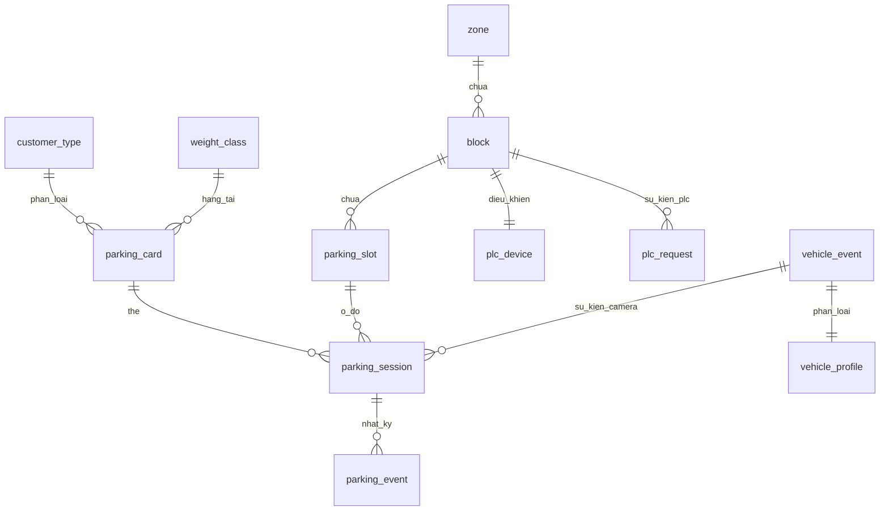
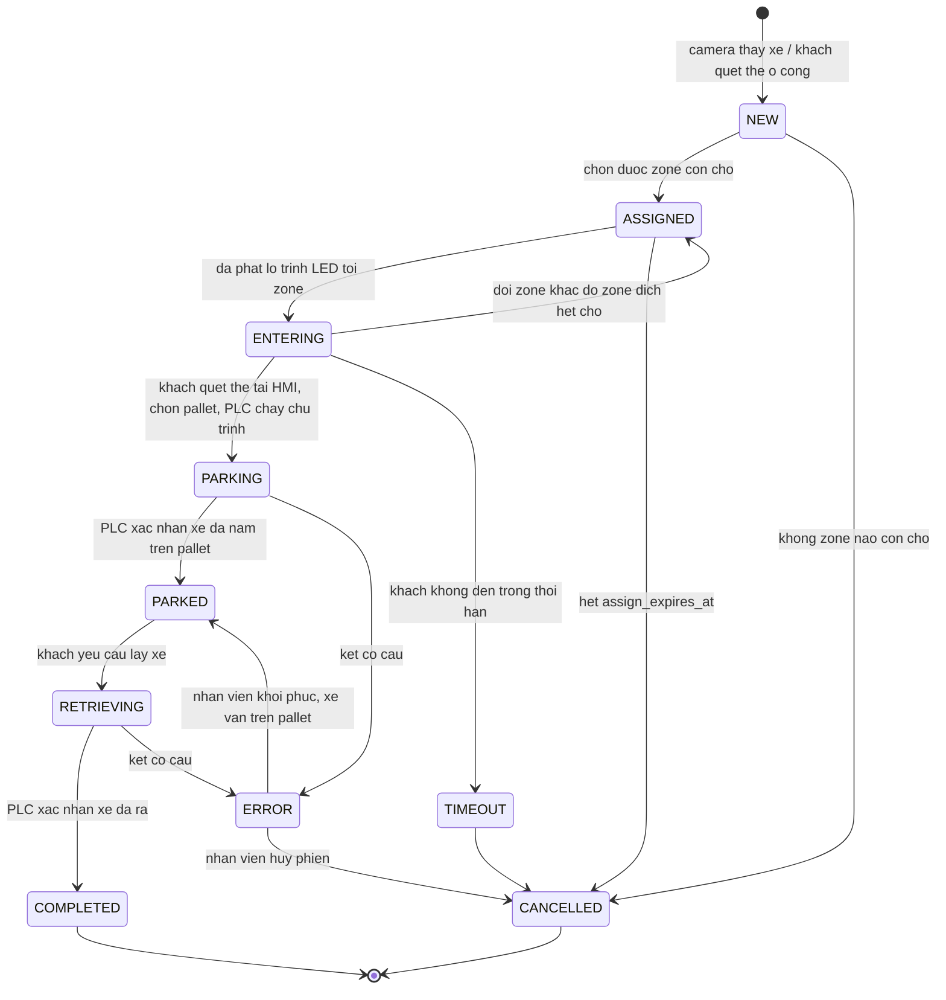

# Thiết kế database — Phiên gửi xe, Block/Pallet và tầng PLC

Mở rộng schema `total_parking` hiện có để phục vụ bài toán điều hướng xe và chống gửi xe
trùng nêu trong `docs/parking_scada_omron_plc_prompt.md`.

Trạng thái: **chỉ là thiết kế**. Chưa chạy DDL nào. Mục 12 liệt kê những gì cần chốt trước
khi tạo migration.

Tài liệu liên quan: `docs/camera-led-routing-design.md` (luồng xe vào, phân loại, LED) và
`docs/block-capability-README.md` (bảng khảo sát năng lực block).

**Sáu tiền đề đã chốt:**

1. **Danh tính của xe là thẻ RFID**, không phải Camera AI. Camera là nguồn bổ trợ — nó làm
   giàu thông tin và có quyền chặn khi phát hiện xe nặng hơn thẻ cho phép, nhưng luồng gửi xe
   không phụ thuộc vào nó. Xem mục 3.3 và 3.4.

2. **Bố cục bãi lấy từ bản vẽ CAD thật**, không phải từ mock trong code. Xem mục 5.

   `TotalParking/Images/LM-CL1-BAS-NTC-CP-SHD-0001-01-Mechanical Parking System Drawing_page-000{1..7}.jpg`
   là bản vẽ hệ thống đỗ xe cơ khí của tầng hầm, và `Images/zones_map.jpeg` là bản đã tô 6
   zone mà `FloorPlan.cshtml` đang dùng làm nền. Đây mới là nguồn sự thật về vị trí block và
   pallet — mọi con số trong `OperationControl.cshtml` và `block-capability-template.csv` đều
   phải bỏ đi.

3. **Quy tắc chọn ô khi thẻ rộng hơn xe cần: theo thẻ.** Mục 3.4 — đã chốt, không còn là câu
   hỏi mở.

4. **Khách chọn block, SCADA chỉ điều hướng.** SCADA dẫn xe tới **zone** hợp lệ (giai đoạn
   này khớp với giao diện zone đang có); trong zone đó khách tự chọn block để gửi, rồi chọn
   pallet trên HMI của block từ danh sách đã bị lọc sẵn. Lấy xe thì giải phóng ô đang chiếm.

   Hệ quả với schema: `parking_session.block_id` và `slot_id` **được điền muộn**, khi PLC báo
   về — không phải do SCADA gán lúc phân bổ. Xem mục 5.5 và 8.

5. **Camera AI chỉ có một vai trò: đưa ra category để điều hướng.** Nó không định danh xe,
   không quyết định block, không biết loại khách. Loại khách (vãng lai / xe tháng) và hạng
   tải chỉ biết được khi **quẹt RFID**, mà đường đọc RFID là **qua PLC**.

6. **Ba thanh ghi đã chốt địa chỉ:** `D100` (PLC ghi mã thẻ lên), `W75.0` (SCADA trả quyền
   `1`/`0`), `D402` (SCADA trả `2200`/`2600` để HMI ẩn/hiện pallet). Đây là phần trọng tâm
   hiện tại — xem mục 6.

## 1. Điểm xuất phát — database hiện có

Đã kiểm chứng trong `TotalParking/Database/*.sql` và `TotalParking/Services/`:

| Thành phần | Chi tiết |
|---|---|
| DBMS | MySQL 8.0.19+, InnoDB, `utf8mb4_0900_ai_ci` |
| Driver | `MySqlConnector` 2.6.2, ADO.NET thuần, **không ORM** |
| Quy ước | snake_case; tiền tố `uq_` / `ix_` / `fk_` / `v_`; comment trong `.sql` viết không dấu |

Năm bảng và hai view đang tồn tại:

```
customer_type    3 dòng   VANG / XT / GHI
weight_class     3 dòng   THUONG (max_weight_kg NULL) / 2200KG / 2600KG
parking_card     ~467     card_code CHAR(8), card_no, FK -> customer_type, weight_class
vehicle_event    log      event_id VARCHAR(48) PK, số đo từ Camera AI, raw_body JSON
vehicle_profile  log      1-1 với vehicle_event: lane, weight_class, required_pallet_kg

v_parking_card     phẳng hoá parking_card + hai bảng tra cứu
v_vehicle_intake   vehicle_event LEFT JOIN vehicle_profile
```

Hai điều ở phần đã có định hình toàn bộ phần thiết kế mới:

**`parking_card.card_code` là UID RFID 4 byte, lưu 8 ký tự hex** — comment tại
`01_schema.sql:45` nói rõ. 4 byte = 32 bit = **đúng 2 word PLC**. Đây là dữ kiện giải
quyết phần lớn câu hỏi "D100 encode thế nào" của prompt §8: không còn phải đoán độ rộng,
chỉ còn cần biết PLC đặt nó ở thanh ghi nào và theo thứ tự word nào.

**`weight_class` đã khớp sẵn với prompt §4.** THUONG có `max_weight_kg` NULL kèm diễn giải
"Quá tải — đỗ thường, không dùng pallet cơ khí". Ba loại RFID prompt mô tả đã có mã trong
DB, không cần tạo phân loại mới:

Và ba mã đó thực chất chỉ nói **xe được đỗ ở tầng pallet nào**, không phải một phép so sánh
tải trọng:

```
2200KG  ->  đỗ được cả pallet trên lẫn pallet dưới   -> mọi tier
2600KG  ->  chỉ pallet dưới                          -> tier = 0
THUONG  ->  không dùng pallet cơ khí                 -> chỉ block kind = Ground
```

Điều này làm gọn schema đáng kể: **không cần lưu tải trọng kg của từng ô.** `tier` là căn cứ
duy nhất, và nó đọc được từ bản vẽ. Con số `max_weight_kg` trong `weight_class` giữ nguyên vì
nó đang là dữ liệu thật của bảng thẻ, nhưng tầng chọn ô không dùng tới nó.

> **Luật `2600 -> chỉ tier 0` là ràng buộc an toàn, không phải quy tắc nghiệp vụ.**
> Đưa xe 2600 lên tầng trên thì khả năng cao **sập pallet**. Điều đó đổi cách xử lý mọi
> trường hợp không chắc chắn trong tài liệu này: khi hệ thống không biết chắc hạng của một
> thẻ, mặc định phải là **hạn chế** (chỉ tier 0), không bao giờ là cho phép. Xem mục 6.2 —
> đây là nơi luật này được thi hành thật.

## 2. Cái đang thiếu

Database hiện chỉ trả lời được *"thẻ này là thẻ gì"* và *"camera đã thấy xe nào"*. Nó chưa
biểu diễn được **bãi xe** lẫn **phiên gửi xe** — tức toàn bộ phần mà bài toán điều hướng cần:

| Thiếu | Hiện đang nằm ở đâu |
|---|---|
| `zone` / `block` / `parking_slot` | mock: `OperationControl.cshtml:499` và lưới 3x4 trong `localStorage` |
| `plc_device` | mock: `Settings.cshtml:40` ghi Modbus TCP port 502 (sai giao thức, Omron FINS là 9600) |
| `parking_session` | **không tồn tại** — đây chính là "single source of truth" prompt §6 yêu cầu |
| `parking_event` | không tồn tại, nên không truy vết được ai đổi trạng thái lúc nào |

Không có `parking_session` thì quy tắc *"1 RFID = 1 phiên ACTIVE"* không có chỗ nào để được
thực thi. `localStorage` không thay thế được: nó nằm trong từng trình duyệt, không nhìn thấy
lần quẹt thẻ ở HMI của block khác. Đây là ràng buộc vật lý, không phải lựa chọn kiến trúc.

## 3. Sáu quyết định thiết kế

### 3.1 Chống hai phiên ACTIVE — MySQL không có partial index

Trên SQL Server hay PostgreSQL, cách quen thuộc là filtered / partial unique index:

```sql
-- KHONG chay duoc tren MySQL
CREATE UNIQUE INDEX ... ON parking_session (card_id) WHERE status IN (...);
```

MySQL không hỗ trợ mệnh đề `WHERE` trên index. Cách tương đương, và là cách chuẩn trong
MySQL 8, là **cột sinh trả về NULL khi phiên đã đóng**, rồi đặt UNIQUE lên cột đó — vì
InnoDB cho phép nhiều NULL trùng nhau trong một unique index:

```sql
active_card_id INT UNSIGNED
    GENERATED ALWAYS AS (IF(status IN ('ASSIGNED','ENTERING','PARKING',
                                       'PARKED','RETRIEVING'), card_id, NULL)) VIRTUAL,
UNIQUE KEY uq_session_active_card (active_card_id)
```

Hệ quả đúng với yêu cầu nghiệp vụ:

- Phiên đang mở → `active_card_id = card_id` → lần quẹt thứ hai của cùng thẻ bị chặn **ở
  tầng lưu trữ**, bất kể quẹt ở block nào.
- Phiên `COMPLETED` / `CANCELLED` → NULL → thẻ dùng lại được cho lần gửi sau.
- Phiên chưa gán thẻ (`card_id` NULL, xe vừa được camera phát hiện) → NULL → không vướng
  ràng buộc. Điểm này quan trọng: nó cho phép tạo phiên ngay lúc camera thấy xe, **trước
  khi** có thẻ, mà không phải tách thành hai bảng.

Đây là **quyền phán quyết cuối cùng**. Kiểm tra ở tầng ứng dụng chỉ để trả thông báo đẹp;
nếu constraint này bị vi phạm thì đó là lỗi phần mềm, không phải tình huống cần xử lý mềm.

### 3.2 Cùng cơ chế đó chống hai xe vào một pallet

Prompt không nêu, nhưng lỗi này nghiêm trọng hơn cả gửi trùng — nó làm hỏng xe thật. Dùng
lại đúng kỹ thuật trên, cột sinh thứ hai:

```sql
active_slot_id INT UNSIGNED
    GENERATED ALWAYS AS (IF(status IN ('ASSIGNED','ENTERING','PARKING',
                                       'PARKED','RETRIEVING'), slot_id, NULL)) VIRTUAL,
UNIQUE KEY uq_session_active_slot (active_slot_id)
```

Lưu ý về thời điểm: theo tiền đề 4, SCADA không phân ô — `slot_id` chỉ được điền khi PLC báo
về ô mà khách đã bấm chọn trên HMI. Nên ràng buộc này **không** phải để chống hai xe cùng
được *phân* một ô (việc phân ô không còn tồn tại), mà để chống hai phiên cùng *nằm* trên một
ô. Nó bắt được đúng trường hợp nguy hiểm: PLC báo về một ô mà hệ thống đang tin là có xe khác.

Việc giữ chỗ mà `camera-led-routing-design.md` §5.4 đòi giờ ở **mức zone**: một phiên
`ASSIGNED` kèm `assign_expires_at` chiếm một suất trong `v_zone_capacity.in_use` (mục 5.5).
Vẫn không cần bảng `reservation` riêng.

### 3.3 RFID là danh tính của xe — không tạo bảng `vehicle`

Prompt §13 liệt kê `vehicles`. Không tạo, vì **thẻ RFID đã là danh tính**, và bảng của nó đã
tồn tại: `parking_card`.

Camera là nguồn **bổ trợ**, không phải nguồn định danh. Nó không gửi biển số
(`camera-led-routing-design.md` §6.1) — chỉ gửi `event_id`, hãng, đời, số đo. Tạo bảng
`vehicle` trên nền dữ liệu đó sẽ sinh ra một bảng mà mỗi lượt xe vào lại thêm một dòng mới:
mang tiếng là danh mục xe nhưng thực chất là bản sao của `vehicle_event`.

Ba hệ quả cần bám theo trong toàn bộ thiết kế:

**a. Phiên phải tạo được chỉ từ một lần quẹt thẻ.** Không có sự kiện camera thì phiên vẫn
hợp lệ. Trong DDL mục 7, `event_id` là `NULL`-able và **không** phải điều kiện để tạo phiên —
nó chỉ là dữ liệu làm giàu thêm khi camera có thấy xe. Khi camera hỏng hoặc xe vào lúc camera
mất heartbeat (`Routing.cshtml` gọi là AI-VDS Fallback Mode), luồng gửi xe không dừng.

**b. Hạng tải lấy từ thẻ trước, camera chỉ để đối chiếu.** `parking_card.weight_class_id` đã
có sẵn và có dữ liệu thật — xem mục 3.4. Đây mới là căn cứ chọn ô. Số đo camera dùng để
**chặn**, không dùng để **nới**.

**c. Thẻ = xe trong phạm vi một phiên, không phải xuyên suốt.** Thẻ vãng lai (`VANG`, 162 thẻ)
được phát ra rồi thu lại, nên `card_id` không truy được lịch sử "chiếc xe này đã vào bãi mấy
lần". Với thẻ tháng (`XT`, 110 thẻ) thì có, vì thẻ gắn với một khách cố định. Truy vấn lịch sử
theo xe chỉ có nghĩa với `XT` — cần nhớ điều này khi làm tab Báo cáo.

Giữ `plate VARCHAR(16) NULL` trên phiên để hiển thị khi nhân viên nhập tay. Khi nào mới nên
tạo bảng `vehicle`: lúc có LPR đọc biển ổn định, hoặc khi bảng thẻ tháng được bổ sung cột biển
số để gắn thẻ với một xe cụ thể. Cả hai đều chưa có.

**Hai đường vào một phiên.** Thẻ là danh tính, nhưng nó xuất hiện *muộn* trong luồng có camera:

```
Đường 1 — có camera:   camera thấy xe -> tạo phiên NEW (card_id NULL, event_id có)
                       -> chọn ô, ASSIGNED -> LED chỉ đường -> khách quẹt thẻ ở HMI
                       -> điền card_id vào chính phiên đó
Đường 2 — không camera: khách quẹt thẻ -> tạo phiên NEW (card_id có, event_id NULL)
                       -> chọn ô, ASSIGNED
```

Đường 1 buộc phải tạo phiên trước khi có thẻ, vì bảng LED phải chỉ được block trước khi tài xế
lái tới đó. Đường 2 là đường dự phòng khi camera hỏng, và cũng là đường của mọi thao tác quẹt
thẻ ở block.

Việc điền `card_id` vào một phiên `ASSIGNED` sẵn có là **UPDATE, không phải INSERT** — và
`uq_session_active_card` bắt đúng lúc đó: nếu thẻ này đã có phiên khác đang mở thì UPDATE thất
bại, hệ thống trả `ALREADY_PARKED`. Ràng buộc ở mục 3.1 vì vậy bảo vệ cả hai đường, không cần
thêm kiểm tra riêng cho đường 1.

Còn lại một câu hỏi vận hành: phiên đường 1 mà không ai quẹt thẻ (tài xế đổi ý, lái ra) sẽ
treo ở `ASSIGNED` giữ một ô. Đó là việc của `assign_expires_at` — mục 12.14.

### 3.4 Hai nguồn hạng tải — thẻ thắng, camera có quyền chặn

Hạng tải xuất hiện ở hai chỗ, cùng bộ giá trị (`04_vehicle_profile.sql:22` ghi rõ *"cung bo
gia tri voi parking_card.weight_class"*):

```
parking_card.weight_class_id     khách đã đăng ký gì   -> quyền được cấp
vehicle_profile.weight_class     camera đo được gì     -> nhu cầu thật của xe
```

Chúng có thể mâu thuẫn, và đây là mâu thuẫn nguy hiểm: thẻ ghi 2200KG nhưng xe thật cần
2600KG nghĩa là pallet sẽ nâng quá tải.

**Việc này code đã xử lý sẵn** — `VehicleClassifier.CheckAgainstCard` tại
[VehicleClassifier.cs:118](../TotalParking/Services/VehicleClassifier.cs#L118) so hai bên qua
thang `Rank`: `2200 < 2600 < THUONG` (đỗ nền là hạng *rộng nhất*, không phải thấp nhất, vì
nền nhận được mọi xe trong giới hạn bãi). Kết quả có bốn giá trị:

| Kết quả | Nghĩa | Xử lý khi chọn ô |
|---|---|---|
| `Ok` | khớp | chọn ô theo hạng của thẻ |
| `CardHigherThanNeeded` | thẻ rộng hơn xe cần | chọn theo **thẻ** (đã chốt) |
| `VehicleExceedsCard` | xe nặng hơn thẻ cho phép | **từ chối**, không phân ô |
| `Undetermined` | không có dữ liệu camera, hoặc camera bảo cần người xử lý | chọn theo **thẻ** |

Điểm quan trọng: `Undetermined` là trường hợp **bình thường**, không phải lỗi — nó xảy ra mỗi
khi khách quẹt thẻ mà không có sự kiện camera nào ghép được. Luồng phải chạy tiếp bằng hạng
tải của thẻ, đúng tinh thần mục 3.3a.

`CardHigherThanNeeded` chọn theo thẻ — đã chốt. Cụ thể: thẻ `THUONG` thì ra chỗ đỗ nền kể cả
khi camera đo ra một chiếc xe nhỏ vừa pallet. Lý do: thẻ là thứ khách đăng ký và nhiều khả năng
là căn cứ tính phí; và hai chiều sai không đối xứng — camera đo hụt rồi đưa xe lên pallet là
quá tải cơ khí, còn đưa xe nhẹ xuống nền chỉ tốn chỗ. Hệ quả cần biết trước: 265/467 thẻ đang
là `THUONG` (57%), nên phần lớn lượt gửi sẽ đi vào chỗ đỗ nền chứ không vào pallet cơ khí.

Thiết kế DB không cần cột mới cho việc này, nhưng **kết quả đối chiếu phải được ghi lại** vào
`parking_event` (`event_type = 'CARD_CHECK'`, `detail` chứa hai hạng tải và kết luận). Khi có
sự cố quá tải pallet, đó là bằng chứng duy nhất cho biết lúc phân ô hệ thống đã biết những gì.

### 3.5 `tier` là căn cứ chọn ô, không lưu tải trọng từng ô

Luật chọn ô rút gọn về đúng một cột (mục 1):

```
thẻ 2200KG  ->  mọi tier
thẻ 2600KG  ->  tier = 0
thẻ THUONG  ->  block kind = Ground
```

Hệ quả với schema: `parking_slot` **không có cột tải trọng**. Trước đó thiết kế định lưu
`pallet_rating_kg` để tra theo kg, nhưng đó là suy diễn thừa — cơ cấu không phân biệt theo
kg mà theo tầng, và tầng thì đọc thẳng được từ bản vẽ.

Điều đó cũng xoá luôn câu hỏi `rating_uniform` mà `block-capability-README.md` coi là "cột
quan trọng nhất". Câu hỏi đó sinh ra từ giả định các ô trong một block có tải trọng khác
nhau; thực tế chúng khác nhau ở **vị trí tầng**, và `(tier, col_index)` đã biểu diễn đủ.

Vẫn khai ở mức ô chứ không mức block, vì `condition_state` (một ô hỏng, một ô đang bảo trì)
và `cycle_count` (hao mòn từng pallet) vốn dĩ là thuộc tính của ô. Chỉ riêng năng lực chứa xe
là suy được từ `tier` + `bay_length_mm` của block.

### 3.6 Trạng thái kết nối PLC không ghi xuống DB mỗi vòng poll

Prompt §7 liệt kê `Connection Status` và `Last Communication Time` trong cấu hình PLC. Ghi
thẳng vào `plc_device` thì với 18 PLC poll 500ms là **36 lượt UPDATE mỗi giây**, chạy 24/7,
chỉ để lưu một giá trị mất ý nghĩa sau nửa giây — và con số đó tăng tuyến tính nếu bãi mở
rộng. Một bảng cấu hình bị ghi liên tục còn kéo theo việc mọi truy vấn đọc cấu hình phải chờ
khoá hàng.

Tách đôi:

- `plc_device` — **cấu hình**, đổi rất hiếm: IP, port, node, block, bản đồ thanh ghi.
- Trạng thái sống (online, RTT, lần bắt tay cuối) — giữ trong bộ nhớ ở `PlcConnectionManager`,
  phục vụ UI qua một endpoint snapshot. Chỉ ghi DB khi **đổi trạng thái** (online→offline và
  ngược lại), dưới dạng một dòng `parking_event`.

Giữ được lịch sử sự cố mà không biến bảng cấu hình thành bảng log.

## 4. Sơ đồ quan hệ



`customer_type`, `weight_class`, `parking_card`, `vehicle_event`, `vehicle_profile` giữ
nguyên — thiết kế này **không sửa cột nào của bảng đã có**.

## 5. Bố cục thật của bãi, đọc từ bản vẽ

Trước khi viết DDL, cần ghi lại bản vẽ nói gì — vì nó mâu thuẫn với gần như mọi con số đang
có trong code.

### 5.1 Bản vẽ cho biết gì

Đọc được từ 7 trang bản vẽ, mức tin cậy cao vì nhãn in thẳng trên từng khối:

| Hạng mục | Bản vẽ | Code hiện tại |
|---|---|---|
| Số block | **đánh số 1 → 112**, liên tục toàn bãi | 18, mã `Block A-01` |
| Số zone | 6, mỗi zone là một vùng liền mạch của tầng hầm | 6 — khớp |
| Số ô mỗi block | **thay đổi: 3, 5, 6, 10** | cố định 12 |
| Mã block | số nguyên trần: `21`, `63`, `112` | `Block A-01` |
| Chỗ đỗ nền | ô `P 1 LOTS` rải khắp bãi, nằm ngoài block cơ khí | không có khái niệm |

Nhãn trên mỗi khối theo đúng một khuôn:

```
BLOCK <số ô> SPACES-<chiều dài>L

ví dụ:  BLOCK 10 SPACES-5000L      block 21, 22, 23, 25, 26, 59, 61, 64, 65, 67, 69
        BLOCK 5 SPACES-5000L       block 63, 66, 68, 70, 71, 72, 82, 83, 92, 93, 110, 111, 112
        BLOCK 6 SPACES-5000L       block 27, 28, 106
        BLOCK 3 SPACES-5000L       block 86, 96, 103
        BLOCK 3 SPACES-8000L       block 88, 89
```

Hậu tố `L` là **chiều dài khoang tính bằng mm**, không phải lít. Điều này khớp với hai hằng
số đã có trong `ClassifierOptions`: `MechanicalMaxLengthShortMm = 4800` và
`MechanicalMaxLengthLongMm = 5000`, và khớp với ba giá trị của `vehicle_profile.lane` —
`MechanicalL48M` / `MechanicalL5M` / `Normal`. Nói cách khác, phần phân loại theo chiều dài
**đã được viết theo đúng bản vẽ này từ trước**; chỉ có bảng block là chưa.

Khối `8000L` là ngoại lệ đáng chú ý: dài 8 m, gần gấp đôi phần còn lại. Cần xác nhận đó là
khoang cho xe tải nhỏ hay là hai khoang 4 m xếp nối — xem mục 12.

Màu viền khối gần như trùng với số ô (đỏ ↔ 5 ô, vàng-xanh ↔ 10 ô, xanh lá ↔ 6 ô, lục lam ↔
3 ô), nhưng đây là **quan sát, không phải chú giải** — bản vẽ không kèm bảng legend nào trong
7 trang này. Không dùng màu làm căn cứ dữ liệu.

### 5.2 Hai hệ toạ độ, đừng trộn

Hình học xuất hiện ở hai nơi và chúng **không cùng đơn vị**:

```
Bản vẽ CAD        toạ độ thật, đơn vị mm      -> chưa lấy được, cần file DWG/DXF
zones_map.jpeg    ảnh nền, khung 1016 x 781   -> FloorPlan.cshtml đang dùng
```

Sáu polygon zone trong `FloorPlan.cshtml:84-112` là toạ độ **ảnh**, do các script trong
`TotalParking/scratch/` dò viền màu trên ảnh mà ra. Chúng đủ dùng để vẽ và để bắt sự kiện
click, nhưng không suy ra được khoảng cách thật.

Thiết kế này lưu toạ độ ảnh, kèm một bảng `floor_plan` khai báo rõ toạ độ thuộc hệ nào:

- Dùng được ngay, vì đó chính là thứ `FloorPlan.cshtml` cần và đang hardcode.
- Khi có file CAD, thêm `mm_per_unit` vào `floor_plan` là quy đổi được sang mm mà không phải
  sửa dòng dữ liệu nào.
- Không giả vờ có độ chính xác mm khi thứ đang có chỉ là pixel dò từ ảnh JPEG.

### 5.3 DDL

Dự kiến thành file `TotalParking/Database/05_parking_topology.sql`, theo đúng quy ước hiện
có: `USE total_parking`, `CREATE TABLE IF NOT EXISTS`, chạy lại nhiều lần an toàn, comment
không dấu, lưu UTF-8 không BOM.

```sql
USE total_parking;

-- ------------------------------------------------------------------ floor_plan
-- Khai bao he toa do cua mot ban ve. Moi toa do trong zone/block/parking_slot
-- deu thuoc ve mot dong o day, khong bao gio la toa do "chung chung".
--
-- mm_per_unit NULL = chua biet ti le that, toa do chi dung de ve va bat click.
-- Khi co file CAD, dien mm_per_unit vao la quy doi duoc sang mm.
CREATE TABLE IF NOT EXISTS floor_plan (
    floor_plan_id TINYINT UNSIGNED NOT NULL AUTO_INCREMENT,
    code          VARCHAR(32)  NOT NULL,
    image_path    VARCHAR(255) NOT NULL,
    width_units   INT          NOT NULL,
    height_units  INT          NOT NULL,
    mm_per_unit   DECIMAL(10,4) NULL,
    source_note   VARCHAR(255) NULL,
    PRIMARY KEY (floor_plan_id),
    UNIQUE KEY uq_floor_plan_code (code)
) ENGINE = InnoDB;

INSERT INTO floor_plan (code, image_path, width_units, height_units, mm_per_unit, source_note)
VALUES ('B1', '~/Images/zones_map.jpeg', 1016, 781, NULL,
        'Toa do anh, do vien mau bang script trong scratch/. Chua co ti le mm.') AS new
ON DUPLICATE KEY UPDATE image_path = new.image_path;

-- ------------------------------------------------------------------------ zone
-- polygon: chuoi diem SVG "x,y x,y ..." trong he toa do cua floor_plan.
-- Giu nguyen dinh dang SVG de FloorPlan.cshtml dung thang, khoi phai chuyen doi.
CREATE TABLE IF NOT EXISTS zone (
    zone_id       TINYINT UNSIGNED NOT NULL,
    floor_plan_id TINYINT UNSIGNED NOT NULL,
    code          VARCHAR(8)   NOT NULL,
    name          VARCHAR(64)  NOT NULL,
    polygon       VARCHAR(512) NULL,
    label_x       SMALLINT     NULL,
    label_y       SMALLINT     NULL,
    color_hex     CHAR(7)      NULL,
    -- Thu tu gan/xa tinh tu cong vao. Dung de xep hang khi nhieu block cung phu hop.
    gate_rank     TINYINT UNSIGNED NOT NULL DEFAULT 0,
    is_active     TINYINT(1)   NOT NULL DEFAULT 1,
    PRIMARY KEY (zone_id),
    UNIQUE KEY uq_zone_code (code),
    CONSTRAINT fk_zone_floor_plan
        FOREIGN KEY (floor_plan_id) REFERENCES floor_plan (floor_plan_id)
) ENGINE = InnoDB;

-- ----------------------------------------------------------------------- block
-- kind: Mechanical = block pallet co khi (nhan "BLOCK n SPACES-xxxxL" tren ban ve),
--       Ground     = cum cho do nen (nhan "P 1 LOTS").
--
-- block_no la SO IN TREN BAN VE (1..112), khong phai ma tu dat. Dung no lam ma
-- doi ngoai: nhan vien, HMI va ban ve deu goi block bang so nay.
--
-- bay_length_mm lay tu hau to nhan: "-5000L" -> 5000. Day la chieu dai khoang,
-- tuc gioi han chieu dai xe, khop voi ClassifierOptions.MechanicalMaxLength*Mm.
--
-- Toa do: origin/size la khung bao cua block tren floor_plan. Du de to sang block
-- dich tren so do; khong du de mo phong chuyen dong co cau.
CREATE TABLE IF NOT EXISTS block (
    block_id        SMALLINT UNSIGNED NOT NULL AUTO_INCREMENT,
    zone_id         TINYINT UNSIGNED  NOT NULL,
    block_no        SMALLINT UNSIGNED NOT NULL,
    kind            VARCHAR(16)       NOT NULL,
    slot_count      TINYINT UNSIGNED  NOT NULL,
    bay_length_mm   INT               NULL,
    max_width_mm    INT               NULL,
    max_height_mm   INT               NULL,
    -- Luoi co cau: slot_count = tier_count * column_count voi block co khi.
    tier_count      TINYINT UNSIGNED  NULL,
    column_count    TINYINT UNSIGNED  NULL,
    origin_x        SMALLINT          NULL,
    origin_y        SMALLINT          NULL,
    width_units     SMALLINT          NULL,
    height_units    SMALLINT          NULL,
    led_panel_id    VARCHAR(32)       NULL,
    is_active       TINYINT(1)        NOT NULL DEFAULT 1,
    created_at      DATETIME          NOT NULL DEFAULT CURRENT_TIMESTAMP,
    PRIMARY KEY (block_id),
    UNIQUE KEY uq_block_no (block_no),
    KEY ix_block_zone (zone_id, is_active),
    KEY ix_block_bay  (kind, bay_length_mm, is_active),
    CONSTRAINT fk_block_zone FOREIGN KEY (zone_id) REFERENCES zone (zone_id),
    CONSTRAINT ck_block_kind CHECK (kind IN ('Mechanical','Ground'))
) ENGINE = InnoDB;

-- ---------------------------------------------------------------- parking_slot
-- Mot o do (pallet). tier = 0 la tang duoi cung.
--
-- KHONG co cot tai trong: hang the 2200KG / 2600KG chi noi xe duoc do o tang tren
-- hay tang duoi, nen tier da la can cu day du. Xem muc 3.5.
--
-- Day la bang quyet dinh xe nao vao duoc o nao: xem v_slot_available.
CREATE TABLE IF NOT EXISTS parking_slot (
    slot_id          INT UNSIGNED      NOT NULL AUTO_INCREMENT,
    block_id         SMALLINT UNSIGNED NOT NULL,
    slot_index       TINYINT UNSIGNED  NOT NULL,
    label            VARCHAR(8)        NOT NULL,
    -- Vi tri trong luoi co cau. tier 0 la tang duoi cung, col 0 la cot ngoai cung
    -- ben trai theo huong nhin cua ban ve. Doi chieu duoc voi o tren so do.
    tier             TINYINT UNSIGNED  NOT NULL DEFAULT 0,
    col_index        TINYINT UNSIGNED  NOT NULL DEFAULT 0,
    max_length_mm    INT               NULL,
    max_width_mm     INT               NULL,
    max_height_mm    INT               NULL,
    -- Trang thai co hoc cua o, doc lap voi viec o co xe hay khong.
    -- OK | MAINTENANCE | FAULT | DISABLED
    condition_state  VARCHAR(16)       NOT NULL DEFAULT 'OK',
    cycle_count      INT UNSIGNED      NOT NULL DEFAULT 0,
    PRIMARY KEY (slot_id),
    UNIQUE KEY uq_slot_block_index (block_id, slot_index),
    UNIQUE KEY uq_slot_block_grid  (block_id, tier, col_index),
    KEY ix_slot_capacity (block_id, condition_state, tier),
    CONSTRAINT fk_slot_block FOREIGN KEY (block_id) REFERENCES block (block_id),
    CONSTRAINT ck_slot_condition
        CHECK (condition_state IN ('OK','MAINTENANCE','FAULT','DISABLED'))
) ENGINE = InnoDB;
```

`uq_slot_block_grid` là ràng buộc bắt lỗi seed: nếu script sinh ô đặt hai ô vào cùng một vị
trí `(tier, col)` của một block thì `INSERT` hỏng ngay lúc nạp, thay vì lặng lẽ tạo ra một sơ
đồ sai mà mãi sau mới phát hiện qua việc chỉ sai chỗ cho khách.

### 5.4 Đồ thị đường đi

Các dải màu vàng trên bản vẽ là **làn xe chạy**, và trên đó có mũi tên chỉ chiều. Đây là đồ
thị **có hướng** — một số làn chỉ đi được một chiều, nên thuật toán tìm đường bắt buộc phải
tôn trọng chiều, không được coi là đồ thị vô hướng.

Hai bảng, thêm vào `05_parking_topology.sql`:

```sql
-- Nut tren mang lan xe: cong vao, nga re, cua vao zone, cua ra.
-- pos_x/pos_y trong he toa do cua floor_plan, dung de ve va de tinh khoang cach.
CREATE TABLE IF NOT EXISTS route_node (
    node_id       SMALLINT UNSIGNED NOT NULL AUTO_INCREMENT,
    floor_plan_id TINYINT UNSIGNED  NOT NULL,
    code          VARCHAR(32)       NOT NULL,
    -- GATE | JUNCTION | ZONE_ENTRY | EXIT
    kind          VARCHAR(16)       NOT NULL,
    -- Chi co gia tri voi kind = ZONE_ENTRY.
    zone_id       TINYINT UNSIGNED  NULL,
    pos_x         SMALLINT          NOT NULL,
    pos_y         SMALLINT          NOT NULL,
    is_active     TINYINT(1)        NOT NULL DEFAULT 1,
    PRIMARY KEY (node_id),
    UNIQUE KEY uq_route_node_code (code),
    KEY ix_route_node_zone (zone_id, kind),
    CONSTRAINT fk_route_node_floor_plan
        FOREIGN KEY (floor_plan_id) REFERENCES floor_plan (floor_plan_id),
    CONSTRAINT fk_route_node_zone FOREIGN KEY (zone_id) REFERENCES zone (zone_id),
    CONSTRAINT ck_route_node_kind
        CHECK (kind IN ('GATE','JUNCTION','ZONE_ENTRY','EXIT'))
) ENGINE = InnoDB;

-- Mot doan lan xe di duoc, CO HUONG.
-- Lan hai chieu = hai dong. Lan mot chieu = mot dong. Khong co cot "one_way":
-- chieu duoc bieu dien bang su ton tai cua dong, khong bang mot co.
--
-- led_panel_id / led_arrow: khi doan nay nam tren lo trinh, bang LED dat o
-- from_node phai hien mui ten nay. Day chinh la "do thi dan duong" ma
-- camera-led-routing-design.md muc 12.2 dang thieu.
CREATE TABLE IF NOT EXISTS route_edge (
    edge_id        SMALLINT UNSIGNED NOT NULL AUTO_INCREMENT,
    from_node_id   SMALLINT UNSIGNED NOT NULL,
    to_node_id     SMALLINT UNSIGNED NOT NULL,
    distance_units SMALLINT UNSIGNED NOT NULL,
    led_panel_id   VARCHAR(32)       NULL,
    led_arrow      VARCHAR(8)        NULL,
    is_active      TINYINT(1)        NOT NULL DEFAULT 1,
    PRIMARY KEY (edge_id),
    UNIQUE KEY uq_route_edge_pair (from_node_id, to_node_id),
    KEY ix_route_edge_from (from_node_id, is_active),
    CONSTRAINT fk_route_edge_from FOREIGN KEY (from_node_id) REFERENCES route_node (node_id),
    CONSTRAINT fk_route_edge_to   FOREIGN KEY (to_node_id)   REFERENCES route_node (node_id),
    CONSTRAINT ck_route_edge_loop CHECK (from_node_id <> to_node_id)
) ENGINE = InnoDB;
```

`distance_units` để trong hệ toạ độ ảnh, không quy ra mét. Tìm đường ngắn nhất chỉ cần khoảng
cách **tương đối**, mà pixel tỉ lệ thuận với mét chừng nào bản vẽ đúng tỉ lệ. Đổi sang mét
không làm lộ trình khác đi, chỉ thêm một ẩn số chưa có (mục 5.2).

Không lưu `one_way` dạng cờ: một cạnh có hướng đã tự nói lên chiều. Cờ boolean kèm hai node
là cách biểu diễn thừa, và là chỗ dễ sinh ra mâu thuẫn khi ai đó sửa cờ mà quên sửa cạnh.

### 5.5 Thuật toán chọn zone và dẫn đường

```
Vào:  hạng tải của xe (2200 / 2600 / THUONG), nút xuất phát (thường là GATE)
Ra:   zone đích + danh sách cạnh của lộ trình + lệnh LED cho từng bảng trên đường

1. Lọc zone khả dụng
   - THUONG      -> zone có block kind = Ground còn chỗ
   - 2600        -> zone có ô tier 0 còn trống
   - 2200        -> zone có bất kỳ ô nào còn trống
   Zone nào không còn chỗ thì loại ngay ở bước này, không đưa vào tìm đường.

2. Dijkstra một lần từ nút xuất phát trên đồ thị có hướng
   (chỉ đi qua cạnh và nút có is_active = 1)
   -> khoảng cách tới MỌI nút, trong đó có mọi ZONE_ENTRY

3. Chọn zone khả dụng có khoảng cách nhỏ nhất.
   Hoà nhau -> chọn zone có tỉ lệ trống cao hơn, để tải rải đều.

4. Truy vết lại đường đi -> chuỗi cạnh -> mỗi cạnh cho một lệnh LED
   (led_panel_id, led_arrow)
```

Vì sao **Dijkstra chứ không phải A\***: đồ thị này cỡ vài chục nút và trên dưới hai trăm cạnh.
Một lượt Dijkstra chạy hết chưa tới một phần nghìn giây, và nó cho khoảng cách tới *tất cả*
zone trong một lượt — đúng thứ bước 3 cần. A\* tối ưu cho việc tìm đường tới **một** đích đã
biết, ở đây đích lại là thứ phải chọn ra, nên heuristic không giúp gì.

**Bãi chỉ có một cổng**, nên nút xuất phát là cố định. Điều đó làm bước 2 gần như miễn phí:
khoảng cách từ cổng tới 6 nút `ZONE_ENTRY` là **một mảng 6 số không đổi**, tính một lần lúc
`Application_Start` và tính lại chỉ khi có thao tác đóng/mở làn. Công việc cho mỗi xe vào rút
về "lọc zone còn chỗ, lấy min trên 6 phần tử".

Vì sao vẫn **không lưu bảng khoảng cách xuống DB**: lộ trình đổi mỗi khi một làn bị đóng để
bảo trì (`route_edge.is_active = 0`). Một bảng trong DB bị lệch sẽ dẫn xe vào làn đang chặn —
loại lỗi không ai phát hiện cho tới khi có xe kẹt ở đó. Giữ trong bộ nhớ và tính lại khi đồ
thị đổi thì không có trạng thái nào để lệch.

#### Chạy được trước khi có mạng làn xe

Mạng làn hiện chưa khảo sát. Nhưng phần chọn zone **không cần chờ nó**: cột `zone.gate_rank`
đã có sẵn trong schema, và với 6 zone thì nó chỉ là **6 con số thứ tự gần → xa**, điền được
bằng cách nhìn bản vẽ, không cần đo đạc.

```
Giai đoạn 1 — chưa có đồ thị:  xếp hạng zone khả dụng theo zone.gate_rank
Giai đoạn 2 — có đồ thị:       xếp hạng theo khoảng cách Dijkstra
```

Hai giai đoạn dùng chung bước 1 và bước 3, chỉ khác nguồn của con số xếp hạng — nên chuyển
từ giai đoạn 1 sang 2 là thay một hàm, không phải viết lại.

Cái **thật sự** cần đồ thị là bước 4: chỉ đường bằng LED. Không có `route_edge` thì không
biết bảng LED nào phải hiện mũi tên nào. Nói cách khác, thiếu mạng làn thì hệ thống vẫn
**chọn** được zone đúng, chỉ chưa **dẫn** được xe tới đó bằng LED.

Nạp `route_node` / `route_edge` vào bộ nhớ lúc `Application_Start` và giữ ở đó; đọc lại khi
có thao tác đóng/mở làn. Đồ thị này gần như không bao giờ đổi nên không cần truy vấn DB mỗi
lần xe vào.

**Sức chứa zone chỉ cần dữ liệu mức block, không cần mức ô.** Đây là điểm đáng chú ý về thứ
tự triển khai: tổng số ô của một zone là `SUM(block.slot_count)`, số ô tier 0 là
`SUM(block.column_count)`, còn số đang dùng là số phiên đang mở trong zone đó. Cả ba đều
không cần bảng `parking_slot` đã seed xong. Nghĩa là **phần điều hướng tới zone chạy được
trước khi có dữ liệu ô chi tiết** — mà dữ liệu ô lại đang là thứ bị chặn bởi file CAD.

```sql
CREATE OR REPLACE VIEW v_zone_capacity AS
SELECT  z.zone_id, z.code,
        SUM(CASE WHEN b.kind = 'Mechanical' THEN b.slot_count   ELSE 0 END) AS total_mech,
        SUM(CASE WHEN b.kind = 'Mechanical' THEN b.column_count ELSE 0 END) AS total_tier0,
        SUM(CASE WHEN b.kind = 'Ground'     THEN b.slot_count   ELSE 0 END) AS total_ground,
        (SELECT COUNT(*) FROM parking_session s
          WHERE s.active_card_id IS NOT NULL AND s.zone_id = z.zone_id)     AS in_use
FROM    zone z
LEFT JOIN block b ON b.zone_id = z.zone_id AND b.is_active = 1
WHERE   z.is_active = 1
GROUP BY z.zone_id, z.code;
```

### 5.6 Ước lượng quy mô

Với 112 block và số ô đọc được trên nhãn, tổng số ô cơ khí rơi vào khoảng 700–900 — chưa
đếm được chính xác vì một số nhãn bị che ở độ phân giải hiện có. So với 216 ô mà mô hình 18
block giả định, đây là chênh lệch gấp 3–4 lần.

Ba chỗ chịu ảnh hưởng trực tiếp:

- **`plc_device`**: 112 PLC khi chạy đủ, thay vì 18. Con số này khớp với "100 Block" trong
  prompt, nên coi như prompt đúng và mock trong code sai. Giai đoạn thí điểm hiện tại chỉ
  **2 PLC** (mục 6.1), nên phần pool kết nối chưa cần tối ưu ngay — nhưng cũng đừng viết theo
  kiểu chỉ đúng với 2, vì chênh lệch là 56 lần.
- **Truy vấn chọn ô**: `v_slot_available` quét vài trăm dòng thay vì vài chục — vẫn nhỏ, index
  `ix_slot_capacity` là đủ, không cần lo tối ưu sớm.
- **`OperationControl.cshtml`**: lưới 3×4 cố định không biểu diễn được block 3, 5, 6 hay 10 ô.
  Giao diện phải vẽ theo `tier_count` × `column_count`. Việc này ngoài phạm vi tài liệu DB
  nhưng cần biết trước khi ai đó nối view vào schema mới.

`cycle_count` đưa vào đây để thay cho `palletCycleData` trong `localStorage` — heatmap hao
mòn ở `Reports.cshtml` và cảnh báo bảo trì `>= 100` chu kỳ ở `Index.cshtml` hiện đọc khoá đó.
Việc chuyển sang DB nên làm ở một task riêng, xem mục 11.

## 6. Giao tiếp với PLC — hợp đồng thanh ghi

Đây là phần trọng tâm hiện tại. Ba thanh ghi đã được chốt địa chỉ; phần còn lại là làm rõ
thứ tự, thời điểm và cách xử lý khi có sự cố.

### 6.1 Phần cứng và ba thanh ghi đã chốt

Giai đoạn thí điểm: **hai PLC**, `192.168.0.10` và `192.168.0.11`.

`192.168.0.10` chính là con PLC mà dự án **PLC-Connect đã kết nối thành công** —
`.specs/plc-communication-service/spec.json` ghi rõ IP này, và `appsettings.json` để
`Port 9600`, `SourceNode 1`, `DestinationNode 10`. Nghĩa là bắt tay FINS/TCP, cổng, và cách
đánh node **đã được kiểm chứng trên đúng phần cứng này**, không phải suy đoán từ tài liệu.
Model là Omron **CP2E-N60DR-A**.

Điều đó thu hẹp rủi ro kỹ thuật đáng kể: phần chưa chắc chắn không còn là "nói chuyện được với
PLC không", mà chỉ còn là "thanh ghi chứa gì" và "chạy ổn định với nhiều PLC ra sao".

Lưu ý một điểm lệch nhỏ giữa hai nguồn trong PLC-Connect: `appsettings.json` để `SourceNode 1`
còn `PlcConfig.cs` mặc định `SourceNode 100`. Bản thân việc đó không sao vì bắt tay FINS/TCP
trả về node được cấp phát và `OmronFinsClient` ghi đè lại — nhưng khi cấu hình cho PLC thứ hai
thì nên lấy theo file cấu hình đã chạy được, không lấy theo hằng số trong code.

#### Ba thanh ghi

| Thanh ghi | Chiều | Kiểu | Nội dung |
|---|---|---|---|
| `D100` | PLC → SCADA | word, vùng DM | mã thẻ khách vừa quẹt ở HMI |
| `W75.0` | SCADA → PLC | **bit**, vùng WR | `1` = đúng block đã gửi xe → HMI xử lý tiếp; `0` = sai block → HMI báo lỗi |
| `D402` | SCADA → PLC | word, vùng DM | `2200` hoặc `2600`, để HMI ẩn/hiện pallet |

`W75.0` là địa chỉ **bit** (word 75 vùng Work Area, bit 0), không phải word. Điều này khớp
sẵn với `OmronFinsClient` của PLC-Connect: `SetBitStateAsync(PlcMemory.WR, "75.0", ...)` —
mã vùng nhớ bit của WR là `0x31` trong `GetBitMemoryAreaCode`, và hàm này tự tách chuỗi
`"75.0"` thành word 75 / bit 0. Không phải viết thêm gì.

`D402` chứa **số thật** 2200 / 2600, không phải mã quy ước. Cả hai nằm gọn trong
`short` (tối đa 32767) nên `WriteWordsAsync(PlcMemory.DM, 402, new short[]{ 2200 })` là đủ.

Ánh xạ sang API sẵn có của PLC-Connect — cả bốn thao tác đều đã tồn tại, không cần viết
driver mới:

```csharp
// đọc mã thẻ
short[] w = await plc.ReadWordsAsync(PlcMemory.DM, 100, cardWordLen);

// trả hạng tải  (ghi TRƯỚC)
await plc.WriteWordsAsync(PlcMemory.DM, 402, new short[] { 2200 });

// trả quyền     (ghi SAU CÙNG)
await plc.SetBitStateAsync(PlcMemory.WR, "75.0", BitState.ON);

// đọc cờ yêu cầu
short req = await plc.GetBitStateAsync(PlcMemory.WR, "75.1");
```

### 6.2 Vòng trao đổi

```
 1. Khách quẹt RFID ở HMI của block N
 2. PLC ghi mã thẻ vào D100
 3. PLC xoá W75.0 = 0 và D402 = 0        <- mặc định là TỪ CHỐI
 4. PLC bật cờ yêu cầu                    <- xem 6.4, đây là mảnh còn thiếu
 5. SCADA thấy cờ, đọc D100 -> mã thẻ
 6. SCADA tra parking_card + parking_session (mục 9)
 7. SCADA ghi D402 = 2200 hoặc 2600       <- GHI TRƯỚC
 8. SCADA ghi W75.0 = 1                   <- GHI SAU CÙNG
 9. SCADA xoá cờ yêu cầu
10. HMI thấy W75.0 = 1, đọc D402, hiện pallet tương ứng
11. Khách chọn block và pallet -> PLC chạy chu trình -> báo ô đã chọn về SCADA
```

**Bước 7 phải xong trước bước 8.** `W75.0 = 1` là tín hiệu "được phép đi tiếp"; nếu HMI thấy
quyền trước khi hạng tải kịp tới nơi, nó sẽ đọc `D402` còn đang là giá trị cũ hoặc `0`. Với
một khách 2600 mà `D402` còn giữ `2200` của khách trước, HMI mở cả pallet tầng trên — và theo
đúng lời bạn nói, tầng trên khả năng cao sập.

Đây là quy tắc đối xứng với quy tắc phía PLC ở bước 2–4: bên nào cũng ghi dữ liệu trước, ghi
tín hiệu sau cùng.

### 6.3 W75.0 — đúng block hay không

Định nghĩa: **`1` = đúng block đã gửi xe, `0` = không đúng block.** HMI thấy `1` thì xử lý
tiếp, thấy `0` thì báo lỗi ngay.

Bit này là nơi quy tắc *"1 RFID = 1 phiên"* được **thi hành thật ngoài hiện trường**. Toàn bộ
phần schema ở mục 3.1 chỉ có tác dụng nếu bit này được ghi đúng.

| Trạng thái thẻ trong DB | `W75.0` | Khách đang làm gì | HMI |
|---|---|---|---|
| Không có phiên nào đang mở | `1` | gửi xe mới | cho chọn pallet, lọc theo `D402` |
| Có phiên mở **tại chính block này** | `1` | lấy xe | cho lấy xe |
| Có phiên mở ở **block khác** | `0` | nhầm block | báo lỗi, chỉ về đúng block |
| Thẻ không có trong `parking_card` | `0` | — | báo thẻ không hợp lệ |
| SCADA không đọc được DB | `0` | — | báo lỗi hệ thống |
| SCADA mất kết nối PLC | `0` (PLC tự giữ) | — | báo lỗi |

Hai dòng đầu cùng ra `1` nhưng là **hai nghiệp vụ khác nhau** — gửi xe và lấy xe. `W75.0` một
mình không phân biệt được, nên HMI phải tự suy ra từ ngữ cảnh của nó (block này có đang giữ xe
của thẻ vừa quẹt không). Nếu HMI không tự biết điều đó thì cần thêm một thanh ghi phân biệt
hai chế độ — chưa có trong ba thanh ghi đã chốt.

`D402` chỉ có ý nghĩa ở dòng đầu tiên. Lúc lấy xe thì hạng tải không còn liên quan, ô nào đang
giữ xe đã cố định rồi.

Điểm cần chú ý: `0` là **một mã duy nhất cho mọi lý do từ chối**. HMI không phân biệt được
"đã gửi block khác" với "thẻ hỏng" với "SCADA chết". Riêng trường hợp nhầm block thì khách
cần biết **phải đi đâu**, mà bit này không mang được thông tin đó — cần thêm word vị trí, xem
mục 6.5.

**Vì sao `0` là giá trị an toàn.** Mọi đường hỏng đều dẫn về `0`: PLC vừa xoá ở bước 3, SCADA
không kịp ghi, SCADA mất mạng, SCADA chết hẳn. Không có kịch bản nào mà một sự cố làm bit này
tự lên `1`. Đây là thiết kế đúng và nên giữ nguyên — chỉ cần đảm bảo **bước 3 thật sự tồn tại
trong chương trình ladder**, vì nếu PLC không xoá thì bit `1` của khách trước còn nguyên và
khách sau đi lọt.

Với `D402` cũng vậy nhưng chặt hơn một mức: giá trị cũ ở đây không chặn ai, nó **mở nhầm**.
Đề nghị HMI coi `D402` khác `2200` và khác `2600` — kể cả `0` — là **chỉ hiện pallet tầng
dưới**, không phải hiện tất cả.

### 6.4 Mảnh còn thiếu: làm sao biết có lượt quẹt mới

Ba thanh ghi đã chốt chưa đủ để trả lời câu hỏi *"D100 vừa đổi, hay nó vẫn là giá trị của
lượt trước?"*.

Tình huống cụ thể: khách quẹt thẻ `A0D22940`, SCADA xử lý xong. Mười giây sau chính khách đó
quẹt lại cùng thẻ. `D100` không đổi một bit nào. SCADA polling `D100` sẽ không thấy gì và
không xử lý lượt thứ hai — HMI đứng chờ mãi. Đây đúng là hai tình huống prompt §8 liệt kê:
*"D100 không thay đổi"* và *"SCADA đọc trùng dữ liệu"*.

Cần một tín hiệu riêng do PLC chủ động phát. Hai cách, cách đầu gọn hơn:

**Cách A — thêm một bit yêu cầu, ví dụ `W75.1`**

```
PLC:    ghi D100 -> xoá W75.0, D402 -> bật W75.1
SCADA:  polling W75.1; thấy ON thì đọc D100, xử lý,
        ghi D402 rồi W75.0, cuối cùng tắt W75.1
```

Ưu điểm: cùng word `W75` với bit quyền nên đọc/ghi rất gần nhau; polling chỉ một bit; và
`W75.1 = ON` kéo dài cho tới khi SCADA xử lý xong nên SCADA restart giữa chừng vẫn thấy yêu
cầu còn đó — tự phục hồi, đúng Case I của prompt.

**Cách B — một word đếm tăng dần, ví dụ `D101`**

PLC tăng số này mỗi lượt quẹt. SCADA nhớ giá trị cuối đã xử lý của từng block. Mạnh hơn ở chỗ
phân biệt được hai lượt quẹt sát nhau, nhưng cần SCADA lưu trạng thái bền và cần xử lý việc số
đếm quay về 0 khi PLC khởi động lại.

Đề xuất **cách A**, vì bài toán ở đây chỉ là "có yêu cầu chưa xử lý hay không", không cần đếm.

> `W75.1` chỉ là **địa chỉ ví dụ**. Cần bên viết ladder xác nhận bit nào còn trống và đồng ý
> dùng. Đây là mục chặn số 1 hiện nay.

### 6.5 Những gì D100 chứa — chưa đủ thông tin để chốt

**Đã xác nhận:** giá trị đọc từ PLC có dạng `a0d22940` — tức đúng `parking_card.card_code`,
UID 4 byte lưu 8 ký tự hex. Vậy khâu so khớp là so thẳng với cột `card_code`, không cần bảng
quy đổi nào. Collation `utf8mb4_0900_ai_ci` không phân biệt hoa thường nên đầu đọc trả
`A0D22940` vẫn khớp `a0d22940` (comment sẵn tại `01_schema.sql:45`).

**Còn thiếu: bố cục word.** Một word PLC chỉ có 16 bit, chứa tối đa 65535, mà
`0xA0D22940` = 2.698.088.256. Nên giá trị này trải trên nhiều word, và **không suy ra được từ
phía SCADA** là dạng nào:

| Khả năng | Vùng chiếm | Cách giải mã |
|---|---|---|
| 32-bit nhị phân | `D100`–`D101` | ghép 2 word; cần biết word cao trước hay sau |
| ASCII 2 ký tự/word | `D100`–`D103` | mỗi word 2 ký tự hex |
| 1 ký tự/word | `D100`–`D107` | 8 word |
| Mã rút gọn khác | `D100` | HMI gửi số thứ tự thẻ, không phải UID |

Khả năng cuối đáng cân nhắc thật: nếu HMI có sẵn bảng thẻ và chỉ gửi số thứ tự thì một word là
đủ, nhưng khi đó SCADA cần chính bảng đó để tra ngược ra `card_code`.

**Cách xác định chỉ mất vài phút:** quẹt một thẻ đã biết mã — ví dụ `CP.30001` = `a0d22940` —
rồi đọc `D100`–`D107` và gửi lại 8 giá trị. Nhìn dãy số là biết ngay dạng nào.

**Hoặc để SCADA tự dò.** Vì đã có sẵn 467 mã thẻ trong DB, bộ giải mã có thể thử lần lượt các
dạng ở bảng trên và chọn dạng nào cho ra một mã **có trong `parking_card`**. Chạy vài lượt
quẹt là chốt được dạng, ghi vào `plc_device.card_word_len` rồi khoá lại.

Cách này hợp với giai đoạn thí điểm 2 PLC, nhưng **không nên để chạy tự dò vĩnh viễn**: một
dạng sai vẫn có xác suất nhỏ trùng vào mã thẻ khác, và khi đó hệ thống mở nhầm xe của người
khác. Dò để xác định, rồi cố định.

Một cái bẫy ghi sẵn ở đây để khỏi vấp: `ReadWordsAsync` của PLC-Connect trả `short[]` **có
dấu**. Với UID `a0d22940`, word chứa `0xA0D2` sẽ ra số **âm**, và phép ghép quen tay
`(w[0] << 16) | w[1]` sẽ sign-extend làm hỏng toàn bộ giá trị. Phải ép `(ushort)` trước khi
ghép.

### 6.6 Ba việc phía SCADA phải làm đúng

**Đọc gì mỗi vòng poll.** Chỉ đọc `W75.1` — một bit. Chỉ khi nó ON mới đọc tiếp `D100`. Với
112 block poll 500ms, đọc một bit là 224 lượt/giây trên 112 kết nối, tức mỗi PLC 2 lượt/giây.
Đọc cả khối mỗi vòng thì tốn gấp nhiều lần mà 99% số lần không có gì mới.

**Một kết nối một block, và phải khoá.** `OmronFinsClient` **không** đồng bộ hoá socket: nó
ghi `_stream` rồi đọc phản hồi mà không có lock nào. Vòng poll và luồng ghi trả lời chạy song
song trên cùng một kết nối sẽ đan khung tin vào nhau và lệch frame vĩnh viễn. Mỗi kết nối cần
một `SemaphoreSlim(1,1)` bọc trọn cặp ghi-rồi-đọc.

**Một PLC hỏng không được kéo cả hệ thống.** `PlcService` hiện chỉ đặt `IsConnected = false`
khi lỗi rồi thôi — không có reconnect. Với 112 PLC thì việc mất kết nối lẻ tẻ là chuyện hằng
ngày, nên cần vòng kết nối lại có giãn cách, và timeout riêng cho từng block để một PLC treo
không giữ chỗ trong pool.

Ba điểm này cùng với hai lỗi khác của `OmronFinsClient` (`ReadFullAsync` nuốt timeout để lại
byte thừa trong stream; `SID` luôn `0x00` nên không đối chiếu được request/response) cần được
xử lý khi port code sang. Chi tiết thuộc tài liệu tầng PLC riêng, không phải tài liệu DB này.

### 6.7 Lưu gì trong DB

Mỗi lượt quẹt ghi một dòng `plc_request` (DDL ở mục 6.8) — đây là nhật ký đối chiếu khi có
tranh cãi "hệ thống lúc đó biết gì".

`raw_words` giữ nguyên dãy word đọc được dưới dạng hex, **trước khi giải mã**, giống cách
`vehicle_event.raw_body` giữ JSON gốc của camera. Khi dạng dữ liệu D100 hoá ra khác giả định
ban đầu, toàn bộ lịch sử vẫn giải mã lại được.

`result_permit` và `result_class` lưu đúng hai giá trị đã ghi xuống `W75.0` và `D402`. Không
suy lại từ trạng thái phiên: cái cần biết khi truy vết sự cố là **SCADA đã nói gì với HMI**,
không phải cái đáng lẽ nó nên nói.

### 6.8 DDL

Dự kiến `TotalParking/Database/06_plc_device.sql`.

```sql
USE total_parking;

-- Cau hinh ket noi PLC Omron cua tung block. Moi block dung 1 PLC.
-- KHONG luu trang thai ket noi o day: xem muc 3.5 cua tai lieu thiet ke.
CREATE TABLE IF NOT EXISTS plc_device (
    plc_id       SMALLINT UNSIGNED NOT NULL AUTO_INCREMENT,
    block_id     SMALLINT UNSIGNED NOT NULL,
    ip_address   VARCHAR(45)       NOT NULL,
    port         SMALLINT UNSIGNED NOT NULL DEFAULT 9600,
    -- FINS routing: DA1 (node cua PLC) va SA1 (node cua may SCADA).
    -- Bat tay FINS/TCP tra ve node duoc cap phat; gia tri o day la gia tri de nghi.
    plc_node     TINYINT UNSIGNED  NOT NULL,
    pc_node      TINYINT UNSIGNED  NOT NULL DEFAULT 100,
    timeout_ms   SMALLINT UNSIGNED NOT NULL DEFAULT 3000,
    poll_ms      SMALLINT UNSIGNED NOT NULL DEFAULT 500,
    -- Ban do thanh ghi. Khai bao du lieu thay vi hard-code trong C#, de mot block
    -- co ladder khac van cau hinh duoc ma khong phai build lai.
    -- Gia tri mac dinh la dia chi da chot: D100 / W75.0 / D402.
    --
    -- PLC -> SCADA
    card_word        SMALLINT UNSIGNED NOT NULL DEFAULT 100,   -- D100
    card_word_len    TINYINT UNSIGNED  NOT NULL DEFAULT 2,     -- CAN XAC NHAN, muc 6.5
    request_bit      VARCHAR(8)        NULL,                   -- vi du '75.1', muc 6.4
    request_bit_area VARCHAR(4)        NOT NULL DEFAULT 'WR',
    -- SCADA -> PLC/HMI
    permit_bit       VARCHAR(8)        NOT NULL DEFAULT '75.0',-- W75.0
    permit_bit_area  VARCHAR(4)        NOT NULL DEFAULT 'WR',
    class_word       SMALLINT UNSIGNED NOT NULL DEFAULT 402,   -- D402, chua 2200/2600
    is_active    TINYINT(1)        NOT NULL DEFAULT 1,
    created_at   DATETIME          NOT NULL DEFAULT CURRENT_TIMESTAMP,
    PRIMARY KEY (plc_id),
    UNIQUE KEY uq_plc_block (block_id),
    UNIQUE KEY uq_plc_endpoint (ip_address, port),
    CONSTRAINT fk_plc_block FOREIGN KEY (block_id) REFERENCES block (block_id)
) ENGINE = InnoDB;

-- Seed giai doan thi diem: hai PLC. block_id can thay bang block_id that
-- sau khi seed bang block.
-- 192.168.0.10 la con PLC ma PLC-Connect da ket noi thanh cong (muc 6.1).
INSERT INTO plc_device (block_id, ip_address, port, plc_node, pc_node) VALUES
    (1, '192.168.0.10', 9600, 10, 1),
    (2, '192.168.0.11', 9600, 11, 1) AS new
ON DUPLICATE KEY UPDATE ip_address = new.ip_address, port = new.port;

-- Nhat ky tung luot quet the: SCADA doc duoc gi va da tra loi HMI ra sao.
-- Day la bang doi chieu khi co tranh cai "luc do he thong biet gi".
CREATE TABLE IF NOT EXISTS plc_request (
    plc_request_id BIGINT UNSIGNED   NOT NULL AUTO_INCREMENT,
    block_id       SMALLINT UNSIGNED NOT NULL,
    -- Du lieu tho doc tu D100, dang hex, TRUOC khi giai ma. Giu lai de con
    -- giai ma lai duoc neu dinh dang D100 hoa ra khac gia dinh ban dau.
    raw_words      VARCHAR(128)      NOT NULL,
    card_code      CHAR(8)           NULL,
    received_at    DATETIME(3)       NOT NULL,
    -- Dung hai gia tri DA GHI xuong W75.0 va D402, khong suy lai tu trang thai
    -- phien: cai can biet khi truy vet la SCADA da noi gi voi HMI.
    result_permit  TINYINT(1)        NULL,
    result_class   SMALLINT UNSIGNED NULL,
    reject_reason  VARCHAR(32)       NULL,
    session_id     BIGINT UNSIGNED   NULL,
    answered_at    DATETIME(3)       NULL,
    PRIMARY KEY (plc_request_id),
    KEY ix_plc_request_received (received_at),
    KEY ix_plc_request_block (block_id, received_at),
    KEY ix_plc_request_card (card_code, received_at),
    CONSTRAINT fk_plc_request_block FOREIGN KEY (block_id) REFERENCES block (block_id)
) ENGINE = InnoDB;
```

**Không còn khoá idempotency `(block, epoch, seq)`** như bản trước. Khoá đó giả định có một
số đếm tăng dần; với cơ chế cờ yêu cầu ở mục 6.4 cách A thì không có số đếm nào — chống trùng
nằm ở chỗ SCADA tắt cờ sau khi xử lý, và ở ràng buộc `uq_session_active_card` (mục 3.1). Nếu
sau này chọn cách B thì thêm lại `seq` cùng khoá duy nhất.

`reject_reason` là mã nội bộ (`ALREADY_PARKED_OTHER_BLOCK`, `INVALID_CARD`, `DB_DOWN`...).
`W75.0` chỉ có một bit nên HMI không phân biệt được các lý do này (mục 6.3); cột này giữ lại
phần thông tin đó cho phía SCADA và cho tab Báo cáo.

## 7. DDL — phiên gửi xe

Dự kiến `TotalParking/Database/07_parking_session.sql`. Đây là phần lõi.

```sql
USE total_parking;

-- Nguon su that trung tam ve trang thai gui xe.
--
-- Hai cot sinh active_card_id / active_slot_id la co che chong trung: chung chi
-- co gia tri khi phien con mo, nen UNIQUE tren chung dam bao
--   - moi the chi co toi da 1 phien dang mo, tren toan bo bai;
--   - moi o do chi co toi da 1 phien dang mo.
-- InnoDB cho phep nhieu NULL trung nhau nen phien da dong khong vuong rang buoc.
-- MySQL khong co partial index, day la cach tuong duong.
CREATE TABLE IF NOT EXISTS parking_session (
    session_id        BIGINT UNSIGNED NOT NULL AUTO_INCREMENT,

    card_id           INT UNSIGNED    NULL,
    event_id          VARCHAR(48)     NULL,
    plate             VARCHAR(16)     NULL,

    -- NEW ASSIGNED ENTERING PARKING PARKED RETRIEVING COMPLETED CANCELLED ERROR TIMEOUT
    status            VARCHAR(16)     NOT NULL,

    -- Ba cot vi tri duoc dien theo BA THOI DIEM KHAC NHAU, khong dien cung luc:
    --   zone_id  luc phan bo, truoc khi xe di chuyen  (SCADA chon - muc 5.5)
    --   block_id luc khach quet the tai HMI cua block (PLC bao ve)
    --   slot_id  luc khach bam chon pallet tren HMI   (PLC bao ve)
    -- Vi vay ca ba deu NULL-able, va slot_id NULL khong co nghia la loi.
    zone_id           TINYINT UNSIGNED  NULL,
    block_id          SMALLINT UNSIGNED NULL,
    slot_id           INT UNSIGNED      NULL,

    assign_expires_at DATETIME(3)     NULL,
    created_at        DATETIME(3)     NOT NULL,
    updated_at        DATETIME(3)     NOT NULL,
    parked_at         DATETIME(3)     NULL,
    completed_at      DATETIME(3)     NULL,

    error_code        VARCHAR(32)     NULL,
    error_message     VARCHAR(255)    NULL,

    active_card_id INT UNSIGNED GENERATED ALWAYS AS (
        IF(status IN ('ASSIGNED','ENTERING','PARKING','PARKED','RETRIEVING'),
           card_id, NULL)) VIRTUAL,
    active_slot_id INT UNSIGNED GENERATED ALWAYS AS (
        IF(status IN ('ASSIGNED','ENTERING','PARKING','PARKED','RETRIEVING'),
           slot_id, NULL)) VIRTUAL,

    PRIMARY KEY (session_id),
    UNIQUE KEY uq_session_active_card (active_card_id),
    UNIQUE KEY uq_session_active_slot (active_slot_id),
    KEY ix_session_status  (status, updated_at),
    KEY ix_session_block   (block_id, status),
    KEY ix_session_zone    (zone_id, status),
    KEY ix_session_card    (card_id, created_at),
    CONSTRAINT fk_session_card  FOREIGN KEY (card_id)  REFERENCES parking_card (card_id),
    CONSTRAINT fk_session_zone  FOREIGN KEY (zone_id)  REFERENCES zone (zone_id),
    CONSTRAINT fk_session_slot  FOREIGN KEY (slot_id)  REFERENCES parking_slot (slot_id),
    CONSTRAINT fk_session_block FOREIGN KEY (block_id) REFERENCES block (block_id),
    CONSTRAINT fk_session_event FOREIGN KEY (event_id) REFERENCES vehicle_event (event_id),
    CONSTRAINT ck_session_status CHECK (status IN
        ('NEW','ASSIGNED','ENTERING','PARKING','PARKED','RETRIEVING',
         'COMPLETED','CANCELLED','ERROR','TIMEOUT'))
) ENGINE = InnoDB;

-- Nhat ky moi lan doi trang thai. Append-only, khong bao gio UPDATE.
-- Dung cho truy vet su co va cho tab Alarm & Event.
CREATE TABLE IF NOT EXISTS parking_event (
    parking_event_id BIGINT UNSIGNED NOT NULL AUTO_INCREMENT,
    session_id       BIGINT UNSIGNED NULL,
    block_id         SMALLINT UNSIGNED NULL,
    -- CAMERA | HMI | PLC | SCADA | OPERATOR | SYSTEM
    actor            VARCHAR(16)     NOT NULL,
    actor_ref        VARCHAR(64)     NULL,
    event_type       VARCHAR(32)     NOT NULL,
    from_status      VARCHAR(16)     NULL,
    to_status        VARCHAR(16)     NULL,
    detail           JSON            NULL,
    occurred_at      DATETIME(3)     NOT NULL,
    PRIMARY KEY (parking_event_id),
    KEY ix_parking_event_session  (session_id, occurred_at),
    KEY ix_parking_event_occurred (occurred_at),
    KEY ix_parking_event_block    (block_id, occurred_at),
    CONSTRAINT fk_parking_event_session
        FOREIGN KEY (session_id) REFERENCES parking_session (session_id)
) ENGINE = InnoDB;
```

Hai view phục vụ đường nóng, theo đúng thói quen `v_parking_card` đang dùng:

```sql
-- Tra vi tri xe theo the. Day chinh la cau tra loi cho prompt Case C va Case N:
-- quet the o BAT KY block nao cung ra duoc Zone / Block / Pallet.
CREATE OR REPLACE VIEW v_active_session AS
SELECT  s.session_id, s.status,
        c.card_code, c.card_no,
        z.zone_id, z.code AS zone_code,
        b.block_id, b.block_no,
        sl.slot_id, sl.label AS slot_label, sl.tier, sl.col_index,
        s.plate, s.created_at, s.parked_at
FROM    parking_session s
JOIN    parking_card  c  ON c.card_id  = s.card_id
LEFT JOIN parking_slot sl ON sl.slot_id = s.slot_id
LEFT JOIN block       b  ON b.block_id = sl.block_id
LEFT JOIN zone        z  ON z.zone_id  = b.zone_id
WHERE   s.active_card_id IS NOT NULL;

-- O trong va dung duoc, kem hang tai. Dau vao cua thuat toan chon o.
CREATE OR REPLACE VIEW v_slot_available AS
SELECT  sl.slot_id, sl.block_id, b.block_no, b.zone_id, b.kind,
        sl.label, sl.tier, sl.col_index,
        COALESCE(sl.max_length_mm, b.bay_length_mm) AS max_length_mm,
        COALESCE(sl.max_width_mm,  b.max_width_mm)  AS max_width_mm,
        COALESCE(sl.max_height_mm, b.max_height_mm) AS max_height_mm,
        z.gate_rank
FROM    parking_slot sl
JOIN    block b ON b.block_id = sl.block_id
JOIN    zone  z ON z.zone_id  = b.zone_id
WHERE   sl.condition_state = 'OK'
  AND   b.is_active = 1
  AND   z.is_active = 1
  AND   sl.slot_id NOT IN (SELECT active_slot_id FROM parking_session
                           WHERE active_slot_id IS NOT NULL);
```

## 8. Máy trạng thái

Hợp nhất hai bộ trạng thái đang tồn tại song song: bộ trong `camera-led-routing-design.md`
§6.2 (`Detected → Classified → Assigned → CardBound → Guiding → Stored`) và bộ prompt §11 yêu
cầu (`NEW → ASSIGNED → ENTERING → PARKING → PARKED → RETRIEVING → COMPLETED`). Để hai tài liệu
định nghĩa hai vòng đời khác nhau cho cùng một phiên là mầm lệch dữ liệu về sau.

Bảng đối chiếu — trạng thái phía camera trở thành thuộc tính, không phải trạng thái riêng:

| Camera doc | Ở đây | Ghi chú |
|---|---|---|
| Detected / Classified | `NEW` | phân loại nằm sẵn ở `vehicle_profile`, không cần trạng thái riêng |
| Assigned | `ASSIGNED` | đã chọn **zone**, `assign_expires_at` chạy |
| CardBound | `ASSIGNED` + `card_id` | gán thẻ là điền một cột, không phải chuyển trạng thái |
| Guiding | `ENTERING` | đã phát lộ trình LED tới zone |
| Stored | `PARKED` | PLC xác nhận, và đây mới là lúc `slot_id` có giá trị |



Ai được đổi trạng thái — prompt §11 hỏi thẳng câu này:

| Chuyển | Ai kích hoạt | Ai ghi DB |
|---|---|---|
| → `NEW` | Camera (`POST /vehicle`) hoặc HMI quẹt thẻ | SCADA |
| → `ASSIGNED` | SCADA (thuật toán chọn zone, mục 5.5) | SCADA |
| → `ENTERING` | SCADA sau khi LED ack | SCADA |
| → `PARKING`, `PARKED` | **PLC** — sự thật vật lý | SCADA, sau khi đọc được từ PLC |
| điền `block_id` | **PLC** — khách quẹt thẻ ở block nào | SCADA |
| điền `slot_id` | **Khách bấm trên HMI**, PLC báo về | SCADA |
| → `RETRIEVING` | Khách tại HMI, hoặc nhân viên ở OCC | SCADA |
| → `COMPLETED` | **PLC** | SCADA |
| → `ERROR` | PLC hoặc nhân viên | SCADA |
| → `CANCELLED`, `TIMEOUT` | SCADA (job quét hạn) hoặc nhân viên | SCADA |

Nguyên tắc: **chỉ SCADA ghi DB.** PLC và HMI không nói chuyện trực tiếp với database. Đây là
điều kiện để ràng buộc ở mục 3.1 có ý nghĩa — một đường ghi khác vào `parking_session` là một
đường vòng qua constraint.

Và giữ nguyên nguyên tắc ở `camera-led-routing-design.md` §6.3: **phân bổ chỉ là ý định, chỉ
PLC chốt được sự thật.** `PARKED` không bao giờ được đặt bởi suy luận của SCADA.

> **Giải pháp tạm đang chạy trong code.** Hợp đồng thanh ghi hiện chỉ có
> `D100` / `D402` / `W75.0` — **không có tín hiệu nào báo chu trình cất xe đã
> xong**. Không có nó thì SCADA không bao giờ biết xe đã vào, `parking_session`
> mãi rỗng, và `W75.0` mãi bằng `1`: toàn bộ cơ chế chống nhầm block không hoạt
> động.
>
> Vì vậy `CardScanService` tạm **mở phiên ngay lúc cấp quyền** (`status =
> PARKING`) và **đóng phiên khi quẹt lần thứ hai tại đúng block đó**. Hai hệ quả
> phải biết trước:
>
> - Khách quẹt thẻ rồi lái đi luôn để lại phiên treo, khoá thẻ cho tới khi có
>   người huỷ tay.
> - Khách lỡ quẹt hai lần tại cùng block sẽ đóng phiên trong khi xe vẫn nằm
>   trong đó. Một bit không mang đủ thông tin để phân biệt hai trường hợp.
>
> Khi ladder có tín hiệu chốt xong, chuyển điểm mở phiên sang đó và hai hệ quả
> trên biến mất. Xem mục 12.6b.

Điểm khác so với bản trước: SCADA **không chọn ô**. Nó chọn zone, còn ô là do khách bấm trên
HMI từ danh sách đã bị `D402` lọc sẵn (mục 6.2). Vì vậy `slot_id` chỉ có giá trị từ
`PARKING` trở đi, và ràng buộc `uq_session_active_slot` (mục 3.2) chuyển vai: nó không còn
chống hai xe *được phân* cùng một ô, mà chống hai xe *thật sự nằm* trên cùng một ô — tức bắt
được cả trường hợp PLC báo nhầm ô đã có xe khác.

## 9. Luồng quẹt thẻ — chống race condition

Prompt §10 mô tả đúng lỗi: hai HMI cùng `SELECT` thấy "không có phiên", cả hai cùng `INSERT`.

Ba lớp, theo thứ tự từ ngoài vào:

**Lớp 1 — một yêu cầu một lần.** SCADA chỉ xử lý khi cờ yêu cầu ON, và tắt cờ sau khi đã ghi
`D402` + `W75.0`. Cờ đóng vai trò "còn việc chưa làm": SCADA restart giữa chừng thì cờ vẫn ON
và lượt quẹt đó được xử lý lại từ đầu — không mất, cũng không nhân đôi. Xử xong Case I, J, K
(mục 10).

**Lớp 2 — khoá hàng.** Toàn bộ nghiệp vụ nằm trong một transaction, mở đầu bằng khoá ghi trên
đúng dòng thẻ:

```sql
START TRANSACTION;

-- Khoa hang the. Hai lan quet cung the bi tuan tu hoa tai day.
SELECT card_id, weight_class_id, is_active
  FROM parking_card
 WHERE card_code = @code
   FOR UPDATE;

-- Da co phien dang mo chua? Doc trong cung transaction, sau khi da giu khoa.
SELECT session_id, status, slot_id, block_id
  FROM parking_session
 WHERE active_card_id = @card_id;
-- Co  -> ALREADY_PARKED, tra ve Zone/Block/Pallet, COMMIT, khong ghi gi them.
-- Khong -> chon o, INSERT phien moi, COMMIT.

COMMIT;
```

Dùng `SELECT ... FOR UPDATE` trên `parking_card` chứ không dùng `GET_LOCK()`: khoá hàng gắn
với transaction nên tự nhả khi commit/rollback/mất kết nối, không cần nhớ `RELEASE_LOCK` và
không rò khi connection quay lại pool. MySQL mặc định `REPEATABLE READ`, và locking read luôn
đọc bản mới nhất đã commit, nên không dính bẫy snapshot cũ.

**Lớp 3 — constraint.** Nếu hai lớp trên hở vì bất kỳ lý do gì, `uq_session_active_card` chặn.
Ứng dụng bắt lỗi trùng khoá (MySQL 1062), đọc lại phiên đang mở và trả về `ALREADY_PARKED` —
tức là **thua cuộc đua vẫn cho ra kết quả đúng**, không phải màn hình lỗi.

Chọn ô nằm trong cùng transaction đó, và `uq_session_active_slot` là chốt chặn tương ứng cho
việc hai xe cùng nhắm một ô.

## 10. Ánh xạ các Case trong prompt §15

| Case | Cơ chế xử lý |
|---|---|
| A — chưa gửi, quẹt Block 1 | luồng mục 9, `INSERT` phiên mới |
| B — đã gửi B1, quẹt B2 | `uq_session_active_card` → SCADA ghi `W75.0 = 0` → HMI báo lỗi nhầm block |
| C — đã gửi B1, quẹt lại B1 | cũng `W75.0 = 0`. HMI không phân biệt được với case B (mục 6.3) |
| D — hai HMI quẹt đồng thời | ba lớp mục 9; bên thua nhận `W75.0 = 0` |
| E — mất kết nối DB | SCADA **không ghi gì**. `W75.0` giữ nguyên `0` do PLC vừa xoá → HMI báo lỗi. Fail-closed tự nhiên, không cần xử lý đặc biệt |
| F, G — mất kết nối PLC | không ghi được `W75.0` → bit giữ `0` → HMI báo lỗi. Phiên đứng tại chỗ; job quét `assign_expires_at` chuyển `TIMEOUT` |
| H — PLC restart | `W75.0` và cờ yêu cầu về `0` khi PLC khởi động → không có yêu cầu treo nào bị hiểu nhầm |
| I — SCADA restart | cờ yêu cầu vẫn ON vì chưa ai tắt → SCADA lên là thấy và xử lý tiếp (mục 6.4 cách A) |
| J — D100 dữ liệu cũ | SCADA chỉ đọc `D100` khi cờ yêu cầu ON, không đọc theo giá trị `D100` |
| K — đọc trùng event | SCADA tắt cờ sau khi xử lý; `uq_session_active_card` chặn phiên thứ hai nếu vẫn lọt |
| L — camera thấy một xe nhiều lần | `vehicle_event.event_id` là PK, đã chống trùng sẵn |
| M — quẹt nhầm thẻ | thẻ không có trong `parking_card` → `INVALID_RFID` |
| N — quên block | `v_active_session` truy theo `card_code`, không cần biết block |

Điểm chung của E, F, G, H: **không trường hợp hỏng nào làm `W75.0` tự lên `1`.** Mọi đường
hỏng đều dừng ở `0` = từ chối. Đó là lý do thiết kế bit này theo chiều "SCADA phải chủ động
cấp quyền" đúng hơn hẳn chiều ngược lại — với một bit "cấm" thì SCADA chết đồng nghĩa với
không ai cấm ai.

Toàn bộ tính chất đó phụ thuộc **một dòng trong ladder**: PLC phải xoá `W75.0 = 0` mỗi lần có
lượt quẹt mới (mục 6.2 bước 3). Thiếu dòng đó thì bit `1` của khách trước còn nguyên và khách
sau đi lọt — và không có gì ở phía SCADA phát hiện được.

## 11. Ảnh hưởng tới code hiện có

Phần thêm mới:

```
TotalParking/Database/  05_parking_topology.sql   zone, block, parking_slot
                        06_plc_device.sql         plc_device, plc_request
                        07_parking_session.sql    parking_session, parking_event, 2 view
Models/                 Zone, Block, ParkingSlot, ParkingSession, PlcDevice
Services/               ZoneRepository, BlockRepository, SlotRepository,
                        ParkingSessionRepository, PlcDeviceRepository
```

Theo đúng khuôn `ParkingCardRepository` đang dùng: ADO.NET thuần qua `MySqlConnector`, đọc
connection string qua `Db.ConnectionString`, đọc từ view khi cần dạng phẳng. Không kéo ORM vào.

Mọi file `.cs` mới **phải** thêm `<Compile Include>` vào `TotalParking.csproj` — khác view
Razor, C# biên dịch lúc build nên thiếu khai báo là lỗi build ngay, không âm thầm thành 404
lúc publish.

Phần dữ liệu đang nằm ở `localStorage` và sẽ trùng lặp với DB:

| Khoá | Bảng tương ứng | Xử lý |
|---|---|---|
| `occPalletOccupancy` | `parking_session.active_slot_id` | chuyển sang DB, **task riêng** |
| `palletCycleData` | `parking_slot.cycle_count` | chuyển sang DB, **task riêng** |
| `occBlockStates` | `parking_slot.condition_state` | chuyển sang DB, **task riêng** |
| `activeAlarms` | `parking_event` | ngoài phạm vi tài liệu này |

`CLAUDE.md` ghi rõ bốn khoá này là hợp đồng liên trang và không có test nào bảo vệ. **Không**
chuyển chúng trong cùng lần thay đổi với việc tạo schema: tạo bảng là thao tác cộng thêm,
không ảnh hưởng view nào; chuyển khoá `localStorage` thì đụng `Index`, `OperationControl`,
`Reports`, `Diagnostics` cùng lúc. Hai việc khác mức rủi ro, nên tách.

Thứ tự đề xuất:

| # | Bước | Kiểm chứng bằng |
|---|---|---|
| 1 | 3 file DDL, chưa seed | bảng tạo được, ràng buộc mục 3.1 / 3.2 chạy đúng |
| 2 | Test đua: 2 request đồng thời cùng `card_code` | đúng 1 phiên được tạo, request kia ra `ALREADY_PARKED` |
| 3 | Seed zone + `route_node`/`route_edge` + block (chưa cần ô) | Dijkstra ra đúng zone gần nhất cho vài ca mẫu |
| 4 | Repository + endpoint `POST /api/parking/rfid/scan` | quẹt thẻ thật, xem đúng 3 kết quả prompt §14 |
| 5 | Đọc `D100`, ghi `D402` + `W75.0` (mục 6) | quẹt thẻ đã gửi ở block khác → HMI báo lỗi; thẻ 2600 → HMI chỉ hiện tầng dưới |
| 6 | Seed ô chi tiết, từ nguồn CAD | đếm ô mỗi block khớp nhãn `BLOCK n SPACES` |
| 7 | Chuyển từng khoá `localStorage` sang DB | từng view một |

Hai điểm về thứ tự này:

Bước 1 và 2 **không phụ thuộc dữ liệu bãi** — chạy được với vài dòng bịa ra trong test. Bước 2
mới là thứ kiểm chứng quy tắc lõi của cả bài toán.

Bước 6 (seed ô) tụt xuống gần cuối, vì mục 5.5 cho thấy **phần điều hướng tới zone chỉ cần dữ
liệu mức block**. Nghĩa là bước 3, 4, 5 chạy được trước khi có bảng ô chi tiết — mà bảng ô lại
đúng là thứ đang bị chặn bởi file CAD (mục 12.1). Việc chia như vậy tháo được nút thắt: phần
lớn hệ thống không phải chờ.

Bước 2 kiểm chứng chính xác cái quy tắc mà cả bài toán này xoay quanh, chạy được bằng hai lời
gọi HTTP song song, không cần phần cứng và không cần dữ liệu bãi thật.

## 12. Cần chốt trước khi viết migration

**Chặn phần bãi xe (mục 5)**

1. **File CAD gốc (DWG/DXF), hoặc bảng thống kê block do bên cơ khí xuất ra.**

   Đây là thứ chặn duy nhất còn thật sự lớn. Bản vẽ JPEG cho đọc được *khuôn* dữ liệu — 112
   block, nhãn `BLOCK n SPACES-xxxxL`, 6 zone — nhưng **không nên chép tay 112 dòng từ ảnh**.
   Một số block bị đè nhãn ở độ phân giải hiện có, và chép nhầm số ô của một block sẽ tạo ra
   một ô không tồn tại trong DB: hệ thống chỉ khách tới một chỗ trống không có thật, và không
   có ràng buộc nào bắt được lỗi đó.

   Cần cho mỗi block: `block_no`, zone, số ô, chiều dài khoang, `tier × column`, và khung
   toạ độ. Năm cột đầu lý tưởng nhất là xin bên cơ khí xuất thẳng từ CAD.

   Hệ quả: `docs/block-capability-template.csv` (18 dòng, mã `Block A-01`) **đã lỗi thời** —
   nó dựng trên mock trong code, và cột `rating_uniform` mà README gọi là "quan trọng nhất"
   giờ không còn ý nghĩa (mục 3.5). Cần sinh lại theo `block_no` 1–112.

2. **Số tầng mỗi block.** `tier_count × column_count` phải bằng `slot_count`. Bản vẽ cho thấy
   hầu hết block xếp 2 hàng xe, nhưng ở độ phân giải hiện có không đếm chắc được, và các
   block 3 ô thì không rõ là 1×3 hay 3×1. Đây là cột trực tiếp quyết định xe 2600KG được vào
   ô nào, nên sai là sai vào đúng luật an toàn.

3. **Khối `8000L` là gì?** Block 88 và 89 ghi `BLOCK 3 SPACES-8000L`, dài 8 m trong khi phần
   còn lại là 5 m. Một khoang cho xe tải nhỏ, hay hai khoang 4 m xếp nối nhau? Ảnh hưởng trực
   tiếp tới `bay_length_mm` và tới việc `VehicleClassifier` có cần thêm một `lane` thứ tư
   ngoài `MechanicalL48M` / `MechanicalL5M` / `Normal` hay không.

4. **Chỗ đỗ nền có được quản lý không?** Bản vẽ rải rác các ô `P 1 LOTS` ngoài block cơ khí.
   Với 57% thẻ là `THUONG` (mục 3.4), phần lớn lượt gửi sẽ đi vào đây — nhưng chỗ đỗ nền
   thường không có PLC, không có cảm biến, nên hệ thống không tự biết ô nào đang trống. Cần
   chốt: SCADA có phân ô nền cụ thể cho từng xe, hay chỉ chỉ về zone rồi để tài xế tự tìm?
   Câu trả lời quyết định `block` kind `Ground` có cần sinh `parking_slot` hay không.

**Chặn phần PLC (mục 6) — ưu tiên cao nhất hiện nay**

5. **Bố cục word của `D100`.** Giá trị thì đã rõ — dạng `a0d22940`, khớp thẳng
   `parking_card.card_code`. Nhưng UID 4 byte không nằm vừa một word 16 bit, nên cần biết nó
   trải trên mấy word và theo dạng nào (mục 6.5).

   **Cách lấy nhanh nhất:** quẹt thẻ `CP.30001` (mã `a0d22940`), đọc `D100`–`D107`, gửi lại 8
   giá trị. Hoặc để SCADA tự dò bằng cách đối chiếu với 467 mã thẻ đã có, rồi cố định lại.

6b. **Tín hiệu báo chu trình cất xe đã xong — chưa có.** Đây là mảnh thứ tư của
   hợp đồng, và là thứ chặn việc `parking_session` phản ánh đúng sự thật:

   ```
   D100   HMI → SCADA   có người vừa quẹt thẻ          đã có
   D402   SCADA → HMI   hạng tải                       đã có
   W75.0  SCADA → HMI   được phép hay không            đã có
     ?    PLC  → SCADA  xe đã cất xong ở ô nào         CHƯA CÓ
   ```

   Cần một bit báo hoàn tất, kèm một word số ô. Có nó rồi thì phiên mở đúng lúc
   PLC xác nhận, `slot_id` được điền thật, và bỏ được toàn bộ phần tạm ở mục 8.

6. **Cờ báo có lượt quẹt mới — chưa có** (mục 6.4). Ba thanh ghi đã chốt không cho biết
   *"D100 vừa đổi hay vẫn là giá trị lượt trước"*. Nếu cùng một khách quẹt lại chính thẻ đó
   thì `D100` không đổi một bit, SCADA không phát hiện được và HMI đứng chờ.

   Đề xuất một bit yêu cầu, ví dụ `W75.1`: PLC bật khi có lượt quẹt, SCADA tắt sau khi trả
   lời. Cần bên viết ladder xác nhận bit nào còn trống.

7. **Xác nhận PLC có xoá `W75.0 = 0` và `D402 = 0` mỗi lượt quẹt mới** (mục 6.2 bước 3).
   Toàn bộ tính chất hỏng-an-toàn của thiết kế nằm ở dòng ladder này. Thiếu nó thì quyền của
   khách trước còn nguyên cho khách sau, và **không có gì ở phía SCADA phát hiện được**.

8. **Xác nhận HMI coi `D402` khác `2200`/`2600` là chỉ hiện pallet tầng dưới**, không phải
   hiện tất cả. Mặc định của trường hợp không chắc chắn phải là hạn chế.

9. **Node của PLC thứ hai.** `192.168.0.10` đã biết dùng `DestinationNode 10`. `192.168.0.11`
   dùng node mấy? Và khi mở rộng lên 112 PLC thì đánh số theo quy tắc nào — `plc_node` là 1
   byte, tối đa 254 node mỗi network nên vẫn đủ, nhưng cần một quy tắc chứ không phải gán tay.

9b. **HMI phân biệt gửi xe với lấy xe bằng gì?** `W75.0 = 1` xuất hiện ở cả hai nghiệp vụ
   (mục 6.3). Nếu HMI không tự suy ra được thì cần thêm một thanh ghi phân biệt.

**Phần điều hướng — chặn việc dẫn đường bằng LED, không chặn việc chọn zone**

10. **`zone.gate_rank` — 6 con số, cần ngay.** Thứ tự 6 zone từ gần cổng tới xa. Nhìn bản vẽ
   là điền được, không cần khảo sát. Có nó là phần chọn zone chạy được ngay (mục 5.5).

11. **Mạng làn xe: nút và cạnh.** Chưa rõ, và đây là thứ chặn phần **dẫn đường bằng LED** —
   không chặn phần chọn zone, nhờ fallback ở mục 10. Khi khảo sát được, cần: nút vào của mỗi
   zone nằm ở đâu, làn nào một chiều, từ cổng có mấy đường tới mỗi zone.

12. **Danh mục bảng LED + hướng mũi tên.** `camera-led-routing-design.md` mục 12.2 đã hỏi và
    vẫn chưa có. `route_edge.led_panel_id` / `led_arrow` là chỗ để điền câu trả lời. Cùng bị
    chặn với mục 11, và cùng không chặn phần chọn zone.

**Ảnh hưởng thiết kế nhưng không chặn**

13. **Xe tháng có được giữ chỗ cố định không?** `customer_type` có `XT` (xe tháng). Nếu xe tháng
   có ô riêng thì `parking_slot` cần thêm `reserved_for_card_id`, và thuật toán chọn ô phải
   loại các ô đó ra. Hiện thiết kế giả định **không** có ô cố định.

14. **Thời hạn giữ chỗ** (`assign_expires_at`) là bao lâu — từ lúc phân bổ tới lúc xe phải vào
   tới nơi. Ảnh hưởng tỉ lệ `TIMEOUT` và mức lãng phí chỗ.

15. **Lưu lịch sử bao lâu.** `parking_event` và `plc_request` tăng theo lượt xe và theo nhịp
    poll. `Settings.cshtml` có ô "thời gian lưu lịch sử cảnh báo (ngày)" nhưng chưa nối vào đâu.
