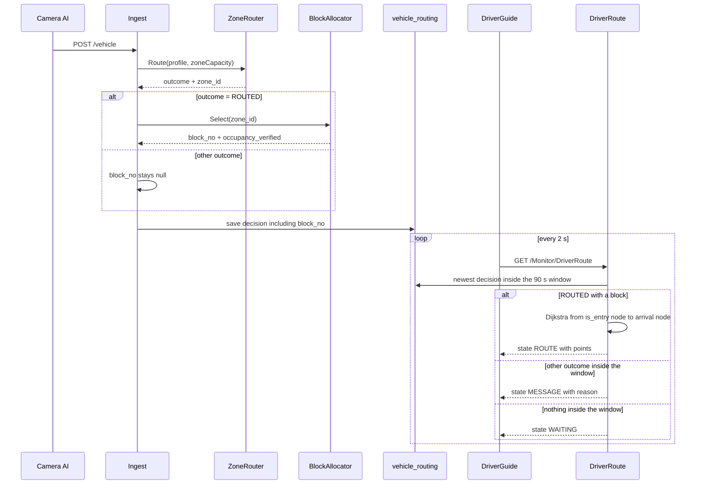

# Design

## Boundary

- **Owns:** the drivable lane network and its ramp origin node; the shortest-path computation from that origin to a block's arrival node; the selection and persistence of one destination block per Camera AI routing decision; the driver-facing guidance view and the read-only endpoint that feeds it.
- **Reads:** `block.map_x`/`block.map_y` and `block.slot_count` through the repository layer; the zone decision produced by `ZoneRouter`; observed occupancy through `v_slot_taken` and read freshness through `plc_slot_state`; the routing map image `TotalParking/Images/plan_map.jpg`.
- **Writes/exposes:** two new lane tables plus one new block column; one new `block_no` column on `vehicle_routing`; `GET /Monitor/DriverRoute`; the `Home/DriverGuide` view; a widened destination payload on the existing `GET /Monitor/Simulate`.
- **Outside boundary:** zone selection and weight-class filtering, which stay in `ZoneRouter` unchanged; LED frame construction; PLC and HMI register contracts; vehicle classification; slot-level or pallet-level destinations; authentication.

## Typed Anchors

| ID | Type | Target | Role | Access | Action |
|---|---|---|---|---|---|
| A-D-01 | file | `TotalParking/Services/BlockMapRepository.cs` | constraint | read | read |
| A-D-02 | file | `TotalParking/Services/ZoneRouter.cs` | constraint | read | read |
| A-D-03 | file | `TotalParking/Database/05_parking_topology.sql` | reference | read | read |
| A-D-04 | file | `TotalParking/Database/08_vehicle_routing.sql` | reference | read | read |
| A-D-05 | file | `TotalParking/Database/11_remove_demo_data.sql` | constraint | read | read |
| A-D-06 | file | `TotalParking/Database/17_plc_slot_state.sql` | reference | read | read |
| A-D-07 | file | `TotalParking/Database/27_slot_card_plausible.sql` | reference | read | read |
| A-D-08 | file | `TotalParking/Database/33_block_xy_gate_rank.sql` | reference | read | read |
| A-D-09 | file | `TotalParking/Database/34_block_map_xy.sql` | reference | read | read |
| A-D-10 | file | `TotalParking/Images/plan_map.jpg` | constraint | read | read |
| A-D-11 | file | `docs/LM-CL1-BAS-NTC-CP-SHD-0001-02-Mechanical-Parking-System-Drawing.pdf` | reference | read | read |
| A-D-12 | file | `docs/block-capability-README.md` | constraint | read | read |

## Decisions and Invariants

### D1 — One routing map frame, declared once

- **Decision:** All lane node coordinates, all block arrival coordinates, and both views use the frame already declared by `BlockMapRepository.ViewW = 1200` and `BlockMapRepository.ViewH = 1139`, which is the pixel frame of `TotalParking/Images/plan_map.jpg`. The lane tables store plain integer `x` and `y` in that frame and carry no separate scale, offset, or `floor_plan_id`.
- **Rejects ambiguity:** Do not attach the lane network to the `floor_plan` row `B1`. That row still describes `~/Images/zones_map.jpeg` at 1016 by 781, a different image at a different scale, and `block.map_x` and `block.map_y` do not live in it. Do not restate `1200` or `1139` as a literal in the new service or in either view.
- **Negative path:** The migration fails and names each offending row when any node lies outside `0 <= x <= 1200` or `0 <= y <= 1139`.
- **Anchors:** A-D-01, A-D-03, A-D-09, A-D-10

### D2 — Lane geometry comes from the same drawing and the same transform as the block coordinates

- **Decision:** Aisle centre lines are taken from page 1 of the mechanical parking system drawing and mapped into the routing frame with the transform already recorded in `34_block_map_xy.sql`: `point_pdf = raw * 0.06`, `pixel = point_pdf * 2.0`, `pixel_y = page_height_pt - point_pdf_y`. Using the same source and the same transform as `block.map_x` and `block.map_y` is what keeps lane nodes and block dots in one frame.
- **Rejects ambiguity:** Do not fit lane geometry to the rendered image by colour detection, bounding-box matching, or per-zone alignment. `34_block_map_xy.sql` records four such attempts failing at 68 percent, 79 percent, and a 15.6 percent axis-ratio error, for the stated reason that the older image had no shared anchor with the drawing.
- **Negative path:** If aisle linework cannot be isolated from that content stream, the bounded reversal is to hand-trace the lane centre lines against `plan_map.jpg` and insert the same node and edge rows. The stored schema, the frame, and every consumer are unchanged by that reversal, so it stays inside the migration file.
- **Anchors:** A-D-09, A-D-10, A-D-11

### D3 — The ramp head becomes a data node, not a code constant

- **Decision:** The ramp entry point is one lane node flagged `is_entry = 1`. The route service resolves the path origin by reading that flagged node.
- **Rejects ambiguity:** Do not compute a route from `BlockMapRepository.GateX` and `GateY` and then snap to the nearest lane node at request time. The snap result would move silently whenever the lane network is edited, and `BlockMapRepository.cs` already records that those two constants were placed by hand because the drawing carries no ramp label.
- **Negative path:** The migration fails when the count of nodes with `is_entry = 1` is not exactly one.
- **Anchors:** A-D-01, A-D-11

### D4 — Shortest path is Dijkstra over Euclidean edge cost, with no geometric fallback

- **Decision:** Route cost is the sum of Euclidean distances between edge endpoints in the routing frame. When the origin and the target arrival node are disconnected, the service returns an explicit no-route result naming the `block_no`.
- **Rejects ambiguity:** Do not fall back to the two-segment gate-to-target polyline the operator page draws today, and do not return the partial path explored so far. On a driver-facing screen a line that crosses through blocks is an instruction to drive through them.
- **Negative path:** A disconnected target yields no route; the caller renders outcome text and draws nothing.
- **Anchors:** A-D-01, A-D-10

### D5 — Block choice is made on observed occupancy only

- **Decision:** Within the zone `ZoneRouter` already chose, the destination block is the candidate with the greatest free capacity, where free capacity is `block.slot_count` minus that block's rows in `v_slot_taken` minus the pending-assignment debit of D9. Ties break on the lower `block_no` so the result is deterministic.
- **Rejects ambiguity:** Do not filter candidate blocks by weight class, length, or pallet rating. `block.column_count` is `NULL` for all 112 rows, so `v_zone_capacity.total_tier0` sums to zero and any block-level weight rule would be computed from absent data. `docs/block-capability-README.md` states that this field survey has not been collected and that block choice cannot be deployed without it. Weight-class filtering stays where it already is, at zone level.
- **Negative path:** When no candidate has free capacity above zero, the decision is `NO_CAPACITY` with a null block, never `ROUTED` without a block.
- **Anchors:** A-D-02, A-D-07, A-D-12

### D6 — A block the PLC has not reported recently is ranked last and labelled

- **Decision:** Candidates with a `plc_slot_state` row whose `read_at` is within the last 5 minutes are preferred over candidates without one. When only stale candidates remain, one is still chosen and the decision is marked as unverified occupancy so every surface can say so.
- **Rejects ambiguity:** Do not treat a block with no recent PLC read as empty and rank it first on that basis; its occupancy is an inference, and `BlockMapRepository.cs` already exposes `fresh` for exactly this distinction. Equally, do not exclude stale blocks entirely, because during commissioning that would leave a whole zone with no destination.
- **Negative path:** All candidates stale means the chosen block is returned with the unverified marker set, not suppressed.
- **Anchors:** A-D-01, A-D-06

### D7 — A persisted destination block is final for that event

- **Decision:** The destination block is computed once, when the routing decision is made for an event, and written in the same save as the outcome. Every later read returns the stored value.
- **Rejects ambiguity:** Do not recompute the block on each poll of the driver view or the operator page. The driver view polls while a driver is looking at it, so a recomputed choice would move the destination mid-glance as other vehicles park.
- **Negative path:** A read for an event with no persisted block returns that event's outcome without a block, never a freshly computed one.
- **Anchors:** A-D-04

### D8 — Display freshness window for a routing decision

- **Decision:** A routing decision is shown on the driver view only while it is inside a 90-second window.
  - **Clock anchor:** `vehicle_routing.decided_at`, the moment the destination became valid.
  - **Clock source:** MySQL `NOW(3)` evaluated in the same connection that reads the row, on the same host that runs both the ingest endpoint and the site.
  - **Timezone and precision:** server local time with no UTC conversion, matching every `DateTime.Now` already used across the controllers; the column is `DATETIME(3)` and the comparison is made at millisecond precision.
  - **Comparator and inclusivity:** the decision is current while `NOW(3) - decided_at <= 90 seconds`, inclusive at exactly 90 seconds and excluded beyond it.
  - **Enforcement boundary:** the server, inside the route endpoint's query. The browser never decides freshness and never filters by time.
- **Rejects ambiguity:** Do not anchor the window on `vehicle_event.camera_timestamp` or on `vehicle_event.received_at`.
- **Wrong-clock counterexample:** `camera_timestamp` is nullable, because the ingest layer normalises the camera's `0` and `"Unknown"` to `null`; a null anchor makes such a decision either permanently current or permanently stale depending on how the null is coerced, and neither is the truth. `received_at` fails differently: the ingest layer documents that the app pool recycles at 03:00 with the old and new workers both alive for up to 90 seconds, so a queued burst can be decided minutes after it was received. A decision made one second ago would then be suppressed as stale and the driver waiting at the barrier would see the idle screen.
- **Boundary counterexample:** a decision aged exactly 90.000 seconds is still shown; at 90.001 seconds the view returns to the waiting state.
- **Anchors:** A-D-04

### D9 — Assignments already handed out are debited before the next choice

- **Decision:** When choosing a block, each candidate's free capacity is reduced by the number of destination blocks already persisted for other events whose `decided_at` is inside the D8 window and whose vehicle has not yet been observed parked.
- **Rejects ambiguity:** Do not create a `parking_session` row to reserve the destination. `08_vehicle_routing.sql` records why: a session belongs to an RFID card, a camera event has no card, and a session created here would be duplicated when the driver later scans at the HMI, with no column able to join the two.
- **Negative path:** Two vehicles detected 10 seconds apart when the best block has exactly one free space: the first is sent there, the second sees that block debited to zero and is sent to the next candidate.
- **Anchors:** A-D-04, A-D-07

### D10 — The driver view polls; nothing is pushed

- **Decision:** The driver view polls the route endpoint every 2 seconds, which satisfies the 3-second display budget of R4.2 without a push channel.
- **Rejects ambiguity:** Do not add SignalR, WebSockets, or server-sent events. The solution targets .NET Framework 4.5 and every existing live surface in the project refreshes by polling.
- **Negative path:** A failed poll leaves the last rendered state untouched until the next poll succeeds or the decision leaves the D8 window, whichever happens first.
- **Anchors:** A-D-01

### I1 — The routing map frame is declared exactly once in code

`BlockMapRepository.ViewW` and `BlockMapRepository.ViewH` remain the only code-side declaration of the routing frame. The lane service, the route endpoint, the driver view, and the operator view all take their `viewBox` from values served by the API instead of restating those numbers as their own literals.

### I2 — No routing or selection rule exists in browser JavaScript

Zone choice, block choice, freshness, and path geometry are all decided server-side. Browser code draws only what the server sent. A block-candidate filter, sort, or pick written in JavaScript violates this invariant.

### I3 — A path is drawn only when a stored block and a computed route both exist

A path is drawn only when the response carries both a persisted destination `block_no` and a route array of at least two points. Every other response state renders text only.

### I4 — A new SCADA view is not delivered until it is registered

A view added under `Views/Home` counts as delivered only when its file is listed as a `<Content Include>` entry in `TotalParking/TotalParking.csproj`, it sets `Layout = "~/Views/Shared/_ScadaLayout.cshtml"`, and its action name appears in the sidebar active-state expression. Razor compiles views at runtime, so an unregistered view still serves under F5 while Publish silently omits it; ten existing views are already missing from the project file for this reason.

### Named Contracts

#### C1 — Driver route endpoint response contract

- **Owner:** the route service and endpoint task.
- **Consumers:** the driver guidance view, the operator page.
- **Shape/behaviour:**
  - **Method and route:** `GET /Monitor/DriverRoute`, no parameters.
  - **Auth:** none, consistent with every other action on the monitor controller.
  - **Required headers:** none. The response carries `Content-Type: application/json; charset=utf-8`.
  - **Success response, 200:** a JSON object whose fields are `now`, `view_w`, `view_h`, `state`, `event_id`, `outcome`, `reason`, `zone_id`, `block_no`, `occupancy_verified`, and `route`. `state` is exactly one of `ROUTE`, `MESSAGE`, or `WAITING`. `ROUTE` requires a non-null `block_no` and a `route` array of at least two point objects, each carrying an `x` and a `y` field. `MESSAGE` carries `outcome` and `reason` with a null `block_no` and an empty `route`. `WAITING` carries a null `event_id`, a null `outcome`, a null `block_no`, and an empty `route`.
  - **Error semantics:** `503` carrying a single `error` field when the lane or routing views are unavailable, matching the existing behaviour of the routing state endpoint; `500` carrying the same single `error` field on any other failure. No 4xx exists because the endpoint takes no input.
  - **Idempotency and concurrency:** read-only. Two calls inside the same decision's D8 window return the same `event_id`, `block_no`, and `route`. The endpoint writes no row and touches no PLC.
- **Compatibility:** additive. The block map and routing state endpoints keep their current shapes; the simulate endpoint gains `block_no` and `route`.

#### C2 — vehicle_routing destination block column

- **Owner:** the block allocation task.
- **Consumers:** the route endpoint, the operator page.
- **Shape/behaviour:** `vehicle_routing` gains `block_no SMALLINT UNSIGNED NULL` with a foreign key to `block (block_no)`. It is non-null only when `outcome = 'ROUTED'`, enforced by a check constraint. `outcome` keeps the five values established by `11_remove_demo_data.sql`: `ROUTED`, `NO_CAPACITY`, `NO_DATA`, `REJECTED`, `MANUAL`.
- **Compatibility:** existing rows keep a null `block_no`, so historical decisions read back as decisions without a destination rather than as errors. The column is added by a re-runnable `ALTER` guarded on `information_schema`, the pattern already used by `34_block_map_xy.sql`.

#### C3 — Lane network schema

- **Owner:** the lane network migration task.
- **Consumers:** the route service.
- **Shape/behaviour:** `lane_node (node_id SMALLINT UNSIGNED PRIMARY KEY, x SMALLINT NOT NULL, y SMALLINT NOT NULL, is_entry TINYINT(1) NOT NULL DEFAULT 0)` and `lane_edge (from_node, to_node, PRIMARY KEY (from_node, to_node))` with both endpoints foreign-keyed to `lane_node`. Edges are undirected and stored once per unordered pair; the route service expands each row in both directions. `block` gains `lane_node_id SMALLINT UNSIGNED NULL` foreign-keyed to `lane_node`, which is that block's arrival node. Edge cost is not stored; it is computed from the endpoint coordinates so that moving a node cannot leave a stale cost behind.
- **Compatibility:** two new tables and one new nullable column. No existing table, view, or column changes shape.

## Verification Definitions

- **V1**: Criteria R1.1, R1.2, R1.3, R1.4; Owner R1-01; Decision refs D1, D2, D3, C3; Method inspection `TotalParking/Database/verify_lane_network.sql` via A-R1-01-02; Expected every result row reports PASS, the count of nodes outside the frame bounds is 0, the count of is_entry nodes is exactly 1, the count of blocks with a non-null map_x and no arrival node is 0, and a second run of the migration reports the same node and edge totals; Negative/failure inserting a node at x equal to 1300 or a second is_entry node makes the matching result row report FAIL and print the offending node_id; Reachability/grounding entrypoint `TotalParking/Controllers/MonitorController.cs` via A-R1-01-01, A-R1-01-02.
- **V2**: Criteria R2.1, R2.2, R2.3, R2.4, R2.5; Owner R2-01; Decision refs D5, D6, D7, D9, C2; Method inspection `TotalParking/Database/verify_routing_block.sql` via A-R2-01-03; Expected every ROUTED row carries a non-null block_no whose zone_id equals the row zone_id, every non-ROUTED row carries a null block_no, no ROUTED row points at a block whose v_slot_taken count already equals its slot_count, a candidate with a plc_slot_state read inside 5 minutes outranks one without, and re-reading an event returns the block_no written on its first save; Negative/failure inserting a ROUTED row with a null block_no, or a NO_CAPACITY row with a non-null block_no, is refused by the check constraint and the script records that refusal as PASS; Reachability/grounding entrypoint `TotalParking/Controllers/IngestController.cs` via A-R2-01-06.
- **V3**: Criteria R3.1, R3.2, R3.3; Owner R3-01; Decision refs D1, D4, I1, C1; Method inspection `TotalParking/Database/verify_route_reachability.sql` via A-R3-01-03; Expected the recursive reachability query lists zero unreachable arrival nodes, the returned route begins at the is_entry node and ends at the destination block arrival node, and the two calls return identical route arrays; Negative/failure a block whose arrival node has no edge path is listed by the query as unreachable and the endpoint returns state MESSAGE naming that block_no with an empty route instead of any point array; Reachability/grounding entrypoint `TotalParking/Controllers/MonitorController.cs` via A-R3-01-02.
- **V4**: Criteria R4.1, R4.2, R4.3, R4.4, R4.5; Owner R4-01; Decision refs D8, D10, I1, I3, I4, C1; Method inspection `TotalParking/Database/verify_driver_route_state.sql` via A-R4-01-05; Expected the seeded row aged 89 seconds resolves to state ROUTE, the row aged 91 seconds resolves to state WAITING, a seeded NO_CAPACITY row inside the window resolves to state MESSAGE, the opened page renders the plan image with one drawn path and the destination block number, and the view path appears as a Content Include entry in the project file with its action name in the sidebar expression; Negative/failure a seeded row whose outcome is REJECTED renders its reason text with no drawn path and no destination label, and the previously drawn path is cleared when the window lapses instead of being left on screen; Reachability/grounding entrypoint `TotalParking/Controllers/HomeController.cs` via A-R4-01-02, A-R4-01-03.
- **V5**: Criteria R5.1, R5.2; Owner R5-01; Decision refs D5, D7, I2, C1; Method inspection `TotalParking/Database/verify_simulate_readonly.sql` via A-R5-01-02; Expected the simulate response carries a server-selected block_no, the operator map draws that block, and the view file contains no filter, sort, or pick over the block list in JavaScript; Negative/failure the vehicle_event, vehicle_profile, and vehicle_routing row counts recorded before and after the simulate call differ by zero, and any non-zero difference fails the check; Reachability/grounding entrypoint `TotalParking/Views/Home/Routing.cshtml` via A-R5-01-01.

## Flow

## Data and Consistency

Ownership is unchanged for every existing table. `lane_node` and `lane_edge` are new and owned by the migration. `block.lane_node_id` and `vehicle_routing.block_no` are new nullable columns added by guarded `ALTER` statements so both migrations re-run safely, following the pattern in `34_block_map_xy.sql`.

The one lifecycle policy in this feature is the display freshness window, defined in full in D8: anchor `vehicle_routing.decided_at`, source `NOW(3)` on the same host, server local time at millisecond precision, `NOW(3) - decided_at <= 90 seconds` inclusive at the boundary, enforced inside the route endpoint's query, with the wrong-clock and boundary counterexamples recorded there. Nothing is deleted or expired by this feature; the window only controls what is displayed.

Concurrency is bounded by D7 and D9. The destination block is written in the same save as the outcome, so no reader ever sees `ROUTED` without its block. The D9 debit is computed inside the same read that ranks candidates, so two ingest calls arriving together can still observe the same free count; the residual effect is two vehicles sent to a block with one free space, which an attendant resolves and the next PLC read corrects. Reserving capacity properly would need a session row, which `08_vehicle_routing.sql` rules out at camera time.

## Errors and Recovery

| Trigger | Response | Recovery |
|---|---|---|
| Lane tables absent because the migration has not run | the route endpoint returns 503 with the exception message, matching the routing state endpoint | run the lane network migration; the view resumes on the next poll |
| Target block has a null `lane_node_id` | explicit no-route naming the `block_no`; nothing is drawn | the migration's arrival-node check names the block; fix and re-run |
| No decision inside the D8 window | state `WAITING`; any previous path is cleared | the next Camera AI event replaces it |
| Poll fails or the site is restarting | the last rendered state stays in place until the next successful poll | polling continues on its 2-second interval |
| Every PLC connection down | a block is still chosen and returned with `occupancy_verified` false | the surface labels it; nothing is suppressed |

## Migration and Compatibility

The two migrations touch different tables and may be applied in either order relative to each other, but both must precede any use of the route endpoint. Both are guarded on `information_schema` so re-running is safe, and both end with the verification `SELECT`s that `33_block_xy_gate_rank.sql` established as the house pattern.

Rollback trigger: if the lane geometry proves wrong in the field, dropping `lane_edge` and `lane_node` and clearing `block.lane_node_id` returns the route endpoint to its 503 path and leaves every existing surface working, because no existing table or view was altered in place.

`BlockMapRepository.GateX` and `GateY` are kept as they are so the operator page's existing gate marker does not move; D3 removes their authority over route computation only.

## Unresolved Questions

- None.
